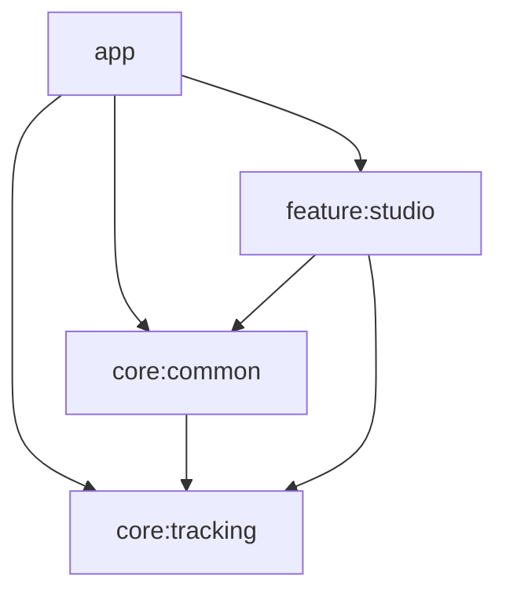

# 얼굴 추적 및 Live2D 연동 개발 문서

## 개요

이 문서는 MediaPipe Face Landmarker와 Live2D Cubism SDK를 연동하여 실시간 얼굴 추적 기능을 구현하면서 발생한 문제점과 해결 방법을 정리한 것입니다.

---

## 목차

1. [시선 추적(Iris Tracking) 구현](#1-시선-추적iris-tracking-구현)
2. [거울 모드 반전 처리](#2-거울-모드-반전-처리)
3. [Pitch 계산 왜곡 문제](#3-pitch-계산-왜곡-문제)
4. [입 벌림 임계값 처리](#4-입-벌림-임계값-처리)
5. [EMA 스무딩 적용](#5-ema-스무딩-적용)
6. [GPU 가속 및 Delegate 전환](#6-gpu-가속-및-delegate-전환)
7. [캐릭터 확대 및 이동 기능](#7-캐릭터-확대-및-이동-기능)
8. [카메라와 프리뷰의 구조적 분리](#8-카메라와-프리뷰의-구조적-분리)
9. [렌더링 엔진 생명주기 안정화](#9-렌더링-엔진-생명주기-안정화)
10. [얼굴 추적 파라미터 정교화 및 명시적 초기화](#10-얼굴-추적-파라미터-정교화-및-명시적-초기화)
11. [VTube Studio 호환 매핑 및 eyeWide 지원](#11-vtube-studio-호환-매핑-및-eyewide-지원)
12. [감정(Expressions) 및 모션(Motions) UI 추가](#12-감정expressions-및-모션motions-ui-추가)
13. [ViewModel 도입 및 상태 관리 개선](#13-viewmodel-도입-및-상태-관리-개선-2026-01-28-업데이트)
14. [에러 처리 시스템 구축](#14-에러-처리-시스템-구축-2026-01-28-업데이트)
15. [수동 의존성 주입(Manual DI) 리팩토링](#15-수동-의존성-주입manual-di-리팩토링-2026-01-28-업데이트)

---

## 1. 시선 추적(Iris Tracking) 구현

### 문제
- 기존 구현에서는 눈동자(ParamEyeBallX/Y)가 고개 방향(Yaw)에 연동되어 있었음
- 사용자가 고개를 고정한 채 눈동자만 움직여도 캐릭터 눈동자가 반응하지 않음

### 해결 방법
MediaPipe Face Landmarker의 Iris 랜드마크를 활용하여 실제 눈동자 위치를 추적:

```kotlin
// 눈동자 랜드마크 인덱스
// 왼쪽 눈동자 중심: 468, 오른쪽 눈동자 중심: 473
val irisL = landmarks[468]
val irisR = landmarks[473]

// 눈 너비 대비 상대적 위치 계산
val eyeLWidth = eyeLInner.x() - eyeLOuter.x()
val irisLRelX = (irisL.x() - eyeLOuter.x()) / eyeLWidth

// 정규화 (-1 ~ 1)
val eyeBallX = -((avgRelX - 0.5f) * 2f).coerceIn(-1f, 1f)
```

### 관련 파일
- `FaceTracker.kt`: `calculateIrisPosition()` 함수 추가
- `FacePose.kt`: `eyeBallX`, `eyeBallY` 필드 추가
- `FaceToLive2DMapper.kt`: Iris 데이터를 ParamEyeBallX/Y에 매핑

---

## 2. 거울 모드 반전 처리

### 문제
- 전면 카메라 사용 시 사용자가 왼쪽으로 기울이면 캐릭터는 오른쪽으로 기울어짐
- Yaw(좌우)에는 반전이 적용되어 있었으나 Roll(기울기)에는 적용 안 됨

### 해결 방법
Roll 계산에 `-` 부호를 적용하여 거울 모드 반전:

```kotlin
// 수정 전
val rollNorm = rollDeg / 20f

// 수정 후 (- 부호 추가)
val rollNorm = -rollDeg / 20f
```

### 거울 모드 적용 파라미터
| 파라미터 | 반전 적용 | 비고 |
|---------|----------|------|
| Yaw (ParamAngleX) | ✅ `-` 적용 | 좌우 회전 |
| Roll (ParamAngleZ) | ✅ `-` 적용 | 기울기 |
| EyeBallX | ✅ `-` 적용 | 시선 좌우 |

---

## 3. Pitch 계산 왜곡 문제

### 문제
고개를 옆으로 돌린 상태에서 위/아래를 바라보면 Pitch가 정확하게 인식되지 않음:
- 옆을 보면서 위를 바라보면 → 캐릭터는 아래를 바라봄
- 고개를 숙이면 → 캐릭터가 반응하지 않음

### 원인
Y좌표 기반 Pitch 계산은 Yaw 회전 시 원근법 왜곡의 영향을 받음

### 해결 방법
**Z좌표(깊이)** 기반으로 Pitch 계산 변경:

```kotlin
// 수정 전: Y좌표 기반 (Yaw에 영향받음)
val pitchPoint = eyeYCenter - nose.y()
val pitchNorm = pitchPoint * 6f * normFactor

// 수정 후: Z좌표 기반 (Yaw와 독립)
val noseBridge = landmarks[6]  // 코 다리 (미간 근처)
val pitchZ = nose.z() - noseBridge.z()
val pitchNorm = pitchZ * 15f
```

### 추가 수정
Live2D ParamAngleY의 부호 규칙에 맞게 Mapper에서 반전:

```kotlin
// Live2D: 양수=위, 음수=아래
params["ParamAngleY"] = (-smoothed.pitch * 40f).coerceIn(-30f, 30f)
```

---

## 4. 입 벌림 임계값 처리

### 문제
입을 다물고 있어도 캐릭터 입이 약간 열려 있음

### 원인
MediaPipe의 `jawOpen` Blendshape 값이 완전히 0이 되지 않고 작은 값(노이즈)이 발생

### 해결 방법
**임계값(Dead Zone)** 적용:

```kotlin
val mouthRaw = scores["jawOpen"] ?: 0f

// 0.15 이하는 닫힌 입으로 간주하고, 이후 값을 0~1로 재정규화
val mouthThreshold = 0.15f
val mouth = ((mouthRaw - mouthThreshold) / (1f - mouthThreshold)).coerceIn(0f, 1f)
```

### 효과
- `jawOpen < 0.15`: `mouth = 0` (입 닫힘)
- `jawOpen = 0.15 ~ 1.0`: `mouth = 0 ~ 1` (비례 열림)

---

## 5. EMA 스무딩 적용

### 문제
카메라 데이터의 미세한 떨림으로 캐릭터가 덜덜 떨림

### 해결 방법
**지수 이동 평균(EMA)** 필터 적용:

```kotlin
/**
 * EMA 스무딩 계수 (alpha)
 * 
 * 공식: smoothed = lastValue + alpha * (newValue - lastValue)
 * 
 * - 0.1~0.3: 부드럽지만 반응 느림 (떨림 억제)
 * - 0.3~0.5: 부드러움과 반응성 균형
 * - 0.5~0.8: 빠른 반응, 떨림 가능성
 */
private val alpha = 0.4f

private fun smooth(last: Float, current: Float): Float {
    return last + alpha * (current - last)
}
```

### 적용 대상
모든 FacePose 필드에 EMA 적용:
- yaw, pitch, roll
- eyeLOpen, eyeROpen
- mouthOpen, mouthForm
- eyeBallX, eyeBallY

---

## 좌표계 참고

### MediaPipe 정규화 좌표
- X: 0.0 (왼쪽) ~ 1.0 (오른쪽)
- Y: 0.0 (위) ~ 1.0 (아래)
- Z: 깊이 (카메라에 가까울수록 음수)

### Live2D 파라미터 범위
| 파라미터 | 범위 | 설명 |
|---------|------|------|
| ParamAngleX | -30 ~ 30 | 좌우 회전 |
| ParamAngleY | -30 ~ 30 | 상하 회전 (양수=위) |
| ParamAngleZ | -30 ~ 30 | 기울기 |
| ParamEyeBallX/Y | -1 ~ 1 | 시선 |
| ParamMouthOpenY | 0 ~ 1 | 입 벌림 |
| ParamEyeLOpen/ROpen | 0 ~ 1 | 눈 뜸 |

---

## 수정된 파일 목록

| 파일 | 변경 내용 |
|------|----------|
| `FacePose.kt` | eyeBallX, eyeBallY, mouthForm 필드 추가 |
| `FaceTracker.kt` | Iris 추적, Z기반 Pitch, 입 임계값, 거울 모드 |
| `FaceToLive2DMapper.kt` | EMA 확장, ParamAngleY 반전, 시선 매핑 |
| `MainActivity.kt` | ParamMouthForm 리셋 추가 |

---

6. [GPU 가속 및 Delegate 전환](#6-gpu-가속-및-delegate-전환)
7. [캐릭터 확대 및 이동 기능](#7-캐릭터-확대-및-이동-기능)
8. [카메라와 프리뷰의 구조적 분리](#8-카메라와-프리뷰의-구조적-분리)

---

## 6. GPU 가속 및 Delegate 전환

### 문제
- 실시간 얼굴 추적 시 CPU 부하가 높고 지연시간이 발생할 수 있음
- 기기 사양에 따라 GPU 가속 사용 여부를 선택할 필요가 있음

### 해결 방법
MediaPipe Face Landmarker에 GPU Delegate를 적용하고, 런타임에 CPU/GPU를 전환할 수 있는 기능을 구현:

- **자동 폴백**: GPU 초기화 실패 시 자동으로 CPU로 폴백하여 안정성 확보
- **런타임 전환**: FaceLandmarker를 닫고 새 Delegate로 재초기화하는 `setGpuEnabled()` 메서드 구현
- **로그 강화**: 초기화에 소요된 시간과 활성화된 Delegate를 확인하기 위한 상세 로깅 추가

---

## 7. 캐릭터 확대 및 이동 기능

### 문제
- 캐릭터가 화면 중앙에 고정되어 있어 세밀한 연출이나 구도 조정이 불가능함

### 해결 방법
Live2D 모델의 Projection 매트릭스에 개별적인 스케일과 오프셋을 적용:

- **확대 (Pinch Zoom)**: `ScaleGestureDetector`를 사용하여 캐릭터 크기를 0.5배 ~ 10배까지 조정
- **이동 (Drag)**: 화면 드래그를 통해 캐릭터 위치를 자유롭게 이동 (-10.0 ~ 10.0 범위)
- **비율 유지**: `scaleRelative`를 사용하여 화면 크기에 관계없이 캐릭터 고유 비율 유지

### 관련 파일
- `LAppMinimumLive2DManager.java`: 스케일/오프셋 API 및 렌더링 로직 추가
- `Live2DGLSurfaceView.kt`: 제스처 감지 및 모드 토글 로직 구현

---

## 8. 카메라와 프리뷰의 구조적 분리

### 문제
- 기존에는 `PreviewView`가 생성될 때만 카메라가 시작되어, 프리뷰를 끄면 얼굴 추적도 멈춤
- 프리뷰 표시 여부와 관계없이 얼굴 추적은 계속 동작해야 함

### 해결 방법
카메라 시작(`startCamera`)과 프리뷰 연결(`attachPreview`)을 물리적으로 분리:

- **독립적 카메라 실행**: `LaunchedEffect(Unit)`에서 카메라를 먼저 시작하여 `ImageAnalysis` 레이어 활성화
- **조건부 프리뷰**: 프리뷰 토글이 ON일 때만 `PreviewView`를 렌더링하고 `attachPreview()`로 연결
- **자원 관리**: `onRelease`에서 `detachPreview()`를 호출하여 메모리 누수 방지

---

## 9. 렌더링 엔진 생명주기 안정화

### 문제
- 특정 상황에서 Live2D 렌더링 엔진이 정상적으로 초기화되지 않거나, 화면 전환 후 모델이 로드되지 않는 현상 발생

### 해결 방법
- `Live2DGLSurfaceView`의 초기화 시점에 `LAppMinimumDelegate`의 `onStart(context)`를 명시적으로 호출하여 네이티브 라이브러리와 렌더링 리소스를 안정적으로 확보
- `LAppMinimumLive2DManager`에서 뷰포트 크기 계산 및 프로젝션 매트릭스 업데이트 로직을 보강하여 모델이 정확하게 화면에 표시되도록 함

### 관련 파일
- [Live2DGLSurfaceView.kt](file:///d:/comon/LiveMotion/app/src/main/java/org/comon/livemotion/Live2DGLSurfaceView.kt)
- [LAppMinimumLive2DManager.java](file:///d:/comon/LiveMotion/app/src/main/java/org/comon/livemotion/demo/minimum/LAppMinimumLive2DManager.java)

---

## 10. 얼굴 추적 파라미터 정교화 및 명시적 초기화

### 문제
- 눈 깜빡임 등 일부 얼굴 파라미터가 0으로 고정되거나 노이즈로 인해 부자연스럽게 동작함
- `FaceLandmarker` 초기화 시점을 앱 생명주기 또는 사용자 상태에 따라 세밀하게 제어할 필요가 있음

### 해결 방법
1. **명시적 초기화 메서드 분리**: `setupFaceLandmarker(useGpu: Boolean)`를 통해 GPU 사용 여부를 런타임에 결정하고 초기화를 명시적으로 수행할 수 있도록 개선
2. **눈 깜빡임 로직 개선**: `eyeBlinkLeft/Right` 점수가 누락되거나 노이즈가 섞일 경우를 대비하여 기본값 처리 및 재정규화 로직 최적화

### 관련 파일
- [FaceTracker.kt](file:///d:/comon/LiveMotion/app/src/main/java/org/comon/livemotion/tracking/FaceTracker.kt)

---

## 좌표계 참고

### MediaPipe 정규화 좌표
- X: 0.0 (왼쪽) ~ 1.0 (오른쪽)
- Y: 0.0 (위) ~ 1.0 (아래)
- Z: 깊이 (카메라에 가까울수록 음수)

### Live2D 파라미터 범위
| 파라미터 | 범위 | 설명 |
|---------|------|------|
| ParamAngleX | -30 ~ 30 | 좌우 회전 |
| ParamAngleY | -30 ~ 30 | 상하 회전 (양수=위) |
| ParamAngleZ | -30 ~ 30 | 기울기 |
| ParamEyeBallX/Y | -1 ~ 1 | 시선 |
| ParamMouthOpenY | 0 ~ 2.1 | 입 벌림 (VTube Studio 호환 확장) |
| ParamEyeLOpen/ROpen | 0 ~ 2.0 | 눈 뜸 (eyeWide 지원) |

---

## 수정된 파일 목록

| 파일 | 변경 내용 |
|------|----------|
| `FacePose.kt` | eyeBallX, eyeBallY, mouthForm 필드 추가 |
| `FaceTracker.kt` | 명시적 초기화 API, 얼굴 파라미터(눈동자/입/깜빡임) 추출 정교화 |
| `FaceToLive2DMapper.kt` | EMA 스무딩 고도화 및 파라미터 매핑 브리지 |
| `MainActivity.kt` | CPU/GPU, 확대, 이동, 프리뷰 토글 UI 및 상태 관리 |
| `Live2DScreen.kt` | 줌/이동 모드 파라미터 연동 |
| `Live2DGLSurfaceView.kt` | 핀치 줌, 드래그 제스처 처리 및 생명주기(`onStart`) 연동 |
| `LAppMinimumLive2DManager.java` | 렌더링 매트릭스 제어 및 뷰포트 업데이트 로직 보강 |

---

---

## 11. VTube Studio 호환 매핑 및 eyeWide 지원 (2026-01-27 업데이트)

### 배경
- VTube Studio용 모델(gyana3 등)은 Live2D 표준 파라미터 범위를 초과하여 더 역동적인 표정을 구현함
- 기존 구현에서는 파라미터가 0~1 표준 범위로 제한되어 있어, 눈을 크게 뜨거나 입을 크게 벌려도 모델이 반응하지 않거나 표현이 제한적이었음

### 구현 변경 사항

#### 1. 눈동자 확장 (eyeWide) 지원
기존에는 눈 깜빡임(`eyeBlink`)만 사용하여 눈 뜬 정도를 0~1로 제한했으나, `eyeWide` Blendshape를 도입하여 1.0 이상의 값(눈 크게 뜸)을 표현:

```kotlin
// 수정 전: 최대 1.0
val eyeLOpen = 1f - eyeBlinkL

// 수정 후: 1.0 + 확장값 (최대 약 1.8~2.0)
val eyeLOpen = (1f - eyeBlinkL) + (eyeWideL * 0.8f)
```

#### 2. 파라미터 출력 범위 확장
FaceToLive2DMapper에서 0~1로 강제하던 제한을 VTube Studio 설정(`gyana3.vtube.json`)을 참고하여 확장:

| 파라미터 | 기존 범위 | 변경된 범위 | 효과 |
|----------|----------|------------|------|
| **ParamEyeLOpen/ROpen** | 0.0 ~ 1.0 | **0.0 ~ 2.0** | 눈을 크게 떴을 때 모델 눈이 커짐 |
| **ParamMouthOpenY** | 0.0 ~ 1.0 | **0.0 ~ 2.1** | 입을 더 크고 역동적으로 벌림 |

#### 3. 눈웃음 자동 연동
미소를 지을 때(`ParamMouthForm`) 눈이 함께 웃도록 새로운 파라미터 매핑 추가 (모델 지원 시 작동):
```kotlin
// 미소(MouthForm) 값을 눈웃음(EyeSmile)에도 전달
params["ParamEyeLSmile"] = smoothed.mouthForm.coerceIn(0f, 1f)
params["ParamEyeRSmile"] = smoothed.mouthForm.coerceIn(0f, 1f)
```

---

## 추후 개선 사항

1. **FaceGeometry 활용**: MediaPipe FaceGeometry를 사용하면 Euler Angles를 직접 얻을 수 있어 더 정확한 회전 계산 가능
2. **개인별 보정**: 사용자마다 다른 얼굴 비율을 고려한 동적 보정
3. **배경 합성**: 크로마키 보드 또는 이미지 배경 추가 기능

---

## 12. 감정(Expressions) 및 모션(Motions) UI 추가 (2026-01-27 업데이트)

### 배경
- 사용자가 버튼 클릭을 통해 모델의 특정 표정이나 동작을 즉시 실행해볼 수 있는 기능 필요
- 모델 에셋 구조(대소문자 차이 등)에 유연하게 대응해야 함

### 구현 내용

#### 1. 에셋 폴더 자동 스캔 (대소문자 무관)
모델마다 `expressions` / `Expressions` 등 폴더명이 다를 수 있어, `StudioScreen` 진입 시 `AssetManager.list()`를 통해 실제 폴더명을 동적으로 찾도록 구현:

```kotlin
private fun findAssetFolder(assetManager: AssetManager, modelId: String, targetFolder: String): String? {
    return try {
        // 대소문자 구분 없이 "expressions" 또는 "motions" 폴더가 있는지 확인하고 실제 이름 반환
        val files = assetManager.list(modelId) ?: return null
        files.firstOrNull { it.equals(targetFolder, ignoreCase = true) }
    } catch (e: IOException) {
        null
    }
}
```

#### 2. 파일 직접 실행 지원
기존 `LAppMinimumModel`은 `model3.json`에 정의된 모션 그룹만 실행 가능했으나, 파일 경로를 통해 임의의 모션/표정 파일을 로드하고 실행하는 메서드를 추가:

- `startMotionFromFile(String fileName)`: `.motion3.json` 파일을 직접 로드하여 실행
- `startExpressionFromFile(String fileName)`: `.exp3.json` 파일을 직접 로드하여 실행

#### 3. UI 구성
- **상단 버튼 바**: 해당 모델에 `expressions` 또는 `motions` 폴더가 존재할 경우에만 "감정", "모션" 버튼 표시
- **파일 목록 다이얼로그**: 버튼 클릭 시 폴더 내의 파일들을 리스트로 표시
- **실행**: 리스트 아이템 선택 시 `LAppMinimumLive2DManager`를 통해 즉시 해당 파일 재생

### 관련 파일
- `StudioScreen.kt`: 에셋 스캔 및 버튼/다이얼로그 UI
- `LAppMinimumModel.java`: 파일 경로 기반 모션/표정 로드 및 재생 로직
- `LAppMinimumLive2DManager.java`: UI와 Model 간 브리지 메서드 (`startMotion`, `startExpression`)

---

## 13. ViewModel 도입 및 상태 관리 개선 (2026-01-28 업데이트)

### 배경
- 기존 `StudioScreen`에서 `remember`로 `FaceTracker`를 생성하여 화면 회전 시 상태 손실 발생
- 상태 변수가 분산되어 관리 어려움
- 에러 발생 시 UI 피드백 부재

### 구현 내용

#### 1. StudioViewModel 도입
`FaceTracker`와 상태를 ViewModel 스코프에서 관리하여 configuration change에서 생존:

```kotlin
class StudioViewModel(private val context: Context) : ViewModel() {
    private var faceTracker: FaceTracker? = null

    // 실시간 트래킹 데이터 (30fps) - 별도 Flow
    val facePose: StateFlow<FacePose>
    val faceLandmarks: StateFlow<List<NormalizedLandmark>>

    // UI 상태 - 단일 State 객체
    val uiState: StateFlow<StudioUiState>
}
```

#### 2. 상태 분리 전략
실시간 데이터(30fps)와 UI 상태를 분리하여 성능 최적화:

| 구분 | 타입 | 업데이트 빈도 |
|------|------|-------------|
| `facePose`, `faceLandmarks` | 별도 StateFlow | 30fps |
| `StudioUiState` | 단일 State 객체 | 사용자 액션 시 |

#### 3. StudioUiState 구조
```kotlin
data class StudioUiState(
    val isModelLoading: Boolean = true,
    val isCalibrating: Boolean = false,
    val isGpuEnabled: Boolean = false,
    val trackingError: TrackingError? = null,
    val isZoomEnabled: Boolean = false,
    val isMoveEnabled: Boolean = false,
    val isPreviewVisible: Boolean = true,
    val dialogState: DialogState = DialogState.None,
    val expressionsFolder: String? = null,
    val motionsFolder: String? = null,
    val expressionFiles: List<String> = emptyList(),
    val motionFiles: List<String> = emptyList()
)
```

### 관련 파일
| 파일 | 변경 내용 |
|------|----------|
| `StudioViewModel.kt` | 신규 생성 - ViewModel 및 UiState 정의 |
| `StudioScreen.kt` | ViewModel 사용으로 리팩토링 |
| `feature/studio/build.gradle.kts` | lifecycle-viewmodel-compose 의존성 추가 |

---

## 14. 에러 처리 시스템 구축 (2026-01-28 업데이트)

### 배경
- 모델 로딩 실패 시 앱이 강제 종료됨 (`Activity.finish()` 호출)
- FaceTracker 에러가 로그로만 출력되어 사용자에게 피드백 없음
- 카메라 권한 거부 시 재요청 방법 없음

### 구현 내용

#### 1. 모델 로딩 에러 처리
기존에는 모델 로딩 실패 시 `Activity.finish()`를 호출하여 앱이 강제 종료되었으나, 이를 예외 기반 처리로 변경:

- `LAppMinimumModel`에서 `Activity.finish()` 대신 `IllegalStateException` throw
- `LAppMinimumLive2DManager`에서 에러 리스너 콜백 추가
- 에러 발생 시 ModelSelectScreen으로 복귀 + 스낵바 표시
- "자세히" 버튼으로 에러 상세 다이얼로그 표시

```java
// 수정 전
if (this.modelSetting.getJson() == null) {
    LAppMinimumDelegate.getInstance().getActivity().finish();
}

// 수정 후
if (this.modelSetting.getJson() == null) {
    throw new IllegalStateException("Failed to load model3.json: " + model3JsonPath);
}
```

#### 2. TrackingError Flow 추가
FaceTracker에 에러 상태 Flow를 추가하여 UI로 에러를 전파:

```kotlin
sealed class TrackingError {
    data class FaceLandmarkerInitError(val message: String) : TrackingError()
    data class CameraError(val message: String) : TrackingError()
    data class MediaPipeRuntimeError(val message: String) : TrackingError()
}

class FaceTracker(...) {
    private val _error = MutableStateFlow<TrackingError?>(null)
    val error: StateFlow<TrackingError?> = _error

    fun clearError() { _error.value = null }
}
```

에러 발생 시점:
| 에러 타입 | 발생 상황 |
|----------|----------|
| `FaceLandmarkerInitError` | MediaPipe 초기화 실패 (GPU/CPU 모두) |
| `CameraError` | 카메라 시작 실패, 전면 카메라 없음 |
| `MediaPipeRuntimeError` | MediaPipe 런타임 에러 |

#### 3. 카메라 권한 UX 개선
기존에는 권한 거부 시 텍스트만 표시되었으나, 사용자 친화적인 UI로 개선:

```kotlin
@Composable
private fun CameraPermissionScreen(
    isPermanentlyDenied: Boolean,
    onRequestPermission: () -> Unit,
    onOpenSettings: () -> Unit
)
```

- 일반 거부: "권한 허용하기" 버튼으로 재요청
- 영구 거부 (`shouldShowRequestPermissionRationale = false`): "설정으로 이동" 버튼
- 설정에서 복귀 시 권한 상태 자동 재확인

#### 4. 전면 카메라 존재 확인
전면 카메라가 없는 기기에서 명확한 에러 메시지 제공:

```kotlin
if (!cameraProvider!!.hasCamera(cameraSelector)) {
    _error.value = TrackingError.CameraError(
        "전면 카메라를 찾을 수 없습니다. 이 앱은 전면 카메라가 필요합니다."
    )
    return@addListener
}
```

### 에러 처리 흐름도

```
┌─────────────────────────────────────────────────────────────┐
│                     에러 발생 지점                           │
├─────────────────────────────────────────────────────────────┤
│  FaceTracker          │  LAppMinimumModel                   │
│  - 초기화 실패        │  - model3.json 로드 실패            │
│  - 카메라 실패        │  - 모델 파일 없음                   │
│  - MediaPipe 에러     │                                     │
└──────────┬────────────┴──────────────┬──────────────────────┘
           │                           │
           ▼                           ▼
┌─────────────────────┐    ┌─────────────────────────────────┐
│ _error.value = ...  │    │ onModelLoadError 콜백 호출      │
└──────────┬──────────┘    └──────────────┬──────────────────┘
           │                              │
           ▼                              ▼
┌─────────────────────────────────────────────────────────────┐
│              StudioViewModel / StudioScreen                 │
│         uiState.trackingError 또는 onError 콜백             │
└──────────────────────────┬──────────────────────────────────┘
                           │
                           ▼
┌─────────────────────────────────────────────────────────────┐
│                      스낵바 표시                             │
│         "트래킹 오류가 발생했습니다" [자세히]               │
│         "모델 로딩에 실패했습니다" [자세히]                 │
└──────────────────────────┬──────────────────────────────────┘
                           │ 자세히 클릭
                           ▼
┌─────────────────────────────────────────────────────────────┐
│                   에러 상세 다이얼로그                       │
│              (에러 메시지 전문 표시)                        │
└─────────────────────────────────────────────────────────────┘
```

### 관련 파일
| 파일 | 변경 내용 |
|------|----------|
| `LAppMinimumModel.java` | `Activity.finish()` → 예외 throw |
| `LAppMinimumLive2DManager.java` | `OnModelLoadListener` 에러 콜백 추가 |
| `FaceTracker.kt` | `TrackingError` sealed class, `error` StateFlow 추가 |
| `StudioViewModel.kt` | `trackingError` 상태 관리, `clearTrackingError()` |
| `StudioScreen.kt` | 트래킹 에러 스낵바/다이얼로그 |
| `ModelSelectScreen.kt` | 모델 로딩 에러 스낵바/다이얼로그 |
| `MainActivity.kt` | `CameraPermissionScreen`, 권한 상태 관리 |
| `Live2DScreen.kt` | `onModelLoadError` 콜백 추가 |

---

## 15. 수동 의존성 주입(Manual DI) 리팩토링 (2026-01-28 업데이트)

### 배경
- `StudioViewModel`에서 `Application`/`Context`를 직접 참조하여 메모리 누수 경고 및 테스트 어려움 발생
- Android 프레임워크에 대한 강한 결합으로 인해 단위 테스트 작성이 어려움
- Hilt 등 DI 프레임워크 없이 수동 의존성 주입 패턴 적용 필요

### 구현 내용

#### 1. DI 인프라 구축

**core:common 모듈**에 추상화 계층 생성:

```kotlin
// AppContainer 인터페이스 (core:common)
interface AppContainer {
    val modelAssetReader: ModelAssetReader
    val faceTrackerFactory: FaceTrackerFactory
}

// CompositionLocal 정의 (core:common)
val LocalAppContainer = staticCompositionLocalOf<AppContainer> {
    error("AppContainer has not been provided")
}
```

**app 모듈**에 구현체 생성:

```kotlin
// AppContainerImpl (app)
class AppContainerImpl(application: Application) : AppContainer {
    override val faceTrackerFactory by lazy { FaceTrackerFactory(application) }
    override val modelAssetReader by lazy { ModelAssetReader(application.assets) }
}

// 커스텀 Application (app)
class LiveMotionApp : Application() {
    lateinit var container: AppContainerImpl
    override fun onCreate() {
        super.onCreate()
        container = AppContainerImpl(this)
    }
}
```

#### 2. Factory 패턴 적용

**FaceTrackerFactory**: ViewModel이 Context 없이 FaceTracker를 생성할 수 있도록 함:

```kotlin
class FaceTrackerFactory(private val context: Context) {
    fun create(lifecycleOwner: LifecycleOwner): FaceTracker {
        return FaceTracker(context, lifecycleOwner)
    }
}
```

**ModelAssetReader**: Asset 접근을 캡슐화:

```kotlin
class ModelAssetReader(private val assets: AssetManager) {
    fun findAssetFolder(modelId: String, targetFolder: String): String?
    fun listFiles(path: String): List<String>
    fun listLive2DModels(): List<String>
}
```

#### 3. ViewModel 리팩토링

기존 `Application` 직접 참조를 Factory 주입으로 변경:

```kotlin
// 수정 전
class StudioViewModel(private val application: Application) : ViewModel()

// 수정 후
class StudioViewModel(
    private val faceTrackerFactory: FaceTrackerFactory,
    private val modelAssetReader: ModelAssetReader
) : ViewModel()
```

#### 4. Compose에서 DI 사용

**MainActivity**에서 `CompositionLocalProvider`로 컨테이너 제공:

```kotlin
setContent {
    val container = (application as LiveMotionApp).container
    CompositionLocalProvider(LocalAppContainer provides container) {
        LiveMotionTheme { MainContent() }
    }
}
```

**Screen**에서 `LocalAppContainer.current`로 의존성 획득:

```kotlin
@Composable
fun StudioScreen(...) {
    val container = LocalAppContainer.current
    val viewModel: StudioViewModel = viewModel(
        factory = StudioViewModel.Factory(
            container.faceTrackerFactory,
            container.modelAssetReader
        )
    )
}
```

### 모듈 의존성 구조



순환 의존성을 방지하기 위해:
- `AppContainer` **인터페이스**는 `core:common`에 정의
- `AppContainerImpl` **구현체**는 `app`에 위치
- `feature:studio`는 인터페이스만 참조

### 관련 파일

**신규 생성**
| 파일 | 위치 | 설명 |
|------|------|------|
| `AppContainer.kt` | core:common/di | 의존성 컨테이너 인터페이스 |
| `LocalAppContainer.kt` | core:common/di | Compose CompositionLocal |
| `ModelAssetReader.kt` | core:common/asset | Asset 읽기 클래스 |
| `FaceTrackerFactory.kt` | core:tracking | FaceTracker 생성 Factory |
| `AppContainerImpl.kt` | app/di | AppContainer 구현체 |
| `LiveMotionApp.kt` | app | 커스텀 Application |

**수정됨**
| 파일 | 변경 내용 |
|------|----------|
| `StudioViewModel.kt` | Application → Factory 주입 |
| `StudioScreen.kt` | LocalAppContainer 사용 |
| `ModelSelectScreen.kt` | LocalAppContainer 사용 |
| `MainActivity.kt` | CompositionLocalProvider 추가 |
| `AndroidManifest.xml` | LiveMotionApp 등록 |
| `libs.versions.toml` | compose-runtime 추가 |
| `app/build.gradle.kts` | core:common, core:tracking 의존성 추가 |
| `feature/studio/build.gradle.kts` | core:common 의존성 추가 |
| `core/common/build.gradle.kts` | core:tracking, compose-runtime 의존성 추가 |


