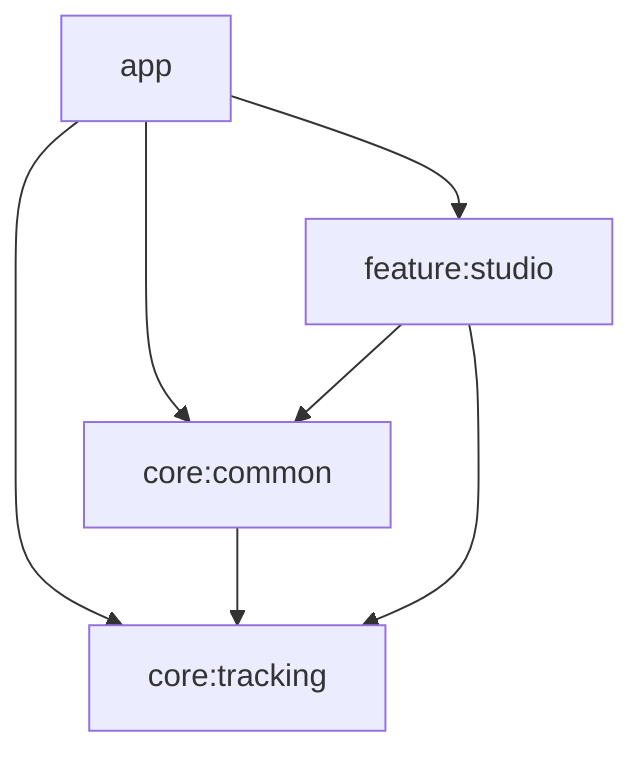
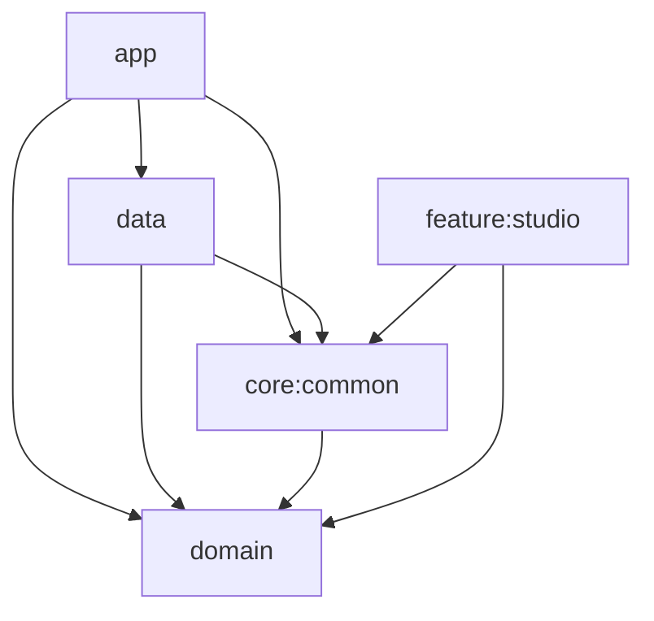

# 얼굴 추적 및 Live2D 연동 개발 문서

## 개요

이 문서는 MediaPipe Face Landmarker와 Live2D Cubism SDK를 연동하여 실시간 얼굴 추적 기능을 구현하면서 발생한 문제점과 해결 방법을 정리한 것입니다.

---

## 목차

1. [시선 추적(Iris Tracking) 구현](#1-시선-추적iris-tracking-구현)
2. [거울 모드 반전 처리](#2-거울-모드-반전-처리)
3. [Pitch 계산 왜곡 문제](#3-pitch-계산-왜곡-문제)
4. [입 벌림 임계값 처리](#4-입-벌림-임계값-처리)
5. [EMA 스무딩 적용](#5-ema-스무딩-적용)
6. [GPU 가속 및 Delegate 전환](#6-gpu-가속-및-delegate-전환)
7. [캐릭터 확대 및 이동 기능](#7-캐릭터-확대-및-이동-기능)
8. [카메라와 프리뷰의 구조적 분리](#8-카메라와-프리뷰의-구조적-분리)
9. [렌더링 엔진 생명주기 안정화](#9-렌더링-엔진-생명주기-안정화)
10. [얼굴 추적 파라미터 정교화 및 명시적 초기화](#10-얼굴-추적-파라미터-정교화-및-명시적-초기화)
11. [VTube Studio 호환 매핑 및 eyeWide 지원](#11-vtube-studio-호환-매핑-및-eyewide-지원)
12. [감정(Expressions) 및 모션(Motions) UI 추가](#12-감정expressions-및-모션motions-ui-추가)
13. [ViewModel 도입 및 상태 관리 개선](#13-viewmodel-도입-및-상태-관리-개선-2026-01-28-업데이트)
14. [에러 처리 시스템 구축](#14-에러-처리-시스템-구축-2026-01-28-업데이트)
15. [수동 의존성 주입(Manual DI) 리팩토링](#15-수동-의존성-주입manual-di-리팩토링-2026-01-28-업데이트)
16. [Clean Architecture 리팩터링](#16-clean-architecture-리팩터링-2026-01-29-업데이트)
17. [외부 모델 가져오기 기능](#17-외부-모델-가져오기-기능-2026-01-30-업데이트)
18. [외부 모델 삭제 기능](#18-외부-모델-삭제-기능-2026-01-31-업데이트)
19. [감정/모션 초기화 기능](#19-감정모션-초기화-기능-2026-01-31-업데이트)
20. [스플래시/인트로 화면 구현](#20-스플래시인트로-화면-구현-2026-01-31-업데이트)
21. [라이트/다크 모드 테마 적용](#21-라이트다크-모드-테마-적용-2026-01-31-업데이트)
22. [Hilt 의존성 주입 마이그레이션](#22-hilt-의존성-주입-마이그레이션-2026-02-02-업데이트)
23. [MVI 패턴 완성 (UiIntent/UiEffect)](#23-mvi-패턴-완성-uiintentuieffect-2026-02-02-업데이트)
24. [Feature 모듈 분리](#24-feature-모듈-분리-2026-02-02-업데이트)
25. [MapFacePoseUseCase 순수 함수화](#25-mapfaceposeusecase-순수-함수화-2026-02-02-업데이트)
26. [스낵바 로직 리팩토링 및 SnackbarStateHolder](#26-스낵바-로직-리팩토링-및-snackbarstateholder-2026-02-02-업데이트)
27. [Screen/Content 분리 및 Preview 지원](#27-screencontent-분리-및-preview-지원-2026-02-04-업데이트)
28. [Predictive Back 제스처 취소 시 모델 소실 문제](#28-predictive-back-제스처-취소-시-모델-소실-문제-2026-02-05-업데이트)
29. [Live2DUiEffect를 통한 렌더링 이벤트 캡슐화](#29-live2duieffect를-통한-렌더링-이벤트-캡슐화-2026-02-05-업데이트)
30. [핀치 줌에서 싱글 터치 전환 시 위치 튀는 현상 수정](#30-핀치-줌에서-싱글-터치-전환-시-위치-튀는-현상-수정-2026-02-05-업데이트)
31. [이용약관 동의 기능](#31-이용약관-동의-기능-2026-02-06-업데이트)
32. [트래킹 감도 설정 기능](#32-트래킹-감도-설정-기능-2026-02-07-업데이트)
33. [다크/라이트 모드 테마 토글](#33-다크라이트-모드-테마-토글-2026-02-07-업데이트)
34. [보상형 광고 프리로드 및 로딩 대기](#34-보상형-광고-프리로드-및-로딩-대기-2026-02-09-업데이트)
35. [앱 내 언어 변경 기능](#35-앱-내-언어-변경-기능-2026-02-10-업데이트)
36. [PrepareScreen 추가 (캐릭터/배경 탭)](#36-preparescreen-추가-캐릭터배경-탭-2026-02-10-업데이트)
37. [배경 선택 기능 구현 (BackgroundSelectScreen)](#37-배경-선택-기능-구현-backgroundselectscreen-2026-02-11-업데이트)
38. [BackgroundCard 이미지 로딩 최적화 (Coil 도입)](#38-backgroundcard-이미지-로딩-최적화-coil-도입-2026-02-11-업데이트)
39. [Landscape 모드 페이스 트래킹 수정](#39-landscape-모드-페이스-트래킹-수정-2026-02-11-업데이트)
40. [Landscape UI 대응](#40-landscape-ui-대응-2026-02-12-업데이트)
41. [화면 회전 시 Live2D 모델 소실 수정](#41-화면-회전-시-live2d-모델-소실-수정-2026-02-12-업데이트)

---

## 1. 시선 추적(Iris Tracking) 구현

### 문제
- 기존 구현에서는 눈동자(ParamEyeBallX/Y)가 고개 방향(Yaw)에 연동되어 있었음
- 사용자가 고개를 고정한 채 눈동자만 움직여도 캐릭터 눈동자가 반응하지 않음

### 해결 방법
MediaPipe Face Landmarker의 Iris 랜드마크를 활용하여 실제 눈동자 위치를 추적:

```kotlin
// 눈동자 랜드마크 인덱스
// 왼쪽 눈동자 중심: 468, 오른쪽 눈동자 중심: 473
val irisL = landmarks[468]
val irisR = landmarks[473]

// 눈 너비 대비 상대적 위치 계산
val eyeLWidth = eyeLInner.x() - eyeLOuter.x()
val irisLRelX = (irisL.x() - eyeLOuter.x()) / eyeLWidth

// 정규화 (-1 ~ 1)
val eyeBallX = -((avgRelX - 0.5f) * 2f).coerceIn(-1f, 1f)
```

### 관련 파일
- `FaceTracker.kt`: `calculateIrisPosition()` 함수 추가
- `FacePose.kt`: `eyeBallX`, `eyeBallY` 필드 추가
- `FaceToLive2DMapper.kt`: Iris 데이터를 ParamEyeBallX/Y에 매핑

---

## 2. 거울 모드 반전 처리

### 문제
- 전면 카메라 사용 시 사용자가 왼쪽으로 기울이면 캐릭터는 오른쪽으로 기울어짐
- Yaw(좌우)에는 반전이 적용되어 있었으나 Roll(기울기)에는 적용 안 됨

### 해결 방법
Roll 계산에 `-` 부호를 적용하여 거울 모드 반전:

```kotlin
// 수정 전
val rollNorm = rollDeg / 20f

// 수정 후 (- 부호 추가)
val rollNorm = -rollDeg / 20f
```

### 거울 모드 적용 파라미터
| 파라미터 | 반전 적용 | 비고 |
|---------|----------|------|
| Yaw (ParamAngleX) | ✅ `-` 적용 | 좌우 회전 |
| Roll (ParamAngleZ) | ✅ `-` 적용 | 기울기 |
| EyeBallX | ✅ `-` 적용 | 시선 좌우 |

---

## 3. Pitch 계산 왜곡 문제

### 문제
고개를 옆으로 돌린 상태에서 위/아래를 바라보면 Pitch가 정확하게 인식되지 않음:
- 옆을 보면서 위를 바라보면 → 캐릭터는 아래를 바라봄
- 고개를 숙이면 → 캐릭터가 반응하지 않음

### 원인
Y좌표 기반 Pitch 계산은 Yaw 회전 시 원근법 왜곡의 영향을 받음

### 해결 방법
**Z좌표(깊이)** 기반으로 Pitch 계산 변경:

```kotlin
// 수정 전: Y좌표 기반 (Yaw에 영향받음)
val pitchPoint = eyeYCenter - nose.y()
val pitchNorm = pitchPoint * 6f * normFactor

// 수정 후: Z좌표 기반 (Yaw와 독립)
val noseBridge = landmarks[6]  // 코 다리 (미간 근처)
val pitchZ = nose.z() - noseBridge.z()
val pitchNorm = pitchZ * 15f
```

### 추가 수정
Live2D ParamAngleY의 부호 규칙에 맞게 Mapper에서 반전:

```kotlin
// Live2D: 양수=위, 음수=아래
params["ParamAngleY"] = (-smoothed.pitch * 40f).coerceIn(-30f, 30f)
```

---

## 4. 입 벌림 임계값 처리

### 문제
입을 다물고 있어도 캐릭터 입이 약간 열려 있음

### 원인
MediaPipe의 `jawOpen` Blendshape 값이 완전히 0이 되지 않고 작은 값(노이즈)이 발생

### 해결 방법
**임계값(Dead Zone)** 적용:

```kotlin
val mouthRaw = scores["jawOpen"] ?: 0f

// 0.15 이하는 닫힌 입으로 간주하고, 이후 값을 0~1로 재정규화
val mouthThreshold = 0.15f
val mouth = ((mouthRaw - mouthThreshold) / (1f - mouthThreshold)).coerceIn(0f, 1f)
```

### 효과
- `jawOpen < 0.15`: `mouth = 0` (입 닫힘)
- `jawOpen = 0.15 ~ 1.0`: `mouth = 0 ~ 1` (비례 열림)

---

## 5. EMA 스무딩 적용

### 문제
카메라 데이터의 미세한 떨림으로 캐릭터가 덜덜 떨림

### 해결 방법
**지수 이동 평균(EMA)** 필터 적용:

```kotlin
/**
 * EMA 스무딩 계수 (alpha)
 * 
 * 공식: smoothed = lastValue + alpha * (newValue - lastValue)
 * 
 * - 0.1~0.3: 부드럽지만 반응 느림 (떨림 억제)
 * - 0.3~0.5: 부드러움과 반응성 균형
 * - 0.5~0.8: 빠른 반응, 떨림 가능성
 */
private val alpha = 0.4f

private fun smooth(last: Float, current: Float): Float {
    return last + alpha * (current - last)
}
```

### 적용 대상
모든 FacePose 필드에 EMA 적용:
- yaw, pitch, roll
- eyeLOpen, eyeROpen
- mouthOpen, mouthForm
- eyeBallX, eyeBallY

---

## 좌표계 참고

### MediaPipe 정규화 좌표
- X: 0.0 (왼쪽) ~ 1.0 (오른쪽)
- Y: 0.0 (위) ~ 1.0 (아래)
- Z: 깊이 (카메라에 가까울수록 음수)

### Live2D 파라미터 범위
| 파라미터 | 범위 | 설명 |
|---------|------|------|
| ParamAngleX | -30 ~ 30 | 좌우 회전 |
| ParamAngleY | -30 ~ 30 | 상하 회전 (양수=위) |
| ParamAngleZ | -30 ~ 30 | 기울기 |
| ParamEyeBallX/Y | -1 ~ 1 | 시선 |
| ParamMouthOpenY | 0 ~ 1 | 입 벌림 |
| ParamEyeLOpen/ROpen | 0 ~ 1 | 눈 뜸 |

---

## 수정된 파일 목록

| 파일 | 변경 내용 |
|------|----------|
| `FacePose.kt` | eyeBallX, eyeBallY, mouthForm 필드 추가 |
| `FaceTracker.kt` | Iris 추적, Z기반 Pitch, 입 임계값, 거울 모드 |
| `FaceToLive2DMapper.kt` | EMA 확장, ParamAngleY 반전, 시선 매핑 |
| `MainActivity.kt` | ParamMouthForm 리셋 추가 |

---

6. [GPU 가속 및 Delegate 전환](#6-gpu-가속-및-delegate-전환)
7. [캐릭터 확대 및 이동 기능](#7-캐릭터-확대-및-이동-기능)
8. [카메라와 프리뷰의 구조적 분리](#8-카메라와-프리뷰의-구조적-분리)

---

## 6. GPU 가속 및 Delegate 전환

### 문제
- 실시간 얼굴 추적 시 CPU 부하가 높고 지연시간이 발생할 수 있음
- 기기 사양에 따라 GPU 가속 사용 여부를 선택할 필요가 있음

### 해결 방법
MediaPipe Face Landmarker에 GPU Delegate를 적용하고, 런타임에 CPU/GPU를 전환할 수 있는 기능을 구현:

- **자동 폴백**: GPU 초기화 실패 시 자동으로 CPU로 폴백하여 안정성 확보
- **런타임 전환**: FaceLandmarker를 닫고 새 Delegate로 재초기화하는 `setGpuEnabled()` 메서드 구현
- **로그 강화**: 초기화에 소요된 시간과 활성화된 Delegate를 확인하기 위한 상세 로깅 추가

---

## 7. 캐릭터 확대 및 이동 기능

### 문제
- 캐릭터가 화면 중앙에 고정되어 있어 세밀한 연출이나 구도 조정이 불가능함

### 해결 방법
Live2D 모델의 Projection 매트릭스에 개별적인 스케일과 오프셋을 적용:

- **확대 (Pinch Zoom)**: `ScaleGestureDetector`를 사용하여 캐릭터 크기를 0.5배 ~ 10배까지 조정
- **이동 (Drag)**: 화면 드래그를 통해 캐릭터 위치를 자유롭게 이동 (-10.0 ~ 10.0 범위)
- **비율 유지**: `scaleRelative`를 사용하여 화면 크기에 관계없이 캐릭터 고유 비율 유지

### 관련 파일
- `LAppMinimumLive2DManager.java`: 스케일/오프셋 API 및 렌더링 로직 추가
- `Live2DGLSurfaceView.kt`: 제스처 감지 및 모드 토글 로직 구현

---

## 8. 카메라와 프리뷰의 구조적 분리

### 문제
- 기존에는 `PreviewView`가 생성될 때만 카메라가 시작되어, 프리뷰를 끄면 얼굴 추적도 멈춤
- 프리뷰 표시 여부와 관계없이 얼굴 추적은 계속 동작해야 함

### 해결 방법
카메라 시작(`startCamera`)과 프리뷰 연결(`attachPreview`)을 물리적으로 분리:

- **독립적 카메라 실행**: `LaunchedEffect(Unit)`에서 카메라를 먼저 시작하여 `ImageAnalysis` 레이어 활성화
- **조건부 프리뷰**: 프리뷰 토글이 ON일 때만 `PreviewView`를 렌더링하고 `attachPreview()`로 연결
- **자원 관리**: `onRelease`에서 `detachPreview()`를 호출하여 메모리 누수 방지

---

## 9. 렌더링 엔진 생명주기 안정화

### 문제
- 특정 상황에서 Live2D 렌더링 엔진이 정상적으로 초기화되지 않거나, 화면 전환 후 모델이 로드되지 않는 현상 발생

### 해결 방법
- `Live2DGLSurfaceView`의 초기화 시점에 `LAppMinimumDelegate`의 `onStart(context)`를 명시적으로 호출하여 네이티브 라이브러리와 렌더링 리소스를 안정적으로 확보
- `LAppMinimumLive2DManager`에서 뷰포트 크기 계산 및 프로젝션 매트릭스 업데이트 로직을 보강하여 모델이 정확하게 화면에 표시되도록 함

### 관련 파일
- [Live2DGLSurfaceView.kt](file:///d:/comon/LiveMotion/app/src/main/java/org/comon/livemotion/Live2DGLSurfaceView.kt)
- [LAppMinimumLive2DManager.java](file:///d:/comon/LiveMotion/app/src/main/java/org/comon/livemotion/demo/minimum/LAppMinimumLive2DManager.java)

---

## 10. 얼굴 추적 파라미터 정교화 및 명시적 초기화

### 문제
- 눈 깜빡임 등 일부 얼굴 파라미터가 0으로 고정되거나 노이즈로 인해 부자연스럽게 동작함
- `FaceLandmarker` 초기화 시점을 앱 생명주기 또는 사용자 상태에 따라 세밀하게 제어할 필요가 있음

### 해결 방법
1. **명시적 초기화 메서드 분리**: `setupFaceLandmarker(useGpu: Boolean)`를 통해 GPU 사용 여부를 런타임에 결정하고 초기화를 명시적으로 수행할 수 있도록 개선
2. **눈 깜빡임 로직 개선**: `eyeBlinkLeft/Right` 점수가 누락되거나 노이즈가 섞일 경우를 대비하여 기본값 처리 및 재정규화 로직 최적화

### 관련 파일
- [FaceTracker.kt](file:///d:/comon/LiveMotion/app/src/main/java/org/comon/livemotion/tracking/FaceTracker.kt)

---

## 좌표계 참고

### MediaPipe 정규화 좌표
- X: 0.0 (왼쪽) ~ 1.0 (오른쪽)
- Y: 0.0 (위) ~ 1.0 (아래)
- Z: 깊이 (카메라에 가까울수록 음수)

### Live2D 파라미터 범위
| 파라미터 | 범위 | 설명 |
|---------|------|------|
| ParamAngleX | -30 ~ 30 | 좌우 회전 |
| ParamAngleY | -30 ~ 30 | 상하 회전 (양수=위) |
| ParamAngleZ | -30 ~ 30 | 기울기 |
| ParamEyeBallX/Y | -1 ~ 1 | 시선 |
| ParamMouthOpenY | 0 ~ 2.1 | 입 벌림 (VTube Studio 호환 확장) |
| ParamEyeLOpen/ROpen | 0 ~ 2.0 | 눈 뜸 (eyeWide 지원) |

---

## 수정된 파일 목록

| 파일 | 변경 내용 |
|------|----------|
| `FacePose.kt` | eyeBallX, eyeBallY, mouthForm 필드 추가 |
| `FaceTracker.kt` | 명시적 초기화 API, 얼굴 파라미터(눈동자/입/깜빡임) 추출 정교화 |
| `FaceToLive2DMapper.kt` | EMA 스무딩 고도화 및 파라미터 매핑 브리지 |
| `MainActivity.kt` | CPU/GPU, 확대, 이동, 프리뷰 토글 UI 및 상태 관리 |
| `Live2DScreen.kt` | 줌/이동 모드 파라미터 연동 |
| `Live2DGLSurfaceView.kt` | 핀치 줌, 드래그 제스처 처리 및 생명주기(`onStart`) 연동 |
| `LAppMinimumLive2DManager.java` | 렌더링 매트릭스 제어 및 뷰포트 업데이트 로직 보강 |

---

---

## 11. VTube Studio 호환 매핑 및 eyeWide 지원 (2026-01-27 업데이트)

### 배경
- VTube Studio용 모델(gyana3 등)은 Live2D 표준 파라미터 범위를 초과하여 더 역동적인 표정을 구현함
- 기존 구현에서는 파라미터가 0~1 표준 범위로 제한되어 있어, 눈을 크게 뜨거나 입을 크게 벌려도 모델이 반응하지 않거나 표현이 제한적이었음

### 구현 변경 사항

#### 1. 눈동자 확장 (eyeWide) 지원
기존에는 눈 깜빡임(`eyeBlink`)만 사용하여 눈 뜬 정도를 0~1로 제한했으나, `eyeWide` Blendshape를 도입하여 1.0 이상의 값(눈 크게 뜸)을 표현:

```kotlin
// 수정 전: 최대 1.0
val eyeLOpen = 1f - eyeBlinkL

// 수정 후: 1.0 + 확장값 (최대 약 1.8~2.0)
val eyeLOpen = (1f - eyeBlinkL) + (eyeWideL * 0.8f)
```

#### 2. 파라미터 출력 범위 확장
FaceToLive2DMapper에서 0~1로 강제하던 제한을 VTube Studio 설정(`gyana3.vtube.json`)을 참고하여 확장:

| 파라미터 | 기존 범위 | 변경된 범위 | 효과 |
|----------|----------|------------|------|
| **ParamEyeLOpen/ROpen** | 0.0 ~ 1.0 | **0.0 ~ 2.0** | 눈을 크게 떴을 때 모델 눈이 커짐 |
| **ParamMouthOpenY** | 0.0 ~ 1.0 | **0.0 ~ 2.1** | 입을 더 크고 역동적으로 벌림 |

#### 3. 눈웃음 자동 연동
미소를 지을 때(`ParamMouthForm`) 눈이 함께 웃도록 새로운 파라미터 매핑 추가 (모델 지원 시 작동):
```kotlin
// 미소(MouthForm) 값을 눈웃음(EyeSmile)에도 전달
params["ParamEyeLSmile"] = smoothed.mouthForm.coerceIn(0f, 1f)
params["ParamEyeRSmile"] = smoothed.mouthForm.coerceIn(0f, 1f)
```

---

## 추후 개선 사항

1. **FaceGeometry 활용**: MediaPipe FaceGeometry를 사용하면 Euler Angles를 직접 얻을 수 있어 더 정확한 회전 계산 가능
2. **개인별 보정**: 사용자마다 다른 얼굴 비율을 고려한 동적 보정
3. **배경 합성**: 크로마키 보드 또는 이미지 배경 추가 기능

---

## 12. 감정(Expressions) 및 모션(Motions) UI 추가 (2026-01-27 업데이트)

### 배경
- 사용자가 버튼 클릭을 통해 모델의 특정 표정이나 동작을 즉시 실행해볼 수 있는 기능 필요
- 모델 에셋 구조(대소문자 차이 등)에 유연하게 대응해야 함

### 구현 내용

#### 1. 에셋 폴더 자동 스캔 (대소문자 무관)
모델마다 `expressions` / `Expressions` 등 폴더명이 다를 수 있어, `StudioScreen` 진입 시 `AssetManager.list()`를 통해 실제 폴더명을 동적으로 찾도록 구현:

```kotlin
private fun findAssetFolder(assetManager: AssetManager, modelId: String, targetFolder: String): String? {
    return try {
        // 대소문자 구분 없이 "expressions" 또는 "motions" 폴더가 있는지 확인하고 실제 이름 반환
        val files = assetManager.list(modelId) ?: return null
        files.firstOrNull { it.equals(targetFolder, ignoreCase = true) }
    } catch (e: IOException) {
        null
    }
}
```

#### 2. 파일 직접 실행 지원
기존 `LAppMinimumModel`은 `model3.json`에 정의된 모션 그룹만 실행 가능했으나, 파일 경로를 통해 임의의 모션/표정 파일을 로드하고 실행하는 메서드를 추가:

- `startMotionFromFile(String fileName)`: `.motion3.json` 파일을 직접 로드하여 실행
- `startExpressionFromFile(String fileName)`: `.exp3.json` 파일을 직접 로드하여 실행

#### 3. UI 구성
- **상단 버튼 바**: 해당 모델에 `expressions` 또는 `motions` 폴더가 존재할 경우에만 "감정", "모션" 버튼 표시
- **파일 목록 다이얼로그**: 버튼 클릭 시 폴더 내의 파일들을 리스트로 표시
- **실행**: 리스트 아이템 선택 시 `LAppMinimumLive2DManager`를 통해 즉시 해당 파일 재생

### 관련 파일
- `StudioScreen.kt`: 에셋 스캔 및 버튼/다이얼로그 UI
- `LAppMinimumModel.java`: 파일 경로 기반 모션/표정 로드 및 재생 로직
- `LAppMinimumLive2DManager.java`: UI와 Model 간 브리지 메서드 (`startMotion`, `startExpression`)

---

## 13. ViewModel 도입 및 상태 관리 개선 (2026-01-28 업데이트)

### 배경
- 기존 `StudioScreen`에서 `remember`로 `FaceTracker`를 생성하여 화면 회전 시 상태 손실 발생
- 상태 변수가 분산되어 관리 어려움
- 에러 발생 시 UI 피드백 부재

### 구현 내용

#### 1. StudioViewModel 도입
`FaceTracker`와 상태를 ViewModel 스코프에서 관리하여 configuration change에서 생존:

```kotlin
class StudioViewModel(private val context: Context) : ViewModel() {
    private var faceTracker: FaceTracker? = null

    // 실시간 트래킹 데이터 (30fps) - 별도 Flow
    val facePose: StateFlow<FacePose>
    val faceLandmarks: StateFlow<List<NormalizedLandmark>>

    // UI 상태 - 단일 State 객체
    val uiState: StateFlow<StudioUiState>
}
```

#### 2. 상태 분리 전략
실시간 데이터(30fps)와 UI 상태를 분리하여 성능 최적화:

| 구분 | 타입 | 업데이트 빈도 |
|------|------|-------------|
| `facePose`, `faceLandmarks` | 별도 StateFlow | 30fps |
| `StudioUiState` | 단일 State 객체 | 사용자 액션 시 |

#### 3. StudioUiState 구조
```kotlin
data class StudioUiState(
    val isModelLoading: Boolean = true,
    val isCalibrating: Boolean = false,
    val isGpuEnabled: Boolean = false,
    val trackingError: TrackingError? = null,
    val isZoomEnabled: Boolean = false,
    val isMoveEnabled: Boolean = false,
    val isPreviewVisible: Boolean = true,
    val dialogState: DialogState = DialogState.None,
    val expressionsFolder: String? = null,
    val motionsFolder: String? = null,
    val expressionFiles: List<String> = emptyList(),
    val motionFiles: List<String> = emptyList()
)
```

### 관련 파일
| 파일 | 변경 내용 |
|------|----------|
| `StudioViewModel.kt` | 신규 생성 - ViewModel 및 UiState 정의 |
| `StudioScreen.kt` | ViewModel 사용으로 리팩토링 |
| `feature/studio/build.gradle.kts` | lifecycle-viewmodel-compose 의존성 추가 |

---

## 14. 에러 처리 시스템 구축 (2026-01-28 업데이트)

### 배경
- 모델 로딩 실패 시 앱이 강제 종료됨 (`Activity.finish()` 호출)
- FaceTracker 에러가 로그로만 출력되어 사용자에게 피드백 없음
- 카메라 권한 거부 시 재요청 방법 없음

### 구현 내용

#### 1. 모델 로딩 에러 처리
기존에는 모델 로딩 실패 시 `Activity.finish()`를 호출하여 앱이 강제 종료되었으나, 이를 예외 기반 처리로 변경:

- `LAppMinimumModel`에서 `Activity.finish()` 대신 `IllegalStateException` throw
- `LAppMinimumLive2DManager`에서 에러 리스너 콜백 추가
- 에러 발생 시 ModelSelectScreen으로 복귀 + 스낵바 표시
- "자세히" 버튼으로 에러 상세 다이얼로그 표시

```java
// 수정 전
if (this.modelSetting.getJson() == null) {
    LAppMinimumDelegate.getInstance().getActivity().finish();
}

// 수정 후
if (this.modelSetting.getJson() == null) {
    throw new IllegalStateException("Failed to load model3.json: " + model3JsonPath);
}
```

#### 2. TrackingError Flow 추가
FaceTracker에 에러 상태 Flow를 추가하여 UI로 에러를 전파:

```kotlin
sealed class TrackingError {
    data class FaceLandmarkerInitError(val message: String) : TrackingError()
    data class CameraError(val message: String) : TrackingError()
    data class MediaPipeRuntimeError(val message: String) : TrackingError()
}

class FaceTracker(...) {
    private val _error = MutableStateFlow<TrackingError?>(null)
    val error: StateFlow<TrackingError?> = _error

    fun clearError() { _error.value = null }
}
```

에러 발생 시점:
| 에러 타입 | 발생 상황 |
|----------|----------|
| `FaceLandmarkerInitError` | MediaPipe 초기화 실패 (GPU/CPU 모두) |
| `CameraError` | 카메라 시작 실패, 전면 카메라 없음 |
| `MediaPipeRuntimeError` | MediaPipe 런타임 에러 |

#### 3. 카메라 권한 UX 개선
기존에는 권한 거부 시 텍스트만 표시되었으나, 사용자 친화적인 UI로 개선:

```kotlin
@Composable
private fun CameraPermissionScreen(
    isPermanentlyDenied: Boolean,
    onRequestPermission: () -> Unit,
    onOpenSettings: () -> Unit
)
```

- 일반 거부: "권한 허용하기" 버튼으로 재요청
- 영구 거부 (`shouldShowRequestPermissionRationale = false`): "설정으로 이동" 버튼
- 설정에서 복귀 시 권한 상태 자동 재확인

#### 4. 전면 카메라 존재 확인
전면 카메라가 없는 기기에서 명확한 에러 메시지 제공:

```kotlin
if (!cameraProvider!!.hasCamera(cameraSelector)) {
    _error.value = TrackingError.CameraError(
        "전면 카메라를 찾을 수 없습니다. 이 앱은 전면 카메라가 필요합니다."
    )
    return@addListener
}
```

### 에러 처리 흐름도

```
┌─────────────────────────────────────────────────────────────┐
│                     에러 발생 지점                           │
├─────────────────────────────────────────────────────────────┤
│  FaceTracker          │  LAppMinimumModel                   │
│  - 초기화 실패        │  - model3.json 로드 실패            │
│  - 카메라 실패        │  - 모델 파일 없음                   │
│  - MediaPipe 에러     │                                     │
└──────────┬────────────┴──────────────┬──────────────────────┘
           │                           │
           ▼                           ▼
┌─────────────────────┐    ┌─────────────────────────────────┐
│ _error.value = ...  │    │ onModelLoadError 콜백 호출      │
└──────────┬──────────┘    └──────────────┬──────────────────┘
           │                              │
           ▼                              ▼
┌─────────────────────────────────────────────────────────────┐
│              StudioViewModel / StudioScreen                 │
│         uiState.trackingError 또는 onError 콜백             │
└──────────────────────────┬──────────────────────────────────┘
                           │
                           ▼
┌─────────────────────────────────────────────────────────────┐
│                      스낵바 표시                             │
│         "트래킹 오류가 발생했습니다" [자세히]               │
│         "모델 로딩에 실패했습니다" [자세히]                 │
└──────────────────────────┬──────────────────────────────────┘
                           │ 자세히 클릭
                           ▼
┌─────────────────────────────────────────────────────────────┐
│                   에러 상세 다이얼로그                       │
│              (에러 메시지 전문 표시)                        │
└─────────────────────────────────────────────────────────────┘
```

### 관련 파일
| 파일 | 변경 내용 |
|------|----------|
| `LAppMinimumModel.java` | `Activity.finish()` → 예외 throw |
| `LAppMinimumLive2DManager.java` | `OnModelLoadListener` 에러 콜백 추가 |
| `FaceTracker.kt` | `TrackingError` sealed class, `error` StateFlow 추가 |
| `StudioViewModel.kt` | `trackingError` 상태 관리, `clearTrackingError()` |
| `StudioScreen.kt` | 트래킹 에러 스낵바/다이얼로그 |
| `ModelSelectScreen.kt` | 모델 로딩 에러 스낵바/다이얼로그 |
| `MainActivity.kt` | `CameraPermissionScreen`, 권한 상태 관리 |
| `Live2DScreen.kt` | `onModelLoadError` 콜백 추가 |

---

## 15. 수동 의존성 주입(Manual DI) 리팩토링 (2026-01-28 업데이트)

### 배경
- `StudioViewModel`에서 `Application`/`Context`를 직접 참조하여 메모리 누수 경고 및 테스트 어려움 발생
- Android 프레임워크에 대한 강한 결합으로 인해 단위 테스트 작성이 어려움
- Hilt 등 DI 프레임워크 없이 수동 의존성 주입 패턴 적용 필요

### 구현 내용

#### 1. DI 인프라 구축

**core:common 모듈**에 추상화 계층 생성:

```kotlin
// AppContainer 인터페이스 (core:common)
interface AppContainer {
    val modelAssetReader: ModelAssetReader
    val faceTrackerFactory: FaceTrackerFactory
}

// CompositionLocal 정의 (core:common)
val LocalAppContainer = staticCompositionLocalOf<AppContainer> {
    error("AppContainer has not been provided")
}
```

**app 모듈**에 구현체 생성:

```kotlin
// AppContainerImpl (app)
class AppContainerImpl(application: Application) : AppContainer {
    override val faceTrackerFactory by lazy { FaceTrackerFactory(application) }
    override val modelAssetReader by lazy { ModelAssetReader(application.assets) }
}

// 커스텀 Application (app)
class LiveMotionApp : Application() {
    lateinit var container: AppContainerImpl
    override fun onCreate() {
        super.onCreate()
        container = AppContainerImpl(this)
    }
}
```

#### 2. Factory 패턴 적용

**FaceTrackerFactory**: ViewModel이 Context 없이 FaceTracker를 생성할 수 있도록 함:

```kotlin
class FaceTrackerFactory(private val context: Context) {
    fun create(lifecycleOwner: LifecycleOwner): FaceTracker {
        return FaceTracker(context, lifecycleOwner)
    }
}
```

**ModelAssetReader**: Asset 접근을 캡슐화:

```kotlin
class ModelAssetReader(private val assets: AssetManager) {
    fun findAssetFolder(modelId: String, targetFolder: String): String?
    fun listFiles(path: String): List<String>
    fun listLive2DModels(): List<String>
}
```

#### 3. ViewModel 리팩토링

기존 `Application` 직접 참조를 Factory 주입으로 변경:

```kotlin
// 수정 전
class StudioViewModel(private val application: Application) : ViewModel()

// 수정 후
class StudioViewModel(
    private val faceTrackerFactory: FaceTrackerFactory,
    private val modelAssetReader: ModelAssetReader
) : ViewModel()
```

#### 4. Compose에서 DI 사용

**MainActivity**에서 `CompositionLocalProvider`로 컨테이너 제공:

```kotlin
setContent {
    val container = (application as LiveMotionApp).container
    CompositionLocalProvider(LocalAppContainer provides container) {
        LiveMotionTheme { MainContent() }
    }
}
```

**Screen**에서 `LocalAppContainer.current`로 의존성 획득:

```kotlin
@Composable
fun StudioScreen(...) {
    val container = LocalAppContainer.current
    val viewModel: StudioViewModel = viewModel(
        factory = StudioViewModel.Factory(
            container.faceTrackerFactory,
            container.modelAssetReader
        )
    )
}
```

### 모듈 의존성 구조



순환 의존성을 방지하기 위해:
- `AppContainer` **인터페이스**는 `core:common`에 정의
- `AppContainerImpl` **구현체**는 `app`에 위치
- `feature:studio`는 인터페이스만 참조

### 관련 파일

**신규 생성**
| 파일 | 위치 | 설명 |
|------|------|------|
| `AppContainer.kt` | core:common/di | 의존성 컨테이너 인터페이스 |
| `LocalAppContainer.kt` | core:common/di | Compose CompositionLocal |
| `ModelAssetReader.kt` | core:common/asset | Asset 읽기 클래스 |
| `FaceTrackerFactory.kt` | core:tracking | FaceTracker 생성 Factory |
| `AppContainerImpl.kt` | app/di | AppContainer 구현체 |
| `LiveMotionApp.kt` | app | 커스텀 Application |

**수정됨**
| 파일 | 변경 내용 |
|------|----------|
| `StudioViewModel.kt` | Application → Factory 주입 |
| `StudioScreen.kt` | LocalAppContainer 사용 |
| `ModelSelectScreen.kt` | LocalAppContainer 사용 |
| `MainActivity.kt` | CompositionLocalProvider 추가 |
| `AndroidManifest.xml` | LiveMotionApp 등록 |
| `libs.versions.toml` | compose-runtime 추가 |
| `app/build.gradle.kts` | core:common, core:tracking 의존성 추가 |
| `feature/studio/build.gradle.kts` | core:common 의존성 추가 |
| `core/common/build.gradle.kts` | core:tracking, compose-runtime 의존성 추가 |

---

## 16. Clean Architecture 리팩터링 (2026-01-29 업데이트)

### 배경
- ViewModel이 `ModelAssetReader`, `FaceToLive2DMapper` 등 인프라 클래스를 직접 참조
- 비즈니스 로직과 데이터 접근 로직이 혼재되어 단위 테스트 어려움
- 에러 처리가 각 레이어에 분산되어 일관성 부족

### 목표
- **Repository 패턴**: 데이터 접근 로직 추상화
- **UseCase 패턴**: 비즈니스 로직 캡슐화
- **Result<T> 패턴**: 일관된 예외 처리

### 아키텍처 변경

#### 변경 전
```
StudioViewModel
├─ FaceTrackerFactory.create() 직접 호출
├─ ModelAssetReader 직접 사용
└─ FaceToLive2DMapper 직접 사용
```

#### 변경 후
```
StudioViewModel
├─ GetModelMetadataUseCase → IModelRepository → ModelRepositoryImpl
└─ MapFacePoseUseCase (EMA 스무딩 포함)
```

### 구현 내용

#### 1. Domain Layer 기반 구축

**Result 래퍼 및 DomainException** (`domain/common/Result.kt`):

```kotlin
sealed class Result<out T> {
    data class Success<T>(val data: T) : Result<T>()
    data class Error(val exception: DomainException) : Result<Nothing>()

    inline fun onSuccess(action: (T) -> Unit): Result<T>
    inline fun onError(action: (DomainException) -> Unit): Result<T>
    inline fun <R> map(transform: (T) -> R): Result<R>
}

sealed class DomainException(message: String, cause: Throwable? = null) : Exception(message, cause) {
    class FaceTrackingInitError(message: String) : DomainException(message)
    class CameraError(message: String) : DomainException(message)
    class MediaPipeRuntimeError(message: String) : DomainException(message)
    class ModelNotFoundError(modelId: String) : DomainException("Model not found: $modelId")
    class AssetReadError(path: String, cause: Throwable?) : DomainException("Failed to read: $path", cause)
}
```

**Domain 모델** (`domain/model/`):

```kotlin
// 모델 메타데이터
data class Live2DModelInfo(
    val modelId: String,
    val expressionsFolder: String?,
    val motionsFolder: String?,
    val expressionFiles: List<String>,
    val motionFiles: List<String>
)

// Live2D 파라미터 래퍼
data class Live2DParams(val params: Map<String, Float>) {
    companion object {
        val DEFAULT = Live2DParams(mapOf(
            "ParamAngleX" to 0f, "ParamAngleY" to 0f, "ParamAngleZ" to 0f,
            "ParamEyeLOpen" to 1f, "ParamEyeROpen" to 1f, ...
        ))
    }
}
```

**Repository 인터페이스** (`domain/repository/IModelRepository.kt`):

```kotlin
interface IModelRepository {
    fun listLive2DModels(): Result<List<String>>
    fun getModelMetadata(modelId: String): Result<Live2DModelInfo>
    fun modelExists(modelId: String): Boolean
}
```

#### 2. UseCase 클래스

**GetLive2DModelsUseCase**: 모델 목록 조회
```kotlin
class GetLive2DModelsUseCase(private val modelRepository: IModelRepository) {
    operator fun invoke(): Result<List<String>> = modelRepository.listLive2DModels()
}
```

**GetModelMetadataUseCase**: 모델 메타데이터 조회
```kotlin
class GetModelMetadataUseCase(private val modelRepository: IModelRepository) {
    operator fun invoke(modelId: String): Result<Live2DModelInfo> =
        modelRepository.getModelMetadata(modelId)
}
```

**MapFacePoseUseCase**: FacePose → Live2D 파라미터 변환 (EMA 스무딩 포함)
```kotlin
class MapFacePoseUseCase {
    private var lastPose = FacePose()
    private val alpha = 0.4f

    fun reset()
    operator fun invoke(facePose: FacePose, hasLandmarks: Boolean): Live2DParams
}
```

> **Note**: `MapFacePoseUseCase`는 EMA 스무딩을 위한 상태를 가지므로, DI 컨테이너에서 매번 새 인스턴스를 생성합니다.

#### 3. Data Layer 구현

**ModelRepositoryImpl** (`data/repository/ModelRepositoryImpl.kt`):

```kotlin
class ModelRepositoryImpl(
    private val modelAssetReader: ModelAssetReader
) : IModelRepository {

    override fun listLive2DModels(): Result<List<String>> {
        return try {
            Result.success(modelAssetReader.listLive2DModels())
        } catch (e: Exception) {
            Result.error(DomainException.AssetReadError("assets root", e))
        }
    }

    override fun getModelMetadata(modelId: String): Result<Live2DModelInfo> {
        return try {
            val expressionsFolder = modelAssetReader.findAssetFolder(modelId, "expressions")
            val motionsFolder = modelAssetReader.findAssetFolder(modelId, "motions")
            // ... 파일 목록 조회
            Result.success(Live2DModelInfo(...))
        } catch (e: Exception) {
            Result.error(DomainException.AssetReadError(modelId, e))
        }
    }
}
```

#### 4. DI Container 확장

**AppContainer 인터페이스** (`core/common/di/AppContainer.kt`):

```kotlin
interface AppContainer {
    // 기존 (하위 호환성)
    val modelAssetReader: ModelAssetReader
    val faceTrackerFactory: FaceTrackerFactory

    // 신규 - Repository
    val modelRepository: IModelRepository

    // 신규 - UseCases
    val getLive2DModelsUseCase: GetLive2DModelsUseCase
    val getModelMetadataUseCase: GetModelMetadataUseCase
    fun createMapFacePoseUseCase(): MapFacePoseUseCase  // Stateful - 매번 새 인스턴스
}
```

**AppContainerImpl 구현** (`app/di/AppContainer.kt`):

```kotlin
class AppContainerImpl(application: Application) : AppContainer {
    // 의존성 그래프:
    // modelAssetReader
    //     └─ ModelRepositoryImpl
    //         ├─ GetLive2DModelsUseCase
    //         └─ GetModelMetadataUseCase

    override val modelRepository: IModelRepository by lazy {
        ModelRepositoryImpl(modelAssetReader)
    }

    override val getLive2DModelsUseCase by lazy {
        GetLive2DModelsUseCase(modelRepository)
    }

    override val getModelMetadataUseCase by lazy {
        GetModelMetadataUseCase(modelRepository)
    }

    override fun createMapFacePoseUseCase() = MapFacePoseUseCase()
}
```

#### 5. ViewModel 리팩터링

**StudioViewModel** 변경:

```kotlin
// 수정 전
class StudioViewModel(
    private val faceTrackerFactory: FaceTrackerFactory,
    private val modelAssetReader: ModelAssetReader
) : ViewModel() {
    private val mapper = FaceToLive2DMapper()

    private fun loadModelMetadata(modelId: String) {
        val expressionsFolder = modelAssetReader.findAssetFolder(modelId, "expressions")
        // ... 직접 호출
    }
}

// 수정 후
class StudioViewModel(
    private val faceTrackerFactory: FaceTrackerFactory,
    private val getModelMetadataUseCase: GetModelMetadataUseCase,
    private val mapFacePoseUseCase: MapFacePoseUseCase
) : ViewModel() {

    private fun loadModelMetadata(modelId: String) {
        getModelMetadataUseCase(modelId)
            .onSuccess { metadata ->
                _uiState.update { it.copy(
                    expressionsFolder = metadata.expressionsFolder,
                    motionsFolder = metadata.motionsFolder,
                    expressionFiles = metadata.expressionFiles,
                    motionFiles = metadata.motionFiles
                )}
            }
            .onError { error ->
                _uiState.update { it.copy(domainError = error) }
            }
    }

    fun mapFaceParams(facePose: FacePose, hasLandmarks: Boolean): Map<String, Float> {
        return mapFacePoseUseCase(facePose, hasLandmarks).params
    }
}
```

### 최종 아키텍처 다이어그램

```
┌─────────────────────────────────────────────────────────────┐
│                    Presentation Layer                        │
│  ┌─────────────────┐    ┌──────────────────────────────┐   │
│  │ ModelSelectScreen│    │         StudioScreen         │   │
│  └────────┬────────┘    └──────────────┬───────────────┘   │
│           │                            │                    │
│           ▼                            ▼                    │
│  ┌────────────────────────────────────────────────────┐    │
│  │                  StudioViewModel                    │    │
│  │  - uiState: StateFlow<UiState>                     │    │
│  │  - facePose: StateFlow<FacePose>                   │    │
│  └────────────────────────┬───────────────────────────┘    │
└───────────────────────────┼─────────────────────────────────┘
                            │
┌───────────────────────────┼─────────────────────────────────┐
│                    Domain Layer                              │
│           ┌───────────────┴───────────────┐                 │
│           ▼                               ▼                 │
│  ┌─────────────────────┐    ┌─────────────────────────┐    │
│  │GetModelMetadataUseCase│   │   MapFacePoseUseCase    │    │
│  └──────────┬──────────┘    └─────────────────────────┘    │
│             │                                               │
│             ▼                                               │
│  ┌─────────────────────┐                                   │
│  │   IModelRepository   │ ◄── Interface                    │
│  └──────────┬──────────┘                                   │
└─────────────┼───────────────────────────────────────────────┘
              │
┌─────────────┼───────────────────────────────────────────────┐
│             │           Data Layer                           │
│             ▼                                                │
│  ┌─────────────────────┐    ┌─────────────────────────┐    │
│  │ ModelRepositoryImpl  │───►│   ModelAssetReader      │    │
│  └─────────────────────┘    └─────────────────────────┘    │
└──────────────────────────────────────────────────────────────┘
```

### 모듈 의존성 변경



**build.gradle.kts 변경 사항**:

| 모듈 | 추가된 의존성 |
|------|--------------|
| `domain` | (변경 없음 - 순수 Kotlin) |
| `data` | `domain`, `core:common` |
| `core:common` | `domain` |
| `app` | `domain`, `data` |

### 관련 파일

**신규 생성 (9개)**

| 파일 | 위치 | 설명 |
|------|------|------|
| `Result.kt` | domain/common | Result 래퍼 + DomainException |
| `Live2DModelInfo.kt` | domain/model | 모델 메타데이터 DTO |
| `Live2DParams.kt` | domain/model | Live2D 파라미터 래퍼 |
| `IModelRepository.kt` | domain/repository | Repository 인터페이스 |
| `GetLive2DModelsUseCase.kt` | domain/usecase | 모델 목록 조회 |
| `GetModelMetadataUseCase.kt` | domain/usecase | 메타데이터 조회 |
| `MapFacePoseUseCase.kt` | domain/usecase | 파라미터 매핑 + EMA |
| `ModelRepositoryImpl.kt` | data/repository | Repository 구현체 |

**수정됨 (7개)**

| 파일 | 변경 내용 |
|------|----------|
| `data/build.gradle.kts` | domain, core:common 의존성 추가 |
| `core/common/build.gradle.kts` | domain 의존성 추가 |
| `app/build.gradle.kts` | domain, data 의존성 추가 |
| `AppContainer.kt` (interface) | Repository, UseCase 프로퍼티 추가 |
| `AppContainerImpl.kt` | 의존성 그래프 구성 |
| `StudioViewModel.kt` | UseCase 주입 및 사용 |
| `StudioScreen.kt` | ViewModel Factory 수정 |
| `ModelSelectScreen.kt` | GetLive2DModelsUseCase 사용 |

### 이점

1. **테스트 용이성**: Repository를 Mock으로 대체하여 UseCase 단위 테스트 가능
2. **관심사 분리**: 데이터 접근, 비즈니스 로직, UI가 명확히 분리
3. **일관된 에러 처리**: `Result<T>` 패턴으로 모든 레이어에서 동일한 방식의 에러 처리
4. **유지보수성**: 데이터 소스 변경 시 Repository 구현체만 수정

---

## 17. 외부 모델 가져오기 기능 (2026-01-30 업데이트)

### 배경
- 앱에 번들된 Asset 모델 외에도 사용자가 직접 Live2D 모델을 가져와서 사용하고 싶은 요구사항
- Android의 Scoped Storage 정책으로 인해 SAF(Storage Access Framework)를 통한 파일 접근 필요

### 구현 내용

#### 1. 외부 모델 저장소 구조

**ModelCacheManager**: SAF로 선택한 폴더를 내부 캐시로 복사
```kotlin
class ModelCacheManager(private val context: Context) {
    // 캐시 구조: /cache/external_models/{model_id}/
    fun copyToCache(folderUri: Uri, modelId: String, onProgress: (Float) -> Unit): Long
    fun validateModelFolder(folderUri: Uri): ModelValidationResult
    fun deleteCache(modelId: String): Boolean
}
```

**ExternalModelMetadataStore**: 가져온 모델의 메타데이터 관리 (SharedPreferences + JSON)
```kotlin
data class ModelMetadata(
    val id: String,
    val name: String,
    val originalUri: String,
    val modelJsonName: String,
    val sizeBytes: Long,
    val cachedAt: Long,
    val lastAccessedAt: Long
)
```

#### 2. Domain Layer 확장

**ModelSource sealed class**: Asset과 External 모델을 구분
```kotlin
sealed class ModelSource {
    abstract val id: String
    abstract val displayName: String

    data class Asset(val modelId: String) : ModelSource()
    data class External(val model: ExternalModel) : ModelSource()
}
```

**IExternalModelRepository**: 외부 모델 관리 인터페이스
```kotlin
interface IExternalModelRepository {
    suspend fun listExternalModels(): Result<List<ExternalModel>>
    suspend fun validateModel(folderUri: String): Result<ModelValidationResult>
    suspend fun importModel(folderUri: String, onProgress: (Float) -> Unit): Result<ExternalModel>
    suspend fun deleteModel(modelId: String): Result<Unit>
    suspend fun getModelMetadata(modelId: String): Result<Live2DModelInfo>
}
```

#### 3. UseCase 추가

**GetAllModelsUseCase**: Asset + External 모델 통합 조회
```kotlin
class GetAllModelsUseCase(
    private val modelRepository: IModelRepository,
    private val externalModelRepository: IExternalModelRepository
) {
    suspend operator fun invoke(): Result<List<ModelSource>>
}
```

**ImportExternalModelUseCase**: 외부 모델 검증 후 캐시로 복사
```kotlin
class ImportExternalModelUseCase(
    private val externalModelRepository: IExternalModelRepository
) {
    suspend operator fun invoke(folderUri: String, onProgress: (Float) -> Unit): Result<ExternalModel>
}
```

#### 4. UI 구현

**ModelSelectScreen 개선**:
- FAB 버튼으로 폴더 선택기 실행
- 가져오기 진행률 다이얼로그 표시
- 외부 모델은 "외부 모델" 라벨 표시

**Live2D 로더 확장**:
- `LAppMinimumPal`: Asset/External 파일 로딩 분기 처리
- `LAppMinimumLive2DManager.loadExternalModel()`: 캐시 경로에서 모델 로드

### 관련 파일

**신규 생성**
| 파일 | 위치 | 설명 |
|------|------|------|
| `ModelCacheManager.kt` | core:storage | 외부 모델 캐시 관리 |
| `ExternalModelMetadataStore.kt` | core:storage | 메타데이터 저장소 |
| `SAFPermissionManager.kt` | core:storage | SAF 권한 관리 |
| `ExternalModel.kt` | domain/model | 외부 모델 데이터 클래스 |
| `ModelSource.kt` | domain/model | 모델 소스 sealed class |
| `ModelValidationResult.kt` | domain/model | 검증 결과 |
| `IExternalModelRepository.kt` | domain/repository | Repository 인터페이스 |
| `ExternalModelRepositoryImpl.kt` | data/repository | Repository 구현체 |
| `GetAllModelsUseCase.kt` | domain/usecase | 통합 모델 조회 |
| `ImportExternalModelUseCase.kt` | domain/usecase | 모델 가져오기 |

---

## 18. 외부 모델 삭제 기능 (2026-01-31 업데이트)

### 배경
- 가져온 외부 모델을 삭제하는 기능 필요
- Asset 모델은 앱에 번들되어 있으므로 삭제 불가
- 다중 선택 삭제 지원 필요

### 구현 내용

#### 1. 삭제 모드 UI

**길게 눌러서 삭제 모드 진입**:
```kotlin
ModelCard(
    modifier = Modifier.combinedClickable(
        onClick = { /* 일반 클릭 */ },
        onLongClick = {
            if (modelSource is ModelSource.External) {
                viewModel.enterDeleteMode(modelSource.id)
            }
        }
    )
)
```

**삭제 모드 앱바**:
- 왼쪽: 뒤로가기 버튼 (삭제 모드 종료)
- 중앙: "N개 선택됨" 타이틀
- 오른쪽: 빨간색 휴지통 버튼

**선택 UI**:
- 외부 모델만 체크박스 표시
- Asset 모델은 비활성화 스타일로 표시 (선택 불가)

#### 2. 삭제 확인 다이얼로그

```kotlin
@Composable
private fun DeleteConfirmDialog(
    count: Int,
    onConfirm: () -> Unit,
    onDismiss: () -> Unit
) {
    AlertDialog(
        title = { Text("모델 삭제") },
        text = { Text("${count}개의 모델을 삭제하시겠습니까?") },
        confirmButton = { TextButton(onClick = onDismiss) { Text("취소") } },
        dismissButton = { TextButton(onClick = onConfirm) { Text("삭제", color = Red) } }
    )
}
```

#### 3. 삭제 진행 다이얼로그

```kotlin
@Composable
private fun DeletingProgressDialog() {
    Dialog(onDismissRequest = { /* 취소 불가 */ }) {
        Row {
            CircularProgressIndicator()
            Text("삭제 중...")
        }
    }
}
```

#### 4. ViewModel 상태 관리

```kotlin
data class UiState(
    // ... 기존 필드
    val isDeleteMode: Boolean = false,
    val selectedModelIds: Set<String> = emptySet(),
    val isDeleting: Boolean = false
)

// 삭제 모드 관련 메서드
fun enterDeleteMode(initialModelId: String)
fun exitDeleteMode()
fun toggleModelSelection(modelId: String)
fun deleteSelectedModels()
```

#### 5. GetModelMetadataUseCase 통합

기존에 Asset 모델과 External 모델의 메타데이터 조회가 분리되어 있었으나, 하나의 UseCase로 통합:

```kotlin
class GetModelMetadataUseCase(
    private val modelRepository: IModelRepository,
    private val externalModelRepository: IExternalModelRepository
) {
    suspend operator fun invoke(modelSource: ModelSource): Result<Live2DModelInfo> {
        return when (modelSource) {
            is ModelSource.Asset -> modelRepository.getModelMetadata(modelSource.modelId)
            is ModelSource.External -> externalModelRepository.getModelMetadata(modelSource.model.id)
        }
    }
}
```

**통합 이유**:
- Asset 모델: `AssetManager`로 assets 폴더 접근
- External 모델: `File` API로 캐시 디렉토리 접근
- 저장소 접근 방식이 다르므로 Repository는 분리하되, UseCase에서 `ModelSource`로 분기 처리

#### 6. 외부 모델 expressions/motions 폴더 인식

**ExternalModelRepositoryImpl.getModelMetadata()**:
```kotlin
override suspend fun getModelMetadata(modelId: String): Result<Live2DModelInfo> {
    val cacheDir = cacheManager.getModelCacheDir(modelId)

    // 대소문자 무시하고 폴더 탐색
    val expressionsFolder = cacheDir.listFiles()
        ?.firstOrNull { it.isDirectory && it.name.equals("expressions", ignoreCase = true) }

    val motionsFolder = cacheDir.listFiles()
        ?.firstOrNull { it.isDirectory && it.name.equals("motions", ignoreCase = true) }

    // 파일 목록 조회
    val expressionFiles = expressionsFolder?.listFiles()
        ?.filter { it.name.endsWith(".exp3.json", ignoreCase = true) }
        ?.map { it.name } ?: emptyList()

    val motionFiles = motionsFolder?.listFiles()
        ?.filter { it.name.endsWith(".motion3.json", ignoreCase = true) }
        ?.map { it.name } ?: emptyList()

    return Result.success(Live2DModelInfo(...))
}
```

### 에러 처리

**Repository 레벨**:
```kotlin
override suspend fun deleteModel(modelId: String): Result<Unit> {
    return try {
        cacheManager.deleteCache(modelId)
        metadataStore.deleteModel(modelId)
        Result.success(Unit)
    } catch (e: Exception) {
        Result.error(DomainException.ExternalModelException.CacheOperationFailed(...))
    }
}
```

**UseCase 레벨**: 첫 번째 에러 발생 시 중단하고 에러 반환

**ViewModel 레벨**: `isDeleting = false` 설정 후 에러 메시지 표시

### 관련 파일

**신규 생성**
| 파일 | 위치 | 설명 |
|------|------|------|
| `DeleteExternalModelsUseCase.kt` | domain/usecase | 다중 모델 삭제 |

**수정됨**
| 파일 | 변경 내용 |
|------|----------|
| `IExternalModelRepository.kt` | `getModelMetadata()` 메서드 추가 |
| `ExternalModelRepositoryImpl.kt` | `getModelMetadata()` 구현 |
| `GetModelMetadataUseCase.kt` | Asset/External 통합, `ModelSource` 파라미터 |
| `ModelSelectViewModel.kt` | 삭제 모드 상태 및 메서드 추가 |
| `ModelSelectScreen.kt` | 삭제 모드 UI, 다이얼로그 추가 |
| `StudioViewModel.kt` | `initialize(modelSource)` 시그니처 변경 |
| `StudioScreen.kt` | ViewModel 초기화 수정 |
| `AppContainer.kt` | `deleteExternalModelsUseCase` 추가 |
| `AppContainerImpl.kt` | UseCase 구현 추가 |

---

## 19. 감정/모션 초기화 기능 (2026-01-31 업데이트)

### 배경
- 감정(Expression) 또는 모션(Motion)을 선택하여 적용한 후, 원래 상태로 되돌리는 기능이 없었음
- 사용자가 다양한 표정/동작을 테스트할 때 초기화 기능 필요

### 구현 내용

#### 1. Expression 초기화

**LAppMinimumModel.java**에 `clearExpression()` 메서드 추가:

```java
/**
 * Clear all active expressions, returning the model to its default state.
 */
public void clearExpression() {
    if (expressionManager != null) {
        expressionManager.stopAllMotions();
    }
}
```

Expression은 `CubismMotionManager`의 `stopAllMotions()`만 호출하면 기본 상태로 복귀됨.

#### 2. Motion 초기화

Motion 초기화는 Expression보다 복잡한 처리가 필요:

**문제점**: `stopAllMotions()`만 호출하면 모션이 현재 프레임에서 멈추고, 기본 포즈로 돌아가지 않음

**원인 분석** (`LAppMinimumModel.update()` 흐름):
1. `model.loadParameters()` - 이전에 저장된 파라미터 로드
2. `motionManager.updateMotion()` - 모션이 파라미터 업데이트
3. `model.saveParameters()` - 현재 파라미터 저장

모션 중지 후에도 `loadParameters()`가 저장된 값을 다시 로드하므로, 파라미터가 모션 상태로 유지됨.

**해결 방법**: 파라미터를 기본값으로 리셋 후 `saveParameters()` 호출

```java
/**
 * Clear all active motions, returning the model to its idle state.
 * Resets all parameters to their default values.
 */
public void clearMotion() {
    if (motionManager != null) {
        motionManager.stopAllMotions();
    }
    // 모든 파라미터를 기본값으로 리셋
    if (model != null) {
        int parameterCount = model.getParameterCount();
        for (int i = 0; i < parameterCount; i++) {
            float defaultValue = model.getParameterDefaultValue(i);
            model.setParameterValue(i, defaultValue);
        }
        // 리셋된 상태를 저장하여 다음 프레임의 loadParameters()에서 유지되도록 함
        model.saveParameters();
    }
}
```

#### 3. Manager Wrapper 메서드

**LAppMinimumLive2DManager.java**에 UI에서 호출할 수 있는 wrapper 추가:

```java
public void clearExpression() {
    if (model != null) {
        model.clearExpression();
    }
}

public void clearMotion() {
    if (model != null) {
        model.clearMotion();
    }
}
```

#### 4. UI 통합

**StudioScreen.kt**의 `FileListDialog` 호출 시 "초기화" 아이템을 목록 맨 앞에 추가:

```kotlin
// Expression 다이얼로그
is StudioViewModel.DialogState.Expression -> {
    FileListDialog(
        title = "감정 목록",
        files = listOf("초기화") + uiState.expressionFiles,
        onFileSelected = { fileName ->
            if (fileName == "초기화") {
                LAppMinimumLive2DManager.getInstance().clearExpression()
            } else {
                LAppMinimumLive2DManager.getInstance()
                    .startExpression("${uiState.expressionsFolder}/$fileName")
            }
            viewModel.dismissDialog()
        }
    )
}

// Motion 다이얼로그
is StudioViewModel.DialogState.Motion -> {
    FileListDialog(
        title = "모션 목록",
        files = listOf("초기화") + uiState.motionFiles,
        onFileSelected = { fileName ->
            if (fileName == "초기화") {
                LAppMinimumLive2DManager.getInstance().clearMotion()
            } else {
                LAppMinimumLive2DManager.getInstance()
                    .startMotion("${uiState.motionsFolder}/$fileName")
            }
            viewModel.dismissDialog()
        }
    )
}
```

### Live2D SDK 참고

`expressionManager`와 `motionManager`는 모두 `CubismMotionManager` 타입:

| 메서드 | 설명 |
|--------|------|
| `startMotionPriority()` | 모션/표정 시작 |
| `updateMotion()` | 프레임별 업데이트 |
| `stopAllMotions()` | 모든 모션 중지 |
| `isFinished()` | 모션 완료 여부 |

### 관련 파일

**수정됨**
| 파일 | 변경 내용 |
|------|----------|
| `LAppMinimumModel.java` | `clearExpression()`, `clearMotion()` 메서드 추가 |
| `LAppMinimumLive2DManager.java` | `clearExpression()`, `clearMotion()` wrapper 추가 |
| `StudioScreen.kt` | 다이얼로그에 "초기화" 아이템 추가 |

---

## 20. 스플래시/인트로 화면 구현 (2026-01-31 업데이트)

### 배경
- 앱 시작 시 브랜딩을 위한 Cubism 로고 표시 필요
- 사용자에게 앱이 로딩 중임을 시각적으로 알려주는 인트로 화면 필요

### 초기 시도: Android Splash Screen API

Android 12+의 Splash Screen API를 사용하여 구현 시도:

```kotlin
// MainActivity.kt
override fun onCreate(savedInstanceState: Bundle?) {
    installSplashScreen()
    super.onCreate(savedInstanceState)
    // ...
}
```

```xml
<!-- themes.xml -->
<style name="Theme.LiveMotion.Splash" parent="Theme.SplashScreen">
    <item name="windowSplashScreenBackground">@android:color/white</item>
    <item name="windowSplashScreenAnimatedIcon">@drawable/splash_icon</item>
    <item name="postSplashScreenTheme">@style/Theme.LiveMotion</item>
</style>
```

**문제점**: Splash Screen API는 아이콘을 원형으로 마스킹하여 표시하기 때문에, 가로로 긴 Cubism 로고가 잘려서 제대로 보이지 않음.

### 최종 구현: CubismIntroScreen Composable

Splash Screen API 대신 별도의 Compose 화면으로 인트로 구현:

#### 1. NavKey.Intro 추가

```kotlin
// NavKey.kt
@Serializable
sealed interface NavKey {
    @Serializable
    data object Intro : NavKey  // 신규 추가

    @Serializable
    data object ModelSelect : NavKey
    // ...
}
```

#### 2. CubismIntroScreen 구현

```kotlin
// CubismIntroScreen.kt
@Composable
fun CubismIntroScreen(
    onTimeout: () -> Unit
) {
    LaunchedEffect(Unit) {
        delay(1000L)  // 1초 대기
        onTimeout()
    }

    Box(
        modifier = Modifier
            .fillMaxSize()
            .background(Color.White),
        contentAlignment = Alignment.Center
    ) {
        Image(
            painter = painterResource(id = R.drawable.cubism_logo_orange),
            contentDescription = "Cubism Logo",
            modifier = Modifier
                .fillMaxWidth()
                .padding(horizontal = 48.dp)
        )
    }
}
```

#### 3. Navigation 설정

```kotlin
// MainActivity.kt
NavHost(
    navController = navController,
    startDestination = NavKey.Intro  // Intro로 시작
) {
    composable<NavKey.Intro> {
        CubismIntroScreen(
            onTimeout = {
                navController.navigate(NavKey.ModelSelect) {
                    popUpTo(NavKey.Intro) { inclusive = true }  // 뒤로가기 스택에서 제거
                }
            }
        )
    }
    composable<NavKey.ModelSelect> { /* ... */ }
    composable<NavKey.Studio> { /* ... */ }
}
```

#### 4. 시스템 스플래시 테마 간소화

시스템 스플래시는 아이콘 없이 흰색 배경만 표시:

```xml
<!-- themes.xml -->
<style name="Theme.LiveMotion.Splash" parent="Theme.SplashScreen">
    <item name="windowSplashScreenBackground">@android:color/white</item>
    <item name="postSplashScreenTheme">@style/Theme.LiveMotion</item>
    <!-- 아이콘 제거 -->
</style>
```

### 화면 전환 흐름

```
앱 시작
    │
    ▼
┌─────────────────────────┐
│   시스템 스플래시        │  (흰색 배경, 아이콘 없음)
│   (매우 짧게 표시)       │
└───────────┬─────────────┘
            │
            ▼
┌─────────────────────────┐
│   CubismIntroScreen     │  (1초간 로고 표시)
│   - 흰색 배경           │
│   - Cubism 로고 중앙    │
└───────────┬─────────────┘
            │ 1초 후 자동 전환
            ▼
┌─────────────────────────┐
│   ModelSelectScreen     │  (뒤로가기 시 앱 종료)
└─────────────────────────┘
```

### 관련 파일

**신규 생성**
| 파일 | 위치 | 설명 |
|------|------|------|
| `CubismIntroScreen.kt` | feature:studio | 인트로 화면 Composable |
| `cubism_logo_orange.png` | feature:studio/res/drawable | 로고 이미지 (복사) |

**수정됨**
| 파일 | 변경 내용 |
|------|----------|
| `libs.versions.toml` | `splashscreen = "1.0.1"` 버전 추가 |
| `app/build.gradle.kts` | `androidx-core-splashscreen` 의존성 추가 |
| `themes.xml` | `Theme.LiveMotion.Splash` 스타일 추가 |
| `AndroidManifest.xml` | MainActivity 테마를 `Theme.LiveMotion.Splash`로 변경 |
| `MainActivity.kt` | `installSplashScreen()` 호출, `NavKey.Intro` composable 추가 |
| `NavKey.kt` | `NavKey.Intro` data object 추가 |

### 이점

1. **로고 전체 표시**: 원형 마스킹 없이 가로로 긴 로고를 온전히 표시
2. **유연한 커스터마이징**: Compose로 구현하여 애니메이션, 레이아웃 자유롭게 변경 가능
3. **일관된 UX**: 시스템 스플래시 → 인트로 화면 → 메인 화면으로 자연스러운 전환
4. **뒤로가기 처리**: `popUpTo(inclusive = true)`로 인트로 화면을 스택에서 제거하여 뒤로가기 시 앱 종료

---

## 21. 라이트/다크 모드 테마 적용 (2026-01-31 업데이트)

### 배경
- 기존 `StudioScreen`의 컨트롤 패널과 버튼들이 하드코딩된 다크 테마 색상만 사용
- 시스템 라이트/다크 모드 전환 시 UI가 일관되지 않음
- `ModelSelectScreen`의 모델 카드 색상도 Asset/External 모델에 따라 다르게 적용되어 있었음

### 구현 내용

#### 1. ModelSelectScreen 모델 카드 색상 통일

기존에는 Asset 모델과 External 모델의 카드 배경색이 달랐으나, 모두 `primaryContainer`(연한 민트)로 통일:

```kotlin
// 변경 전
colors = if (isDeleteMode && !isExternal) {
    CardDefaults.cardColors(containerColor = surfaceVariant.copy(alpha = 0.5f))
} else {
    CardDefaults.cardColors()
}

// 변경 후
colors = when {
    isDeleteMode && !isExternal -> CardDefaults.cardColors(containerColor = surfaceVariant.copy(alpha = 0.5f))
    else -> CardDefaults.cardColors(containerColor = primaryContainer)
}
```

#### 2. StudioScreen MaterialTheme 적용

하드코딩된 색상들을 `MaterialTheme.colorScheme`으로 교체:

| 기존 하드코딩 색상 | MaterialTheme 색상 | 용도 |
|------------------|-------------------|------|
| `ControlPanelBackground` (#1A1A2E) | `surfaceContainer` | 컨트롤 패널 배경 |
| `ButtonDefaultColor` (#2D2D44) | `surfaceVariant` | 비활성 버튼 배경 |
| `AccentBlue` (#4A9FF5) | `primary` | 감정/GPU/이동 버튼 |
| `AccentPurple` (#7C4DFF) | `secondary` | 모션/확대 버튼 |
| `AccentCyan` (#00BCD4) | `tertiary` | 프리뷰 버튼 |
| `TextPrimary` (#FFFFFF) | `onSurface`, `onPrimary` | 주요 텍스트 |
| `TextSecondary` (#B0B0C3) | `onSurfaceVariant` | 보조 텍스트 |

#### 3. 다이얼로그 색상 적용

`FileListDialog`와 `TrackingErrorDetailDialog`도 MaterialTheme 색상 사용:

```kotlin
@Composable
fun FileListDialog(...) {
    Card(
        colors = CardDefaults.cardColors(
            containerColor = MaterialTheme.colorScheme.surfaceContainer
        )
    ) {
        // 제목: onSurface
        // 버튼 배경: surfaceVariant
        // 버튼 텍스트: onSurfaceVariant
        // 닫기 버튼: primary / onPrimary
    }
}
```

### 테마 색상 매핑 (Theme.kt)

| 색상 | 라이트 모드 | 다크 모드 |
|------|------------|----------|
| `primary` | Mint70 (#5BBFAA) | Mint80 (#7DD3C0) |
| `primaryContainer` | Mint90 (#B2DFDB) | Mint30 (#005A4D) |
| `secondary` | Teal40 (#007F8F) | Teal80 (#4DD0E1) |
| `tertiary` | Coral40 (#994D4D) | Coral80 (#FFB4AB) |
| `surface` | Neutral99 (#FBFDFA) | Neutral10 (#191C1B) |
| `surfaceVariant` | NeutralVariant90 (#DBE5E0) | NeutralVariant30 (#3F4945) |
| `surfaceContainer` | (자동 계산) | (자동 계산) |

### 이점

1. **코드 간소화**: 하드코딩된 색상 상수 제거, `MaterialTheme.colorScheme` 직접 사용
2. **자동 테마 전환**: 시스템 라이트/다크 모드에 따라 자동으로 색상 변경
3. **일관된 디자인**: 앱 전체에서 동일한 색상 시스템 사용
4. **유지보수 용이**: 색상 변경 시 `Theme.kt`만 수정하면 전체 반영

### 관련 파일

**수정됨**
| 파일 | 변경 내용 |
|------|----------|
| `ModelSelectScreen.kt` | 모델 카드 배경색 `primaryContainer`로 통일 |
| `StudioScreen.kt` | 하드코딩 색상 제거, `MaterialTheme.colorScheme` 사용 |

---

## 22. Hilt 의존성 주입 마이그레이션 (2026-02-02 업데이트)

### 배경
- 기존에는 수동 DI 컨테이너(`AppContainer`, `LocalAppContainer`)를 사용
- ViewModel Factory를 수동으로 작성해야 하는 번거로움
- 테스트 시 의존성 교체가 복잡

### 구현 내용

#### 1. Application 클래스 설정

```kotlin
// app/src/main/java/org/comon/livemotion/LiveMotionApp.kt
@HiltAndroidApp
class LiveMotionApp : Application()
```

#### 2. Activity 설정

```kotlin
// MainActivity.kt
@AndroidEntryPoint
class MainActivity : ComponentActivity() {
    // CompositionLocalProvider 제거됨
}
```

#### 3. Hilt Module 생성

**AppModule** (`core/common/di/AppModule.kt`):
```kotlin
@Module
@InstallIn(SingletonComponent::class)
object AppModule {
    @Provides
    @Singleton
    fun provideModelAssetReader(@ApplicationContext context: Context): ModelAssetReader {
        return ModelAssetReader(context.assets)
    }

    @Provides
    @Singleton
    fun provideFaceTrackerFactory(@ApplicationContext context: Context): FaceTrackerFactory {
        return FaceTrackerFactory(context)
    }
}
```

**StorageModule** (`core/storage/di/StorageModule.kt`):
```kotlin
@Module
@InstallIn(SingletonComponent::class)
object StorageModule {
    @Provides
    @Singleton
    fun provideModelCacheManager(@ApplicationContext context: Context): ModelCacheManager

    @Provides
    @Singleton
    fun provideExternalModelMetadataStore(@ApplicationContext context: Context): ExternalModelMetadataStore

    @Provides
    @Singleton
    fun provideSAFPermissionManager(@ApplicationContext context: Context): SAFPermissionManager
}
```

**RepositoryModule** (`data/di/RepositoryModule.kt`):
```kotlin
@Module
@InstallIn(SingletonComponent::class)
abstract class RepositoryModule {
    @Binds
    @Singleton
    abstract fun bindModelRepository(impl: ModelRepositoryImpl): IModelRepository

    @Binds
    @Singleton
    abstract fun bindExternalModelRepository(impl: ExternalModelRepositoryImpl): IExternalModelRepository
}
```

**UseCaseModule** (`data/di/UseCaseModule.kt`):
```kotlin
@Module
@InstallIn(SingletonComponent::class)
object UseCaseModule {
    @Provides
    fun provideGetAllModelsUseCase(...): GetAllModelsUseCase

    @Provides
    fun provideGetModelMetadataUseCase(...): GetModelMetadataUseCase

    @Provides
    fun provideImportExternalModelUseCase(...): ImportExternalModelUseCase

    @Provides
    fun provideDeleteExternalModelsUseCase(...): DeleteExternalModelsUseCase
}
```

#### 4. ViewModel 수정

```kotlin
// 수정 전 (수동 DI)
class StudioViewModel(
    private val faceTrackerFactory: FaceTrackerFactory,
    private val getModelMetadataUseCase: GetModelMetadataUseCase
) : ViewModel() {
    class Factory(...) : ViewModelProvider.Factory { ... }
}

// 수정 후 (Hilt)
@HiltViewModel
class StudioViewModel @Inject constructor(
    private val faceTrackerFactory: FaceTrackerFactory,
    private val getModelMetadataUseCase: GetModelMetadataUseCase
) : ViewModel()
```

#### 5. Screen에서 ViewModel 사용

```kotlin
// 수정 전
val container = LocalAppContainer.current
val viewModel: StudioViewModel = viewModel(
    factory = StudioViewModel.Factory(container.faceTrackerFactory, ...)
)

// 수정 후
val viewModel: StudioViewModel = hiltViewModel()
```

### 삭제된 파일

| 파일 | 이유 |
|------|------|
| `core/common/di/AppContainer.kt` | Hilt Module로 대체 |
| `core/common/di/LocalAppContainer.kt` | hiltViewModel()로 대체 |
| `app/di/AppContainerImpl.kt` | Hilt Module로 대체 |

### 관련 파일

**신규 생성**
| 파일 | 위치 | 설명 |
|------|------|------|
| `AppModule.kt` | core/common/di | 공통 의존성 제공 |
| `StorageModule.kt` | core/storage/di | 저장소 의존성 제공 |
| `RepositoryModule.kt` | data/di | Repository 바인딩 |
| `UseCaseModule.kt` | data/di | UseCase 제공 |

**수정됨**
| 파일 | 변경 내용 |
|------|----------|
| `LiveMotionApp.kt` | `@HiltAndroidApp` 추가 |
| `MainActivity.kt` | `@AndroidEntryPoint` 추가, CompositionLocalProvider 제거 |
| `StudioViewModel.kt` | `@HiltViewModel`, `@Inject constructor` |
| `ModelSelectViewModel.kt` | `@HiltViewModel`, `@Inject constructor` |
| `StudioScreen.kt` | `hiltViewModel()` 사용 |
| `ModelSelectScreen.kt` | `hiltViewModel()` 사용 |
| `build.gradle.kts` (여러 모듈) | Hilt, KSP 의존성 추가 |

---

## 23. MVI 패턴 완성 (UiIntent/UiEffect) (2026-02-02 업데이트)

### 배경
- 기존에는 ViewModel에 개별 함수들이 분산되어 있어 사용자 액션 추적이 어려움
- 일회성 이벤트(스낵바, 네비게이션) 처리가 UiState에 혼재
- MVI 패턴의 Intent/Effect 계층이 없어 불완전한 구조

### 구현 내용

#### 1. UiIntent 정의

사용자 액션을 sealed interface로 정의:

```kotlin
// feature/studio/src/main/java/org/comon/studio/StudioUiIntent.kt
sealed interface StudioUiIntent {
    data object ToggleZoom : StudioUiIntent
    data object ToggleMove : StudioUiIntent
    data object TogglePreview : StudioUiIntent
    data class SetGpuEnabled(val enabled: Boolean) : StudioUiIntent
    data object ShowExpressionDialog : StudioUiIntent
    data object ShowMotionDialog : StudioUiIntent
    data object DismissDialog : StudioUiIntent
    data object ClearTrackingError : StudioUiIntent
    data object ClearDomainError : StudioUiIntent
    data object OnModelLoaded : StudioUiIntent
}
```

```kotlin
// feature/studio/src/main/java/org/comon/studio/ModelSelectUiIntent.kt
sealed interface ModelSelectUiIntent {
    data object LoadModels : ModelSelectUiIntent
    data class ImportModel(val folderUri: String) : ModelSelectUiIntent
    data class EnterDeleteMode(val initialModelId: String) : ModelSelectUiIntent
    data object ExitDeleteMode : ModelSelectUiIntent
    data class ToggleModelSelection(val modelId: String) : ModelSelectUiIntent
    data object DeleteSelectedModels : ModelSelectUiIntent
    data object ClearError : ModelSelectUiIntent
}
```

#### 2. UiEffect 정의

일회성 이벤트를 sealed class로 정의:

```kotlin
// feature/studio/src/main/java/org/comon/studio/StudioUiEffect.kt
sealed class StudioUiEffect {
    data class ShowSnackbar(
        val message: String,
        val actionLabel: String? = null
    ) : StudioUiEffect()

    data object NavigateBack : StudioUiEffect()
}
```

```kotlin
// feature/studio/src/main/java/org/comon/studio/ModelSelectUiEffect.kt
sealed class ModelSelectUiEffect {
    data class ShowSnackbar(val message: String) : ModelSelectUiEffect()
    data class NavigateToStudio(val modelSource: ModelSource) : ModelSelectUiEffect()
}
```

#### 3. ViewModel에서 onIntent() 단일 진입점

```kotlin
@HiltViewModel
class StudioViewModel @Inject constructor(...) : ViewModel() {

    private val _uiEffect = Channel<StudioUiEffect>()
    val uiEffect = _uiEffect.receiveAsFlow()

    fun onIntent(intent: StudioUiIntent) {
        when (intent) {
            is StudioUiIntent.ToggleZoom -> toggleZoom()
            is StudioUiIntent.ToggleMove -> toggleMove()
            is StudioUiIntent.TogglePreview -> togglePreview()
            is StudioUiIntent.SetGpuEnabled -> setGpuEnabled(intent.enabled)
            is StudioUiIntent.ShowExpressionDialog -> showExpressionDialog()
            is StudioUiIntent.ShowMotionDialog -> showMotionDialog()
            is StudioUiIntent.DismissDialog -> dismissDialog()
            is StudioUiIntent.ClearTrackingError -> clearTrackingError()
            is StudioUiIntent.ClearDomainError -> clearDomainError()
            is StudioUiIntent.OnModelLoaded -> onModelLoaded()
        }
    }

    private fun toggleZoom() {
        _uiState.update { it.copy(isZoomEnabled = !it.isZoomEnabled) }
    }
    // ...
}
```

#### 4. Screen에서 Intent 사용

```kotlin
@Composable
fun StudioScreen(
    viewModel: StudioViewModel = hiltViewModel()
) {
    // Effect 수집
    LaunchedEffect(Unit) {
        viewModel.uiEffect.collect { effect ->
            when (effect) {
                is StudioUiEffect.ShowSnackbar -> {
                    snackbarHostState.showSnackbar(effect.message)
                }
                is StudioUiEffect.NavigateBack -> onBack()
            }
        }
    }

    // Intent 전달
    Button(onClick = { viewModel.onIntent(StudioUiIntent.ToggleZoom) }) {
        Text("확대")
    }
}
```

### MVI 아키텍처 다이어그램

```
┌─────────────────────────────────────────────────────────────┐
│                         Screen                              │
│  ┌─────────────────┐              ┌─────────────────────┐  │
│  │   User Action   │──────────────│   UI Rendering      │  │
│  └────────┬────────┘              └──────────▲──────────┘  │
│           │                                   │             │
│           │ onIntent(Intent)                  │ uiState     │
│           │                                   │             │
└───────────┼───────────────────────────────────┼─────────────┘
            │                                   │
            ▼                                   │
┌─────────────────────────────────────────────────────────────┐
│                       ViewModel                             │
│  ┌─────────────────┐              ┌─────────────────────┐  │
│  │    onIntent()   │──────────────│   _uiState.update   │  │
│  │   when(intent)  │              │                     │  │
│  └─────────────────┘              └─────────────────────┘  │
│           │                                                 │
│           │ Channel.send(Effect)                           │
│           ▼                                                 │
│  ┌─────────────────┐                                       │
│  │    uiEffect     │────────────────────────────────────►  │
│  │    (Channel)    │              Side Effects (Snackbar)  │
│  └─────────────────┘                                       │
└─────────────────────────────────────────────────────────────┘
```

### 관련 파일

**신규 생성**
| 파일 | 위치 | 설명 |
|------|------|------|
| `StudioUiIntent.kt` | feature/studio | Studio 화면 Intent |
| `StudioUiEffect.kt` | feature/studio | Studio 화면 Effect |
| `ModelSelectUiIntent.kt` | feature/studio | ModelSelect 화면 Intent |
| `ModelSelectUiEffect.kt` | feature/studio | ModelSelect 화면 Effect |

**수정됨**
| 파일 | 변경 내용 |
|------|----------|
| `StudioViewModel.kt` | `onIntent()` 단일 진입점, `uiEffect` Channel |
| `ModelSelectViewModel.kt` | `onIntent()` 단일 진입점, `uiEffect` Channel |
| `StudioScreen.kt` | `viewModel.onIntent()` 호출로 변경 |
| `ModelSelectScreen.kt` | `viewModel.onIntent()` 호출로 변경 |

---

## 24. Feature 모듈 분리 (2026-02-02 업데이트)

### 배경
- 기존에는 `feature:studio` 모듈에 Studio, ModelSelect, Title, Settings, Intro 화면이 모두 포함
- 단일 책임 원칙 위반 (하나의 모듈이 여러 기능 담당)
- 빈 `feature:settings` 모듈이 존재했으나 미사용

### 구현 내용

#### 변경 전 구조

```
feature/
├── studio/              # 모든 화면 포함
│   ├── StudioScreen.kt
│   ├── ModelSelectScreen.kt
│   ├── TitleScreen.kt           # ❌ Studio와 무관
│   ├── SettingsScreen.kt        # ❌ Studio와 무관
│   └── CubismIntroScreen.kt     # ❌ Studio와 무관
│
├── settings/            # 빈 모듈
└── home/                # 미사용
```

#### 변경 후 구조

```
feature/
├── home/                        # 앱 진입점
│   ├── TitleScreen.kt
│   ├── IntroScreen.kt           # CubismIntroScreen → IntroScreen 리네임
│   └── res/
│       ├── drawable/
│       │   ├── title_image.png
│       │   └── cubism_logo_orange.png
│       └── values/strings.xml
│
├── settings/                    # 설정 화면
│   ├── SettingsScreen.kt
│   └── res/values/strings.xml
│
└── studio/                      # Live2D 스튜디오
    ├── StudioScreen.kt
    ├── StudioViewModel.kt
    ├── StudioUiIntent.kt
    ├── StudioUiEffect.kt
    ├── ModelSelectScreen.kt
    ├── ModelSelectViewModel.kt
    ├── ModelSelectUiIntent.kt
    ├── ModelSelectUiEffect.kt
    └── res/values/strings.xml
```

#### 모듈별 책임

| 모듈 | 책임 | 화면 |
|------|------|------|
| `feature:home` | 앱 진입점, 메뉴 | IntroScreen, TitleScreen |
| `feature:settings` | 앱 설정 | SettingsScreen |
| `feature:studio` | Live2D 렌더링, 모델 선택 | StudioScreen, ModelSelectScreen |

#### build.gradle.kts 변경

**feature:home**:
```kotlin
plugins {
    alias(libs.plugins.kotlin.compose)
}

dependencies {
    implementation(project(":core:ui"))
    implementation(platform(libs.androidx.compose.bom))
    implementation(libs.androidx.material3)
}
```

**feature:settings**:
```kotlin
plugins {
    alias(libs.plugins.kotlin.compose)
}

dependencies {
    implementation(project(":core:ui"))
    implementation(platform(libs.androidx.compose.bom))
    implementation(libs.androidx.material3)
    implementation(libs.androidx.material.icons.core)
}
```

**app**:
```kotlin
dependencies {
    implementation(project(":feature:studio"))
    implementation(project(":feature:home"))      // 추가
    implementation(project(":feature:settings"))  // 추가
}
```

#### MainActivity.kt import 변경

```kotlin
// 변경 전
import org.comon.studio.CubismIntroScreen
import org.comon.studio.TitleScreen
import org.comon.studio.SettingsScreen

// 변경 후
import org.comon.home.IntroScreen
import org.comon.home.TitleScreen
import org.comon.settings.SettingsScreen
```

#### 문자열 리소스 분리

**feature:home/res/values/strings.xml**:
```xml
<resources>
    <string name="title_studio">Studio</string>
    <string name="title_settings">Settings</string>
    <string name="title_background_description">Title Background</string>
    <string name="intro_logo_description">Cubism Logo</string>
</resources>
```

**feature:settings/res/values/strings.xml**:
```xml
<resources>
    <string name="settings_title">Settings</string>
    <string name="settings_back">Back</string>
    <string name="settings_coming_soon">Coming Soon</string>
</resources>
```

### 이점

1. **단일 책임**: 각 모듈이 하나의 기능만 담당
2. **독립적 개발**: 모듈별로 독립적인 빌드/테스트 가능
3. **의존성 최소화**: 각 모듈은 필요한 의존성만 포함
4. **빌드 시간 단축**: 변경된 모듈만 재빌드

### 관련 파일

**신규 생성**
| 파일 | 위치 | 설명 |
|------|------|------|
| `TitleScreen.kt` | feature/home | Title 화면 (이동) |
| `IntroScreen.kt` | feature/home | Intro 화면 (이동 + 리네임) |
| `strings.xml` | feature/home/res/values | 문자열 리소스 |
| `SettingsScreen.kt` | feature/settings | Settings 화면 (이동) |
| `strings.xml` | feature/settings/res/values | 문자열 리소스 |

**수정됨**
| 파일 | 변경 내용 |
|------|----------|
| `feature/home/build.gradle.kts` | Compose 의존성 추가 |
| `feature/settings/build.gradle.kts` | Compose 의존성 추가 |
| `feature/studio/res/values/strings.xml` | 이동된 문자열 제거 |
| `app/build.gradle.kts` | feature:home, feature:settings 의존성 추가 |
| `MainActivity.kt` | import 경로 변경 |

**삭제됨**
| 파일 | 이유 |
|------|------|
| `feature/studio/TitleScreen.kt` | feature:home으로 이동 |
| `feature/studio/SettingsScreen.kt` | feature:settings로 이동 |
| `feature/studio/CubismIntroScreen.kt` | feature:home으로 이동 (IntroScreen으로 리네임) |
| `feature/studio/res/drawable/title_image.png` | feature:home으로 이동 |
| `feature/studio/res/drawable/cubism_logo_orange.png` | feature:home으로 이동 |

---

## 25. MapFacePoseUseCase 순수 함수화 (2026-02-02 업데이트)

### 배경
- 기존 `MapFacePoseUseCase`는 EMA 스무딩을 위해 내부에 `lastPose` 상태를 보유
- UseCase가 상태를 가지면 테스트가 어렵고, 여러 ViewModel에서 공유 시 문제 발생
- Clean Architecture 원칙: UseCase는 순수 함수여야 함

### 구현 내용

#### 1. 스무딩 상태 분리

```kotlin
// domain/src/main/java/org/comon/domain/model/FacePoseSmoothing.kt
/**
 * FacePose EMA 스무딩 상태를 저장하는 데이터 클래스.
 *
 * MapFacePoseUseCase가 순수 함수가 되도록 상태를 분리했습니다.
 */
data class FacePoseSmoothingState(
    val lastPose: FacePose = FacePose()
)
```

#### 2. UseCase 순수 함수화

```kotlin
// 변경 전 (상태 보유)
class MapFacePoseUseCase {
    private var lastPose = FacePose()  // ❌ 상태
    private val alpha = 0.4f

    fun reset() { lastPose = FacePose() }

    operator fun invoke(facePose: FacePose, hasLandmarks: Boolean): Live2DParams {
        // lastPose 사용 및 업데이트
    }
}

// 변경 후 (순수 함수)
class MapFacePoseUseCase {
    private val alpha = 0.4f

    /**
     * FacePose를 Live2D 파라미터로 변환합니다.
     *
     * @param facePose 얼굴 포즈 데이터
     * @param state 이전 스무딩 상태
     * @param hasLandmarks 얼굴 랜드마크 감지 여부
     * @return Pair<Live2DParams, FacePoseSmoothingState> - 변환된 파라미터와 새로운 상태
     */
    operator fun invoke(
        facePose: FacePose,
        state: FacePoseSmoothingState,
        hasLandmarks: Boolean
    ): Pair<Live2DParams, FacePoseSmoothingState> {
        if (!hasLandmarks) {
            return Pair(Live2DParams.DEFAULT, FacePoseSmoothingState())
        }
        return map(facePose, state)
    }
}
```

#### 3. ViewModel에서 상태 관리

```kotlin
@HiltViewModel
class StudioViewModel @Inject constructor(
    private val faceTrackerFactory: FaceTrackerFactory,
    private val getModelMetadataUseCase: GetModelMetadataUseCase
) : ViewModel() {

    // MapFacePoseUseCase는 순수 함수, 상태는 ViewModel에서 관리
    private val mapFacePoseUseCase = MapFacePoseUseCase()
    private var smoothingState = FacePoseSmoothingState()

    /**
     * 얼굴 포즈 데이터를 Live2D 파라미터 맵으로 변환합니다.
     */
    fun mapFaceParams(facePose: FacePose, hasLandmarks: Boolean): Map<String, Float> {
        val (params, newState) = mapFacePoseUseCase(facePose, smoothingState, hasLandmarks)
        smoothingState = newState
        return params.params
    }
}
```

### 순수 함수의 특징

| 특징 | 설명 |
|------|------|
| **입력 결정성** | 동일한 입력에 항상 동일한 출력 |
| **부수 효과 없음** | 외부 상태 변경 없음 |
| **테스트 용이** | Mock 없이 단순 입출력 테스트 |
| **스레드 안전** | 상태가 없으므로 동시성 문제 없음 |

### 이점

1. **테스트 용이성**: 순수 함수이므로 단위 테스트가 간단
```kotlin
@Test
fun `mapFacePose returns default when no landmarks`() {
    val useCase = MapFacePoseUseCase()
    val (params, _) = useCase(FacePose(), FacePoseSmoothingState(), hasLandmarks = false)
    assertEquals(Live2DParams.DEFAULT, params)
}
```

2. **재사용성**: 상태가 없으므로 싱글톤으로 공유 가능 (Hilt @Singleton 불필요)

3. **예측 가능성**: 이전 호출이 다음 호출에 영향 없음

### 관련 파일

**신규 생성**
| 파일 | 위치 | 설명 |
|------|------|------|
| `FacePoseSmoothing.kt` | domain/model | 스무딩 상태 데이터 클래스 |

**수정됨**
| 파일 | 변경 내용 |
|------|----------|
| `MapFacePoseUseCase.kt` | 순수 함수로 변환, `Pair<Live2DParams, State>` 반환 |
| `StudioViewModel.kt` | `smoothingState` 필드 추가, UseCase 호출 방식 변경 |

---

## 26. 스낵바 로직 리팩토링 및 SnackbarStateHolder (2026-02-02 업데이트)

### 배경
- MVI 패턴에서 `UiState.error`와 `UiEffect.ShowSnackbar`가 중복으로 에러를 처리하고 있었음
- Screen에서 스낵바 상태(`snackbarHostState`, `scope`, `showErrorDetailDialog`, `currentErrorDetail`)를 수동으로 관리
- 동일한 패턴의 코드가 여러 화면에 중복

### 구현 내용

#### 1. MVI 에러 처리 통합
`UiState.error`를 제거하고 모든 에러를 `UiEffect` 기반으로 통합:

```kotlin
// 변경 전: State와 Effect 중복
data class UiState(
    val error: String? = null  // 제거됨
)

// 변경 후: Effect만 사용
sealed class ModelSelectUiEffect {
    data class ShowSnackbar(val message: String) : ModelSelectUiEffect()
    data class ShowErrorWithDetail(
        val displayMessage: String,
        val detailMessage: String
    ) : ModelSelectUiEffect()
}
```

#### 2. SnackbarStateHolder 상태 홀더
스낵바와 에러 다이얼로그 상태를 통합 관리하는 컨테이너 클래스:

```kotlin
class SnackbarStateHolder(
    val snackbarHostState: SnackbarHostState,
    private val scope: CoroutineScope
) {
    var showErrorDialog by mutableStateOf(false)
    var currentErrorDetail by mutableStateOf<String?>(null)

    // 일반 스낵바 표시
    fun showSnackbar(message: String, actionLabel: String?, duration: SnackbarDuration)

    // 에러 스낵바 + 상세보기 다이얼로그
    fun showErrorWithDetail(displayMessage: String, detailMessage: String, actionLabel: String)

    // 다이얼로그 닫기
    fun dismissErrorDialog()
}

@Composable
fun rememberSnackbarStateHolder(): SnackbarStateHolder
```

#### 3. Screen 코드 단순화

```kotlin
// 변경 전: 5줄 이상의 수동 상태 관리
val snackbarHostState = remember { SnackbarHostState() }
val scope = rememberCoroutineScope()
var showErrorDetailDialog by remember { mutableStateOf(false) }
var currentErrorDetail by remember { mutableStateOf<String?>(null) }

// 변경 후: 1줄
val snackbarState = rememberSnackbarStateHolder()
```

Effect 처리도 단순화:
```kotlin
when (effect) {
    is ShowSnackbar -> snackbarState.showSnackbar(...)
    is ShowErrorWithDetail -> snackbarState.showErrorWithDetail(...)
}
```

### 이점

| 구분 | 변경 전 | 변경 후 |
|------|---------|----------|
| 에러 처리 | State + Effect 중복 | Effect 단일 |
| 상태 관리 | 수동 (5개 변수) | 상태 홀더 (1개) |
| 코드 중복 | 여러 Screen에 동일 패턴 | 공통 컴포넌트 재사용 |
| Effect 블로킹 | `scope.launch` 수동 호출 | 상태 홀더 내부 처리 |

### 관련 파일

**신규/수정**
| 파일 | 변경 내용 |
|------|----------|
| `SnackbarComponents.kt` | `SnackbarStateHolder` 추가, 미사용 클래스 제거 |
| `StudioUiEffect.kt` | `ShowErrorWithDetail` 추가 |
| `ModelSelectUiEffect.kt` | `ShowErrorWithDetail` 추가 |
| `StudioViewModel.kt` | `trackingError`, `domainError` State 제거, Effect 발송 |
| `ModelSelectViewModel.kt` | `error` State 제거, Effect 발송 |
| `StudioUiIntent.kt` | `ClearTrackingError`, `ClearDomainError` 제거 |
| `ModelSelectUiIntent.kt` | `ClearError` 제거 |
| `StudioScreen.kt` | `rememberSnackbarStateHolder()` 사용 |
| `ModelSelectScreen.kt` | `rememberSnackbarStateHolder()` 사용 |

---

## 27. Screen/Content 분리 및 Preview 지원 (2026-02-04 업데이트)

### 배경
- `StudioScreen`, `ModelSelectScreen`이 ViewModel에 직접 의존하여 Android Studio Preview에서 렌더링 불가
- `Live2DScreen`은 네이티브 JNI 라이브러리(`Live2DCubismCore`)를 로드하므로 Preview 환경에서 `UnsatisfiedLinkError` 발생
- ViewModel 로직과 순수 UI를 분리하여 테스트 용이성과 Preview 지원을 확보할 필요

### 구현 내용

#### 1. Screen(wrapper) / ScreenContent(순수 UI) 패턴

각 Screen 함수를 두 계층으로 분리:

```
Screen (public)         → ViewModel 연결, Effect 수집, 상태 collect
  └─ ScreenContent (private) → 순수 UI, 파라미터만으로 동작
```

#### 2. StudioScreen 분리

**StudioScreen (wrapper)** — ViewModel 연결 담당:
- `rememberSnackbarStateHolder()` 생성
- `LaunchedEffect`로 초기화, `uiEffect` 수집
- `facePose`, `landmarks`, `uiState` collect
- `faceParams` 계산
- `LAppMinimumLive2DManager` 호출을 콜백으로 전달
- `Live2DScreen`을 `modelViewContent` 슬롯으로 전달

**StudioScreenContent (순수 UI)** — 파라미터:
```kotlin
@Composable
private fun StudioScreenContent(
    uiState: StudioViewModel.StudioUiState,
    landmarks: List<NormalizedLandmark>,
    snackbarState: SnackbarStateHolder,
    onBack: () -> Unit,
    onIntent: (StudioUiIntent) -> Unit,
    onExpressionFileSelected: (String) -> Unit,
    onMotionFileSelected: (String) -> Unit,
    onExpressionReset: () -> Unit = {},
    onMotionReset: () -> Unit = {},
    modelViewContent: @Composable () -> Unit = {},
)
```

#### 3. ModelSelectScreen 분리

**ModelSelectScreen (wrapper)** — ViewModel 연결 담당:
- `rememberSnackbarStateHolder()` 생성
- `LaunchedEffect`로 `uiEffect` 수집, `errorMessage` 처리
- `SAFPermissionManager`, `folderPickerLauncher` 관리
- `uiState` collect

**ModelSelectScreenContent (순수 UI)** — 파라미터:
```kotlin
@Composable
private fun ModelSelectScreenContent(
    uiState: ModelSelectViewModel.UiState,
    snackbarState: SnackbarStateHolder,
    onModelSelected: (ModelSource) -> Unit,
    onImportClick: () -> Unit,
    onIntent: (ModelSelectUiIntent) -> Unit,
)
```

#### 4. Live2D 네이티브 라이브러리 문제 해결

`Live2DScreen`은 초기화 시 `LAppMinimumDelegate.getInstance()` → `CubismFramework.startUp()` → `Live2DCubismCoreJNI` 네이티브 라이브러리를 로드하므로 Preview 환경에서 사용 불가.

**해결**: `modelViewContent: @Composable () -> Unit` 슬롯 파라미터로 분리:

```kotlin
// wrapper에서 실제 Live2DScreen 전달
StudioScreenContent(
    modelViewContent = {
        Live2DScreen(
            modifier = Modifier.fillMaxSize(),
            modelSource = modelSource,
            faceParams = faceParams,
            ...
        )
    },
)

// Preview에서 placeholder 전달
StudioScreenContent(
    modelViewContent = {
        Box(
            modifier = Modifier.fillMaxSize().background(Color.DarkGray),
            contentAlignment = Alignment.Center,
        ) {
            Text("Live2D Preview", color = Color.White)
        }
    },
)
```

#### 5. Preview 함수 추가

```kotlin
@Preview
@Composable
private fun StudioScreenPreview() {
    LiveMotionTheme {
        StudioScreenContent(
            uiState = StudioViewModel.StudioUiState(isModelLoading = false),
            landmarks = emptyList(),
            snackbarState = rememberSnackbarStateHolder(),
            onBack = {}, onIntent = {},
            onExpressionFileSelected = {}, onMotionFileSelected = {},
            modelViewContent = { /* placeholder */ },
        )
    }
}

@Preview
@Composable
private fun ModelSelectScreenPreview() {
    LiveMotionTheme {
        ModelSelectScreenContent(
            uiState = ModelSelectViewModel.UiState(
                models = listOf(ModelSource.Asset("Haru"), ModelSource.Asset("Mark")),
            ),
            snackbarState = rememberSnackbarStateHolder(),
            onModelSelected = {}, onImportClick = {}, onIntent = {},
        )
    }
}
```

### 설계 결정

| 항목 | 결정 | 이유 |
|------|------|------|
| Content 가시성 | `private` | Screen 외부에서 직접 사용할 필요 없음 |
| Live2D 영역 | 슬롯(`@Composable () -> Unit`) | 네이티브 JNI 의존성을 Preview에서 격리 |
| `BackHandler`, `showDeleteConfirmDialog` | Content 내부 유지 | 순수 UI 상호작용으로 ViewModel 불필요 |
| `SAFPermissionManager`, `folderPickerLauncher` | wrapper에 유지 | `Context`, `ActivityResultLauncher` 등 플랫폼 의존성 |

### 관련 파일

| 파일 | 변경 내용 |
|------|----------|
| `StudioScreen.kt` | `StudioScreen`/`StudioScreenContent` 분리, `modelViewContent` 슬롯 추가, `StudioScreenPreview` 추가 |
| `ModelSelectScreen.kt` | `ModelSelectScreen`/`ModelSelectScreenContent` 분리, `onImportClick` 콜백 추가, `ModelSelectScreenPreview` 추가 |

---

## 28. Predictive Back 제스처 취소 시 모델 소실 문제 (2026-02-05 업데이트)

### 문제

스튜디오 화면에서 Android 13+ predictive back 제스처를 시작했다가 취소하면(드래그 후 놓지 않고 원위치로 돌아가면) 로드된 Live2D 모델이 사라지는 현상이 발생.

### 원인 분석

#### 1. EGL 컨텍스트 손실 (핵심 원인)

`GLSurfaceView`는 기본적으로 pause 시 EGL 컨텍스트를 파괴함. Predictive back 제스처 흐름:

```
1. 제스처 시작 → NavBackStackEntry lifecycle: RESUMED → STARTED
2. Live2DScreen의 LifecycleEventObserver가 ON_PAUSE 수신
3. glView.onPause() 호출
4. GLSurfaceView가 EGL 컨텍스트 파괴 (setPreserveEGLContextOnPause 미설정)
5. 모든 GL 텍스처/버퍼 무효화
6. 제스처 취소 → glView.onResume() → 새 EGL 컨텍스트 생성
7. 모델의 GL 리소스는 이전 컨텍스트에서 생성된 것이라 무효
8. 모델 렌더링 실패 → 화면에 모델 안 보임
```

#### 2. DisposableEffect.onDispose에서의 리소스 정리

기존에는 `Live2DScreen.kt`의 `DisposableEffect.onDispose`에서 `LAppMinimumDelegate.getInstance().onStop()`을 호출하여 Live2D 리소스를 정리했음. Compose의 exit transition이 시작되면 onDispose가 트리거될 수 있어 제스처 취소 시에도 리소스가 파괴되는 문제가 있었음.

### 해결 방법

#### 1. EGL 컨텍스트 보존 설정

`Live2DGLSurfaceView.kt`에 `preserveEGLContextOnPause = true` 추가:

```kotlin
init {
    setEGLContextClientVersion(2)

    // Predictive back 제스처 등으로 GLSurfaceView가 pause/resume될 때
    // EGL 컨텍스트를 유지하여 GL 리소스(텍스처 등)가 무효화되지 않도록 함
    preserveEGLContextOnPause = true

    LAppMinimumDelegate.getInstance().onStart(context as android.app.Activity)
    setRenderer(GLRendererMinimum())
    renderMode = RENDERMODE_CONTINUOUSLY
}
```

#### 2. 리소스 정리 시점 이동

`Live2DScreen.kt`의 `DisposableEffect.onDispose`에서 `onStop()` 호출을 제거하고, `StudioViewModel.onCleared()`로 이동:

**Live2DScreen.kt (변경 후):**
```kotlin
DisposableEffect(lifecycleOwner, glView) {
    val observer = LifecycleEventObserver { _, event ->
        when (event) {
            Lifecycle.Event.ON_RESUME -> glView.onResume()
            Lifecycle.Event.ON_PAUSE -> glView.onPause()
            else -> Unit
        }
    }
    lifecycleOwner.lifecycle.addObserver(observer)
    onDispose {
        lifecycleOwner.lifecycle.removeObserver(observer)
        // Live2D 리소스 정리는 StudioViewModel.onCleared()에서 수행
        // DisposableEffect.onDispose에서 정리하면 predictive back 제스처 취소 시
        // 리소스가 파괴되어 모델이 사라지는 문제 발생
    }
}
```

**StudioViewModel.kt (변경 후):**
```kotlin
override fun onCleared() {
    super.onCleared()
    faceTracker?.stop()
    faceTracker = null
    // Live2D 리소스 정리 (view, textureManager, model, CubismFramework.dispose)
    // ViewModel은 NavBackStackEntry에 바인딩되므로 predictive back 제스처 중에는
    // cleared되지 않고, 실제 네비게이션 완료 시에만 호출됨
    LAppMinimumDelegate.getInstance().onStop()
}
```

### 기술적 배경

#### NavBackStackEntry Lifecycle vs Compose Lifecycle

Navigation Compose에서 `LocalLifecycleOwner`는 **NavBackStackEntry의 lifecycle**을 반환함:

| 상황 | NavBackStackEntry Lifecycle | ViewModel |
|------|---------------------------|-----------|
| 제스처 시작 | RESUMED → STARTED | 유지 |
| 제스처 취소 | STARTED → RESUMED | 유지 |
| 제스처 완료 (뒤로가기) | DESTROYED | onCleared() 호출 |

#### preserveEGLContextOnPause의 역할

| 설정 | pause 시 동작 | resume 시 동작 |
|-----|--------------|---------------|
| `false` (기본값) | EGL 컨텍스트 파괴, GL 리소스 무효화 | 새 컨텍스트 생성, `onSurfaceCreated()` 호출 |
| `true` | EGL 컨텍스트 유지, GL 리소스 보존 | 기존 컨텍스트 재사용 |

### 설계 결정

| 항목 | 결정 | 이유 |
|------|------|------|
| EGL 컨텍스트 보존 | `preserveEGLContextOnPause = true` | 제스처 중 GL 리소스 보존 필수 |
| 리소스 정리 시점 | `ViewModel.onCleared()` | NavBackStackEntry와 동일한 생명주기, 제스처 중 호출 안 됨 |
| Lifecycle Observer 유지 | `DisposableEffect`에서 `onPause`/`onResume` 계속 호출 | GLSurfaceView의 렌더링 일시정지/재개는 여전히 필요 |

### 관련 파일

| 파일 | 변경 내용 |
|------|----------|
| `Live2DGLSurfaceView.kt` | `preserveEGLContextOnPause = true` 추가 |
| `Live2DScreen.kt` | `onDispose`에서 `onStop()` 호출 제거 |
| `StudioViewModel.kt` | `onCleared()`에 `LAppMinimumDelegate.onStop()` 추가, `LAppMinimumDelegate` import 추가 |

---

## 29. Live2DUiEffect를 통한 렌더링 이벤트 캡슐화 (2026-02-05 업데이트)

### 문제

기존에는 `StudioScreen`에서 `LAppMinimumLive2DManager` 싱글톤을 직접 호출하여 Live2D 조작을 수행했음:

```kotlin
// StudioScreen.kt (기존)
onExpressionFileSelected = { fileName ->
    LAppMinimumLive2DManager.getInstance()
        .startExpression("${uiState.expressionsFolder}/$fileName")
},
onMotionFileSelected = { fileName ->
    LAppMinimumLive2DManager.getInstance()
        .startMotion("${uiState.motionsFolder}/$fileName")
},
onExpressionReset = {
    LAppMinimumLive2DManager.getInstance().clearExpression()
},
onMotionReset = {
    LAppMinimumLive2DManager.getInstance().clearMotion()
},
```

**문제점:**
1. **feature 모듈에서 싱글톤 직접 접근** - 결합도가 높고 테스트 어려움
2. **GL 스레드 안전성 미보장** - `queueEvent` 없이 호출하여 잠재적 동시성 문제
3. **관심사 분리 위반** - UI 레이어에서 렌더링 구현 세부사항을 알고 있음

### 해결 방법

#### 1. Live2DUiEffect 정의 (core:live2d)

Live2D 렌더링 관련 일회성 이벤트를 sealed interface로 정의:

```kotlin
// core/live2d/Live2DUiEffect.kt
sealed interface Live2DUiEffect {
    data class StartExpression(val path: String) : Live2DUiEffect
    data object ClearExpression : Live2DUiEffect
    data class StartMotion(val path: String) : Live2DUiEffect
    data object ClearMotion : Live2DUiEffect
    data object ResetTransform : Live2DUiEffect
}
```

#### 2. Live2DScreen에서 Effect 처리

`effectFlow` 파라미터를 추가하고, GL 스레드에서 안전하게 처리:

```kotlin
// core/live2d/Live2DScreen.kt
@Composable
fun Live2DScreen(
    // ...
    effectFlow: Flow<Live2DUiEffect>? = null,
    // ...
) {
    val glView = remember { Live2DGLSurfaceView(context) }

    LaunchedEffect(effectFlow) {
        effectFlow?.collect { effect ->
            glView.queueEvent {
                val manager = LAppMinimumLive2DManager.getInstance()
                when (effect) {
                    is Live2DUiEffect.StartExpression -> manager.startExpression(effect.path)
                    is Live2DUiEffect.ClearExpression -> manager.clearExpression()
                    is Live2DUiEffect.StartMotion -> manager.startMotion(effect.path)
                    is Live2DUiEffect.ClearMotion -> manager.clearMotion()
                    is Live2DUiEffect.ResetTransform -> manager.resetModelTransform()
                }
            }
        }
    }
}
```

#### 3. ViewModel에서 Channel로 Effect 전송

```kotlin
// StudioViewModel.kt
private val _live2dEffect = Channel<Live2DUiEffect>()
val live2dEffect = _live2dEffect.receiveAsFlow()

private fun startExpression(path: String) {
    _live2dEffect.trySend(Live2DUiEffect.StartExpression(path))
}

private fun clearExpression() {
    _live2dEffect.trySend(Live2DUiEffect.ClearExpression)
}

private fun startMotion(path: String) {
    _live2dEffect.trySend(Live2DUiEffect.StartMotion(path))
}

private fun clearMotion() {
    _live2dEffect.trySend(Live2DUiEffect.ClearMotion)
}

private fun resetTransform() {
    _live2dEffect.trySend(Live2DUiEffect.ResetTransform)
}
```

#### 4. StudioUiIntent 확장

```kotlin
// StudioUiIntent.kt
sealed interface StudioUiIntent {
    // ... 기존 Intent ...
    data class StartExpression(val path: String) : StudioUiIntent
    data object ClearExpression : StudioUiIntent
    data class StartMotion(val path: String) : StudioUiIntent
    data object ClearMotion : StudioUiIntent
    data object ResetTransform : StudioUiIntent
}
```

#### 5. StudioScreen에서 Intent 사용

```kotlin
// StudioScreen.kt (변경 후)
StudioScreenContent(
    // ...
    onIntent = viewModel::onIntent,
    modelViewContent = {
        Live2DScreen(
            // ...
            effectFlow = viewModel.live2dEffect,
        )
    },
)

// Dialog에서 Intent 사용
onFileSelected = { fileName ->
    if (fileName == resetLabel) {
        onIntent(StudioUiIntent.ClearExpression)
    } else {
        onIntent(StudioUiIntent.StartExpression("${uiState.expressionsFolder}/$fileName"))
    }
    onIntent(StudioUiIntent.DismissDialog)
}
```

### 아키텍처 결정

#### 일회성 이벤트 처리 방식 비교

| 방식 | 장점 | 단점 |
|------|------|------|
| State 트리거 (Int 카운터) | 간단한 구현 | 의미 불명확, LaunchedEffect 오용 |
| Boolean 토글 | 간단 | 의미 불명확 |
| **Channel/Flow** | 일회성 이벤트에 적합, 명확한 의미 | 약간의 보일러플레이트 |

#### Live2D 조작의 레이어 배치

| 레이어 | 적합성 | 이유 |
|--------|--------|------|
| UseCase (Domain) | ❌ | Domain은 순수 Kotlin, Android/OpenGL 의존성 불가 |
| ViewModel | △ | ViewModel은 뷰 조작을 직접 하면 안 됨 |
| Screen | △ | 싱글톤 직접 접근은 결합도 높음 |
| **Live2DScreen** | ✅ | 렌더링 로직 캡슐화, GL 스레드 안전성 보장 |

Live2D 조작(startExpression, startMotion 등)은 **렌더링/뷰 레벨 작업**이므로:
- ViewModel: "언제" 트리거할지 결정 → Effect 전송
- Live2DScreen: "어떻게" 처리할지 → `queueEvent`로 GL 스레드에서 실행

### 데이터 흐름

```
사용자 액션 (버튼 클릭)
    ↓
StudioUiIntent (StartExpression, ClearMotion, ResetTransform 등)
    ↓
StudioViewModel.onIntent() → _live2dEffect.trySend()
    ↓
Live2DScreen.effectFlow.collect()
    ↓
glView.queueEvent { manager.xxx() }  // GL 스레드에서 실행
```

### 관련 파일

| 파일 | 변경 내용 |
|------|----------|
| `core/live2d/Live2DUiEffect.kt` | 새 파일 - Live2D 일회성 이벤트 정의 |
| `core/live2d/Live2DScreen.kt` | `effectFlow` 파라미터 추가, Effect 처리 로직 |
| `core/live2d/Live2DGLSurfaceView.kt` | 미사용 `resetTransform()` 함수 삭제 |
| `feature/studio/StudioViewModel.kt` | `_live2dEffect` Channel 추가, Live2D 액션 함수들 |
| `feature/studio/StudioUiIntent.kt` | Expression/Motion/Reset Intent 추가 |
| `feature/studio/StudioScreen.kt` | 싱글톤 직접 접근 제거, Intent 기반으로 변경 |
| `feature/studio/res/values/strings.xml` | `studio_reset` 문자열 추가 |

---

## 30. 핀치 줌에서 싱글 터치 전환 시 위치 튀는 현상 수정 (2026-02-05 업데이트)

### 문제

스튜디오 화면에서 확대/축소(핀치 줌)와 이동 기능을 동시에 사용할 때, 두 손가락 중 하나를 먼저 떼면 캐릭터의 위치가 급격하게 튀는 현상이 발생.

### 원인 분석

기존 터치 이벤트 처리 흐름:

```
1. 두 손가락 핀치 줌 중 (pointerCount = 2)
   - scaleGestureDetector만 처리, 바로 return

2. 한 손가락을 뗌 (ACTION_POINTER_UP)
   - 처리되지 않음 ← 문제!

3. 남은 한 손가락으로 ACTION_MOVE
   - lastTouchX/Y는 핀치 시작 전 위치 그대로
   - 남은 손가락 위치와 큰 차이 발생
   - deltaX/Y가 크게 계산됨 → 위치 튀는 현상
```

**핵심 문제점:**
1. `ACTION_POINTER_UP` 이벤트가 처리되지 않음
2. 핀치 → 싱글 터치 전환 시 `lastTouchX/Y`가 갱신되지 않음

### 해결 방법

#### 1. ACTION_POINTER_UP 처리 추가

핀치 줌에서 한 손가락을 뗄 때, 남은 손가락의 위치로 `lastTouchX/Y`를 갱신:

```kotlin
MotionEvent.ACTION_POINTER_UP -> {
    // 핀치에서 한 손가락 뗄 때, 남은 손가락 위치로 갱신하여 튀는 현상 방지
    if (event.pointerCount > 1) {
        val remainingPointerIndex = if (event.actionIndex == 0) 1 else 0
        lastTouchX = event.getX(remainingPointerIndex)
        lastTouchY = event.getY(remainingPointerIndex)
    }
}
```

#### 2. 핀치 진행 중 드래그 처리 차단

`ScaleGestureDetector.isInProgress`를 체크하여 핀치 줌이 진행되는 동안 드래그 처리를 완전히 차단:

```kotlin
// 핀치 줌 감지기에 항상 이벤트 전달 (줌 활성화 시)
if (isZoomEnabled) {
    scaleGestureDetector.onTouchEvent(event)
}

// 핀치 줌 진행 중에는 드래그 처리 차단
if (scaleGestureDetector.isInProgress) {
    return true
}
```

#### 3. 두 손가락 이상일 때 이동 처리 건너뜀

`ACTION_MOVE`에서 `pointerCount >= 2`일 때는 이동 처리를 하지 않음:

```kotlin
MotionEvent.ACTION_MOVE -> {
    // 두 손가락 이상일 때는 이동 처리 안함 (핀치 줌 전용)
    if (event.pointerCount >= 2) {
        return true
    }
    // ... 이동 처리 로직
}
```

### 수정 후 터치 이벤트 흐름

```
1. 두 손가락 핀치 줌 중 (pointerCount = 2)
   - scaleGestureDetector.onTouchEvent() 호출
   - isInProgress = true → 바로 return

2. 한 손가락을 뗌 (ACTION_POINTER_UP)
   - 남은 손가락 인덱스 계산 (actionIndex가 0이면 1, 아니면 0)
   - lastTouchX/Y를 남은 손가락 위치로 갱신

3. 남은 한 손가락으로 ACTION_MOVE
   - lastTouchX/Y가 이미 현재 손가락 근처 위치
   - deltaX/Y가 작게 계산됨 → 부드러운 전환
```

### 아키텍처 결정

| 문제 | 해결 방식 | 대안 |
|------|----------|------|
| 포인터 전환 시 위치 갱신 | `ACTION_POINTER_UP`에서 남은 포인터 위치 저장 | 타이머로 무시 (비권장) |
| 핀치 중 드래그 차단 | `isInProgress` 체크 | pointerCount만 체크 (불완전) |

### 관련 파일

| 파일 | 변경 내용 |
|------|----------|
| `core/live2d/Live2DGLSurfaceView.kt` | `ACTION_POINTER_UP` 처리 추가, `isInProgress` 체크, pointerCount 조건 추가 |

---

## 31. 이용약관 동의 기능 (2026-02-06 업데이트)

### 개요

앱 최초 실행 시 이용약관(Live2D Cubism SDK 라이선스 고지)을 표시하고 사용자 동의를 받아 로컬(DataStore)과 원격(Firebase Firestore)에 저장하는 기능.

### 사용자 플로우

```
앱 실행 → Intro(1초) → [동의 여부 확인]
                         ├─ 미동의 → TermsOfServiceScreen → 동의 → Title
                         └─ 동의 완료 → Title (바로 이동)

Title → 이용약관 버튼 → TermsOfServiceScreen(viewOnly) → 돌아가기 → Title
```

### 저장 데이터

| 필드 | 로컬(DataStore) | Firestore |
|------|----------------|-----------|
| `userId` | `String` (UUID v4) | `string` |
| `tosVersion` | `String` ("1.0") | `string` |
| `agreedAt` | `Long` (epoch millis) | `Timestamp` (날짜 형식) |
| `hasConsented` | `Boolean` | - |

### 아키텍처

**신규 의존성:**
- `androidx.datastore:datastore-preferences:1.2.0` — 로컬 동의 상태
- `com.google.firebase:firebase-bom:34.9.0` — Firebase BOM
- `com.google.firebase:firebase-firestore` — Firestore

**모듈별 역할:**

| 레이어 | 파일 | 역할 |
|--------|------|------|
| domain | `UserConsent.kt` | 동의 데이터 클래스 (userId, tosVersion, agreedAt) |
| domain | `IConsentRepository.kt` | 리포지토리 인터페이스 |
| core:storage | `ConsentLocalDataSource.kt` | DataStore 기반 로컬 읽기/쓰기 |
| data | `ConsentRepositoryImpl.kt` | 로컬 저장 + Firestore 저장 |
| feature:home | `IntroViewModel.kt` | Intro에서 동의 여부 비동기 확인 후 분기 |
| feature:home | `TermsOfServiceViewModel.kt` | MVI 패턴, 동의 처리 |
| feature:home | `TermsOfServiceScreen.kt` | 동의 모드 / viewOnly 모드 지원 |

### 주요 구현 결정

#### 1. IntroViewModel — 동의 확인과 1초 딜레이 병렬 실행

DataStore 조회와 splash 딜레이를 `async`로 병렬 실행하여 총 대기 시간이 `max(조회시간, 1초)`가 되도록 구현:

```kotlin
init {
    viewModelScope.launch {
        val consentDeferred = async {
            try { consentRepository.getLocalConsent() }
            catch (_: Exception) { null }
        }
        delay(1000L)
        val consent = consentDeferred.await()
        if (consent != null) _effect.send(IntroEffect.NavigateToTitle)
        else _effect.send(IntroEffect.NavigateToTermsOfService)
    }
}
```

#### 2. Firestore 저장 실패 허용

Firestore 저장이 실패해도 로컬 저장이 완료되었으면 앱 진행을 허용. Firestore SDK의 오프라인 캐시가 네트워크 복구 시 자동 동기화:

```kotlin
override suspend fun saveConsent(consent: UserConsent) {
    localDataSource.saveConsent(consent) // 로컬 먼저 저장
    try {
        firestore.collection("consents").document(consent.userId)
            .set(data).await()
    } catch (_: Exception) {
        // 실패 허용 — 오프라인 캐시가 자동 동기화
    }
}
```

**Firestore 오프라인 캐시 자동 동기화 원리:**

Firestore Android SDK는 기본적으로 오프라인 지속성(offline persistence)이 활성화되어 있다.

1. `set()` 호출 시 SDK는 데이터를 먼저 **로컬 디스크 캐시(SQLite)**에 쓰고, 서버 전송을 시도한다.
2. 네트워크가 없으면 로컬 캐시에는 이미 저장된 상태이고, 해당 쓰기 작업이 **pending writes 큐**에 남는다.
3. `await()`는 서버 응답(ACK)을 기다리므로 네트워크가 없으면 예외가 발생한다. 하지만 이 시점에서 **로컬 캐시 쓰기는 이미 완료**된 상태다.
4. 네트워크 복구 시 SDK가 자동으로 pending writes 큐의 작업을 서버에 재전송한다. 앱이 실행 중이기만 하면 별도 코드 없이 동기화된다.
5. 앱이 완전히 종료된 경우에도 pending writes는 로컬 디스크에 유지되며, 다음 앱 실행 시 SDK 초기화와 함께 미전송 데이터를 자동 전송한다.

따라서 `catch`에서 예외를 무시해도 SDK 내부의 로컬 캐시 + 재전송 메커니즘이 독립적으로 동작하여 데이터 손실이 발생하지 않는다.

#### 3. Firestore Timestamp 타입 사용

`agreedAt`을 Firestore `Timestamp`으로 변환하여 Firebase Console에서 날짜 형식으로 바로 확인 가능:

```kotlin
"agreedAt" to Timestamp(Date(consent.agreedAt))
```

#### 4. NavKey.TermsOfService — viewOnly 파라미터

`data class TermsOfService(val viewOnly: Boolean = false)`로 정의하여, 최초 동의 플로우와 Title에서의 재열람을 하나의 화면으로 처리:

- `viewOnly = false`: 스크롤 끝까지 내려야 "동의하고 시작하기" 버튼 활성화
- `viewOnly = true`: 스크롤 체크 없이 "돌아가기" 버튼만 표시

#### 5. google-services 플러그인은 app 모듈에만 적용

`google-services` 플러그인은 `google-services.json`을 처리하므로 `app` 모듈에만 적용. `data` 모듈은 Firebase 라이브러리 의존성만 추가.

### 에러 핸들링

| 시나리오 | 처리 |
|---------|------|
| DataStore 읽기 실패 (파일 손상) | `IntroViewModel`에서 catch → 이용약관 재표시 |
| DataStore 쓰기 실패 | `TermsOfServiceViewModel`에서 catch → Title로 진행 (다음 실행 시 재표시) |
| Firestore 저장 실패 (네트워크 오류) | 로컬 저장 완료 상태로 진행. 오프라인 캐시 자동 동기화 |
| 동의 버튼 중복 탭 | `isLoading=true` 동안 버튼 `enabled=false` |
| 약관이 짧아 스크롤 불필요 | `maxScroll == 0` 조건으로 즉시 버튼 활성화 |
| TOS 화면에서 뒤로가기 | Intro가 백스택에서 제거되어 앱 종료 (동의 필수 강제) |

### 관련 파일

| 파일 | 변경 내용 |
|------|----------|
| `gradle/libs.versions.toml` | DataStore, Firebase BOM, google-services 의존성 선언 |
| `app/build.gradle.kts` | google-services 플러그인 적용, Firebase BOM 추가 |
| `data/build.gradle.kts` | Firebase Firestore 의존성 추가 |
| `core/storage/build.gradle.kts` | DataStore 의존성 추가 |
| `feature/home/build.gradle.kts` | Hilt, Lifecycle, domain 의존성 추가 |
| `domain/.../model/UserConsent.kt` | 동의 데이터 클래스 |
| `domain/.../repository/IConsentRepository.kt` | 리포지토리 인터페이스 |
| `core/storage/.../ConsentLocalDataSource.kt` | DataStore 기반 로컬 저장소 |
| `core/storage/.../di/StorageModule.kt` | ConsentLocalDataSource Hilt 등록 |
| `data/.../repository/ConsentRepositoryImpl.kt` | 리포지토리 구현 (DataStore + Firestore) |
| `data/.../di/RepositoryModule.kt` | FirebaseFirestore, IConsentRepository 바인딩 추가 |
| `core/navigation/.../NavKey.kt` | `TermsOfService(viewOnly)` 라우트 추가 |
| `core/navigation/.../Navigator.kt` | `navigateToTermsOfService()` 추가 |
| `app/.../AppNavigatorImpl.kt` | TOS 네비게이션 구현, navigateToTitle 백스택 정리 개선 |
| `app/.../MainActivity.kt` | NavHost에 TermsOfService 라우트 추가, Intro 분기 |
| `feature/home/.../IntroScreen.kt` | ViewModel 기반으로 전환 (동의 여부 분기) |
| `feature/home/.../IntroViewModel.kt` | Intro 화면 ViewModel (async 병렬 조회) |
| `feature/home/.../TermsOfServiceScreen.kt` | 이용약관 UI (동의/viewOnly 모드) |
| `feature/home/.../TermsOfServiceViewModel.kt` | MVI ViewModel |
| `feature/home/.../TermsOfServiceUiIntent.kt` | Intent 정의 (Agree, ScrolledToBottom) |
| `feature/home/.../TermsOfServiceUiEffect.kt` | Effect 정의 (NavigateToTitle) |
| `feature/home/.../TitleScreen.kt` | 이용약관 버튼 추가 |
| `feature/home/.../res/values/strings.xml` | 이용약관 관련 문자열 추가 |

---

## 32. 트래킹 감도 설정 기능 (2026-02-07 업데이트)

### 개요

사용자마다 얼굴 움직임 범위가 다르기 때문에, Yaw(좌우 회전)/Pitch(상하 회전)/Roll(기울기) 감도를 슬라이더로 조절할 수 있는 설정 기능. 또한 EMA 스무딩 계수(alpha)를 조절하여 부드러움과 반응성 사이의 균형을 맞출 수 있음. 기존 `SettingsScreen`의 "Coming Soon" placeholder를 실제 기능으로 대체.

### 사용자 플로우

```
Title → Settings → 트래킹 감도 슬라이더 조절 (0.5x ~ 2.0x)
                   스무딩 강도 슬라이더 조절 (0.1 ~ 0.8)
                   ├─ 즉시 DataStore에 저장
                   └─ Studio 화면에서 실시간 반영

Studio → FaceTracker → MapFacePoseUseCase(sensitivity) → Live2D 파라미터
```

### 감도 배율 적용 범위

| 파라미터 | 기존 수식 | 감도 적용 후 |
|---------|----------|-------------|
| `ParamAngleX` | `yaw * 30f` | `yaw * 30f * sensitivity.yaw` |
| `ParamAngleY` | `-pitch * 40f` | `-pitch * 40f * sensitivity.pitch` |
| `ParamAngleZ` (roll) | `roll * 30f` | `roll * 30f * sensitivity.roll` |
| `ParamAngleZ` (drag) | `yaw * pitch * (-30f)` | `yaw * pitch * (-30f) * sensitivity.yaw * sensitivity.pitch` |
| `ParamBodyAngleX` | `yaw * 10f` | `yaw * 10f * sensitivity.yaw` |

눈, 입, 시선 파라미터는 감도 배율을 적용하지 않음 (blendshape 기반으로 이미 정규화된 값).

### 스무딩 강도 설정

EMA 스무딩 계수(alpha)를 사용자가 조절할 수 있도록 함. 기존에는 `MapFacePoseUseCase`에 `alpha = 0.4f`로 하드코딩되어 있었음.

| alpha 값 | 특성 | 용도 |
|----------|------|------|
| 0.1 ~ 0.3 | 부드럽지만 반응 느림 | 떨림 억제, 자연스러운 움직임 |
| 0.3 ~ 0.5 | 부드러움과 반응성 균형 | 일반적 사용 (기본값 0.4) |
| 0.5 ~ 0.8 | 빠른 반응, 떨림 가능 | 빠른 동작 추적, 게임 |

`TrackingSensitivity.smoothing` 필드로 관리되며, `MapFacePoseUseCase.smooth()` 함수에 alpha로 전달됨.

### 아키텍처

#### 데이터 흐름

```
Settings Screen → SettingsViewModel → TrackingSettingsLocalDataSource → DataStore
                                                     ↓ (Flow)
Studio Screen ← StudioViewModel ← MapFacePoseUseCase(sensitivity) ← TrackingSettingsLocalDataSource
```

#### 모듈별 역할

| 레이어 | 파일 | 역할 |
|--------|------|------|
| domain | `TrackingSensitivity.kt` | 감도 데이터 클래스 (yaw, pitch, roll, smoothing) |
| core:storage | `TrackingSettingsLocalDataSource.kt` | DataStore 기반 감도 저장/읽기 |
| core:storage | `di/StorageModule.kt` | Hilt 등록 |
| feature:settings | `SettingsViewModel.kt` | MVI ViewModel, DataStore Flow 수집/저장 |
| feature:settings | `SettingsUiIntent.kt` | Intent (UpdateYaw, UpdatePitch, UpdateRoll, UpdateSmoothing, ResetToDefault) |
| feature:settings | `SettingsScreen.kt` | Screen/Content 분리 패턴, 감도 슬라이더 + 스무딩 슬라이더 UI |
| feature:studio | `StudioViewModel.kt` | 감도 Flow 수집, UseCase에 전달 |
| domain | `MapFacePoseUseCase.kt` | 감도 배율 적용, 스무딩 alpha 외부화 |

### 주요 구현 결정

#### 1. DataStore를 직접 사용 (Repository 없이)

`ConsentLocalDataSource`와 동일한 패턴으로 `TrackingSettingsLocalDataSource`를 직접 ViewModel에 주입. 트래킹 감도는 순수 로컬 설정이므로 Repository 레이어가 불필요.

#### 2. StudioViewModel에서 Flow 실시간 수집

`TrackingSettingsLocalDataSource.sensitivityFlow`를 `init`에서 수집하여 `currentSensitivity` 필드에 보관. 설정 화면에서 감도를 변경하면 DataStore → Flow → StudioViewModel로 자동 전파되어 별도 이벤트 없이 실시간 반영.

```kotlin
// StudioViewModel.kt
private var currentSensitivity = TrackingSensitivity()

init {
    viewModelScope.launch {
        trackingSettingsLocalDataSource.sensitivityFlow.collect { sensitivity ->
            currentSensitivity = sensitivity
        }
    }
}

fun mapFaceParams(facePose: FacePose, hasLandmarks: Boolean): Map<String, Float> {
    val (params, newState) = mapFacePoseUseCase(facePose, smoothingState, hasLandmarks, currentSensitivity)
    smoothingState = newState
    return params.params
}
```

#### 3. Slider steps로 이산적 값 제한

- 감도 슬라이더: `Slider(steps = 5)` → 0.5, 0.75, 1.0, 1.25, 1.5, 1.75, 2.0 (7단계)
- 스무딩 슬라이더: `Slider(steps = 6)` → 0.1, 0.2, 0.3, 0.4, 0.5, 0.6, 0.7, 0.8 (8단계)

미세한 차이에 민감하지 않은 설정이므로 이산적 값이 UX에 적합. 스무딩 슬라이더는 좌측 "부드러움" / 우측 "빠른 반응" 라벨로 직관적 이해를 도움.

#### 5. 스무딩 alpha 외부화

기존 `MapFacePoseUseCase`의 `private val alpha = 0.4f`를 제거하고, `TrackingSensitivity.smoothing` 값을 `map()` 내부에서 `smooth(last, current, alpha)` 함수에 전달하도록 변경. UseCase가 외부 설정에 의존하되, 기본값은 `TrackingSensitivity()` 생성자에서 0.4f로 유지되므로 호환성에 영향 없음.

#### 4. feature:settings에 Hilt 도입

기존 `feature:settings`는 Compose만 사용하는 placeholder였으나, ViewModel 도입을 위해 Hilt 플러그인/KSP/hilt-navigation-compose 의존성을 추가.

### 관련 파일

| 파일 | 변경 내용 |
|------|----------|
| `domain/.../model/TrackingSensitivity.kt` | 새 파일 — 감도 + 스무딩 데이터 클래스 |
| `domain/.../usecase/MapFacePoseUseCase.kt` | `sensitivity` 파라미터 추가, 배율 적용, 하드코딩 alpha 제거 → `sensitivity.smoothing` 사용 |
| `core/storage/.../TrackingSettingsLocalDataSource.kt` | 새 파일 — DataStore 기반 감도 저장소 |
| `core/storage/.../di/StorageModule.kt` | `provideTrackingSettingsLocalDataSource()` 추가 |
| `feature/settings/build.gradle.kts` | Hilt, domain, core:storage, lifecycle 의존성 추가 |
| `feature/settings/.../SettingsUiIntent.kt` | 새 파일 — Intent 정의 |
| `feature/settings/.../SettingsViewModel.kt` | 새 파일 — MVI ViewModel |
| `feature/settings/.../SettingsScreen.kt` | Screen/Content 분리 패턴으로 재작성 |
| `feature/settings/.../res/values/strings.xml` | 트래킹 감도 관련 문자열 추가 |
| `feature/studio/.../StudioViewModel.kt` | `TrackingSettingsLocalDataSource` 주입, 감도 Flow 수집 |

---

## 33. 다크/라이트 모드 테마 토글 (2026-02-07 업데이트)

### 개요

Settings 화면에서 테마를 시스템 / 라이트 / 다크 중 선택할 수 있는 토글 기능. 기본값은 시스템 설정을 따라가며, 선택 값은 DataStore에 영속 저장되어 앱 재시작 후에도 유지.

### 사용자 플로우

```
Title → Settings → 테마 SegmentedButton (시스템 / 라이트 / 다크)
                   ├─ 즉시 DataStore에 저장
                   └─ MainActivity에서 실시간 반영 (앱 전체 테마 변경)
```

### 아키텍처

#### 데이터 흐름

```
Settings Screen → SettingsViewModel → ThemeLocalDataSource → DataStore
                                                ↓ (Flow)
MainActivity → themeLocalDataSource.themeModeFlow → LiveMotionTheme(darkTheme)
```

`LiveMotionTheme`은 기존에 `isSystemInDarkTheme()` 기본값을 사용했으나, 이제 `MainActivity`에서 `ThemeMode`에 따라 `darkTheme` 파라미터를 명시적으로 전달.

#### 모듈별 역할

| 레이어 | 파일 | 역할 |
|--------|------|------|
| domain | `ThemeMode.kt` | enum (SYSTEM, LIGHT, DARK) |
| core:storage | `ThemeLocalDataSource.kt` | DataStore 기반 테마 모드 저장/읽기 |
| core:storage | `di/StorageModule.kt` | Hilt 등록 |
| feature:settings | `SettingsViewModel.kt` | 테마 상태 수집/저장 |
| feature:settings | `SettingsUiIntent.kt` | `UpdateThemeMode` Intent |
| feature:settings | `SettingsScreen.kt` | `SingleChoiceSegmentedButtonRow` UI |
| app | `MainActivity.kt` | `ThemeLocalDataSource` 주입, Flow 수집, `LiveMotionTheme` 전달 |

### 주요 구현 결정

#### 1. ThemeLocalDataSource를 별도 DataStore로 분리

트래킹 설정과 테마 설정은 다른 도메인 관심사이므로 `tracking_settings`와 `theme_settings`를 별도 DataStore로 분리. `ThemeMode` enum의 `name`을 `stringPreferencesKey`로 저장하고, 읽을 때 `valueOf`로 복원 (잘못된 값은 `SYSTEM` 폴백).

#### 2. MainActivity에서 직접 ThemeLocalDataSource 주입

테마는 앱 최상위(`LiveMotionTheme`)에서 적용되어야 하므로, `@Inject lateinit var`로 `MainActivity`에 직접 주입. `collectAsState(initial = ThemeMode.SYSTEM)`으로 초기값을 시스템 모드로 설정하여 DataStore 로딩 전에도 자연스러운 테마 표시.

#### 3. SingleChoiceSegmentedButtonRow 사용

Material 3의 `SingleChoiceSegmentedButtonRow`를 사용하여 3개 옵션을 시각적으로 배치. RadioButton 대비 더 간결하고 터치 영역이 넓어 모바일 UX에 적합.

#### 4. Hilt 버전 업그레이드 (2.55 → 2.56.2)

Kotlin 2.3.0의 metadata 버전(2.2.0)과 기존 Hilt 2.55의 `kotlin-metadata-jvm` 호환성 문제로 `hiltJavaCompileDebug` 빌드 실패 발생. Hilt 2.56.2로 업그레이드하여 해결. 루트 `build.gradle.kts`와 `libs.versions.toml` 모두 동기화 필요.

### 관련 파일

| 파일 | 변경 내용 |
|------|----------|
| `domain/.../model/ThemeMode.kt` | 새 파일 — SYSTEM/LIGHT/DARK enum |
| `core/storage/.../ThemeLocalDataSource.kt` | 새 파일 — DataStore 기반 테마 저장소 |
| `core/storage/.../di/StorageModule.kt` | `provideThemeLocalDataSource()` 추가 |
| `feature/settings/.../SettingsUiIntent.kt` | `UpdateThemeMode` Intent 추가 |
| `feature/settings/.../SettingsViewModel.kt` | `ThemeLocalDataSource` 주입, 테마 상태 수집/저장 |
| `feature/settings/.../SettingsScreen.kt` | `ThemeModeSelector` (SegmentedButton) UI 추가 |
| `feature/settings/.../res/values/strings.xml` | 테마 관련 문자열 4개 추가 |
| `app/.../MainActivity.kt` | `ThemeLocalDataSource` 주입, `themeModeFlow` 수집, `LiveMotionTheme(darkTheme)` 전달 |
| `build.gradle.kts` | Hilt 2.55 → 2.56.2 |
| `gradle/libs.versions.toml` | Hilt 2.55 → 2.56.2 |

## 34. 보상형 광고 프리로드 및 로딩 대기 (2026-02-09 업데이트)

### 문제

ModelSelectScreen에서 모델 선택 시 보상형 광고(RewardedAd)가 첫 번째 시도에서 표시되지 않고 바로 스튜디오 화면으로 이동하는 현상. 두 번째 시도부터는 정상적으로 광고가 표시됨.

### 원인 분석

`RewardedAd.load()`는 비동기 네트워크 요청으로, 기존 코드에서는 `composable<NavKey.ModelSelect>` 진입 시점에 `LaunchedEffect(Unit)`으로 광고 로딩을 시작했음. 사용자가 모델을 빠르게 선택하면 광고가 아직 로딩 중이라 `rewardedAd == null` 상태에서 광고 없이 스튜디오로 이동.

두 번째 시도에서 동작하는 이유는 첫 번째 요청에서 AdMob SDK가 워밍업(초기화, 광고 크리에이티브 다운로드)되어 두 번째 로드 요청이 훨씬 빠르게 완료되기 때문.

```
[기존 흐름]
ModelSelect 진입 → loadRewardedAd() 시작 (비동기)
                → 사용자 모델 선택 → rewardedAd == null → 광고 스킵
```

### 해결 방법

두 가지 전략을 결합:

#### 1. 광고 상태를 NavHost 상위 레벨로 호이스팅 (조기 프리로드)

광고 관련 상태(`rewardedAd`, `isAdLoading`, `loadRewardedAd`)를 `composable<NavKey.ModelSelect>` 내부에서 `MainContent()` 레벨(NavHost 상위)로 이동. 카메라 권한 획득 직후 `LaunchedEffect(Unit)`으로 광고 로딩을 즉시 시작하여, Intro → Title 화면을 거치는 동안 광고가 미리 로딩됨.

```kotlin
// MainContent() 내, NavHost 상위
var rewardedAd by remember { mutableStateOf<RewardedAd?>(null) }
var isAdLoading by remember { mutableStateOf(false) }

val loadRewardedAd: () -> Unit = remember {
    {
        if (!isAdLoading) {
            isAdLoading = true
            RewardedAd.load(activity, AD_UNIT_ID, ...,
                object : RewardedAdLoadCallback() {
                    override fun onAdLoaded(ad: RewardedAd) {
                        rewardedAd = ad; isAdLoading = false
                    }
                    override fun onAdFailedToLoad(error: LoadAdError) {
                        rewardedAd = null; isAdLoading = false
                    }
                })
        }
    }
}

LaunchedEffect(Unit) { loadRewardedAd() }
```

#### 2. 모델 선택 시 광고 로딩 대기 메커니즘

모델 선택 시 3가지 분기 처리:

```kotlin
onModelSelected = { modelSource ->
    val ad = rewardedAd
    when {
        ad != null -> showAdAndNavigate(ad, modelSource)  // 즉시 표시
        isAdLoading -> pendingModelSource = modelSource     // 대기
        else -> navigator.navigateToStudio(modelSource)     // 실패 시 스킵
    }
}
```

대기 중인 경우 `LaunchedEffect(rewardedAd)`가 광고 로딩 완료를 감지하여 자동으로 광고를 표시하고, 5초 타임아웃 `LaunchedEffect(pendingModelSource)`가 광고 로딩이 너무 오래 걸리면 광고를 스킵.

#### 3. AdLoadingDialog

광고 대기 중 비취소 가능한 로딩 다이얼로그 표시. 기존 `DeletingProgressDialog` 패턴을 따름.

```kotlin
@Composable
private fun AdLoadingDialog() {
    Dialog(onDismissRequest = { }) {
        Card(shape = RoundedCornerShape(16.dp)) {
            Column(horizontalAlignment = CenterHorizontally) {
                CircularProgressIndicator()
                Text("잠시만 기다려주세요...")
            }
        }
    }
}
```

#### 4. 폴백 재시도

`composable<NavKey.ModelSelect>` 진입 시 이전 로드가 실패했으면 재시도:

```kotlin
LaunchedEffect(Unit) {
    if (rewardedAd == null && !isAdLoading) loadRewardedAd()
}
```

### 동작 흐름

```
앱 시작 → MobileAds.initialize() (LiveMotionApp)
카메라 권한 허용 → MainContent LaunchedEffect → loadRewardedAd() 호출
Intro → Title → ModelSelect 진입 (이미 광고 로딩 완료)

Case 1: 광고 준비됨 → 모델 선택 → 즉시 광고 표시 → 닫으면 스튜디오 이동 + 다음 광고 프리로드
Case 2: 광고 로딩 중 → 모델 선택 → 로딩 다이얼로그 → 광고 완료 시 자동 표시
Case 3: 5초 초과  → 광고 스킵 → 바로 스튜디오 이동
Case 4: 로드 실패  → 바로 스튜디오 이동
```

### 관련 파일

| 파일 | 변경 내용 |
|------|----------|
| `app/.../MainActivity.kt` | 광고 상태를 NavHost 상위로 호이스팅, `pendingModelSource` 대기 메커니즘, 5초 타임아웃, `AdLoadingDialog` 추가 |

## 35. 앱 내 언어 변경 기능 (2026-02-10 업데이트)

### 배경

6개 locale(ko, en, ja, zh-CN, zh-TW, in)의 문자열 리소스가 이미 존재하지만 시스템 언어에만 의존하고 있어, 사용자가 앱 내에서 직접 언어를 변경할 수 없었음.

### 접근 방식

`AppCompatDelegate.setApplicationLocales()` API를 사용:
- API 33+: 시스템 per-app language 설정에 위임 (시스템 설정 앱에서도 언어 변경 가능)
- API 33 미만: AppCompat이 `SharedPreferences`에 locale을 저장하고 Activity를 recreate하여 자체 관리
- **별도 DataStore 불필요** — AppCompat이 내부적으로 persistence 처리

### AppCompat 마이그레이션

`AppCompatDelegate` API 사용을 위해 다음 변경이 필요:

1. **`MainActivity`를 `ComponentActivity` → `AppCompatActivity`로 변경**
   - `AppCompatActivity`는 `ComponentActivity`의 하위 클래스(`ComponentActivity → FragmentActivity → AppCompatActivity`)이므로 Compose, `setContent`, `enableEdgeToEdge` 등 기존 API가 모두 동작
   - API 33 미만에서 AppCompat의 locale 관리는 `AppCompatActivity.attachBaseContext()`에서 context를 올바른 locale로 래핑하는 방식으로 동작하므로 필수

2. **테마 parent 변경**: `android:Theme.Material.Light.NoActionBar` → `Theme.AppCompat.Light.NoActionBar`
   - `AppCompatActivity`는 AppCompat 테마를 요구

3. **`locales_config.xml` 추가**: API 33+ 시스템 설정 앱이 읽는 locale 목록 선언
   - `android:localeConfig` 속성에 `tools:targetApi="tiramisu"` 추가 (API 33 미만에서는 무시됨)

### 구현 구조

테마 변경 패턴(`enum → ViewModel → UI`)을 동일하게 따르되, 저장소 계층은 AppCompat에 위임.

#### AppLanguage enum (`domain`)

```kotlin
enum class AppLanguage(val localeTag: String, val displayName: String) {
    SYSTEM("", "System"),
    KOREAN("ko", "한국어"),
    ENGLISH("en", "English"),
    JAPANESE("ja", "日本語"),
    CHINESE_SIMPLIFIED("zh-CN", "简体中文"),
    CHINESE_TRADITIONAL("zh-TW", "繁體中文"),
    INDONESIAN("in", "Bahasa Indonesia");

    companion object {
        fun fromLocaleTag(tag: String): AppLanguage =
            entries.firstOrNull { it.localeTag.equals(tag, ignoreCase = true) } ?: SYSTEM
    }
}
```

#### ViewModel 언어 관리 (`feature:settings`)

```kotlin
// init에서 현재 언어 읽기
val currentLocales = AppCompatDelegate.getApplicationLocales()
val currentTag = if (currentLocales.isEmpty) "" else currentLocales.toLanguageTags()
_uiState.update { it.copy(appLanguage = AppLanguage.fromLocaleTag(currentTag)) }

// 언어 변경
private fun updateLanguage(language: AppLanguage) {
    _uiState.update { it.copy(appLanguage = language) }
    val localeList = if (language == AppLanguage.SYSTEM) {
        LocaleListCompat.getEmptyLocaleList()
    } else {
        LocaleListCompat.forLanguageTags(language.localeTag)
    }
    AppCompatDelegate.setApplicationLocales(localeList)
}
```

#### UI 구성 (`SettingsScreen`)

테마 섹션과 트래킹 감도 섹션 사이에 언어 섹션 추가:
- 현재 선택 언어를 표시하는 `OutlinedButton`
- 클릭 시 `LanguageSelectDialog` 표시 (Dialog > Card > LazyColumn, RadioButton으로 현재 선택 표시)
- 설정 항목 증가에 따라 `Column`에 `verticalScroll` 추가

### 동작 흐름

```
Settings 화면 → 언어 버튼 (현재 언어 표시)
  → 클릭 → LanguageSelectDialog (7개 옵션: 시스템 + 6개 언어)
    → 언어 선택 → AppCompatDelegate.setApplicationLocales() 호출
      → API 33+: 시스템 per-app language 설정 변경
      → API < 33: AppCompat이 locale 저장 + Activity recreate
    → 앱 재시작 후에도 선택 유지 (AppCompat 내부 persistence)
```

### 관련 파일

| 파일 | 변경 내용 |
|------|----------|
| `domain/.../model/AppLanguage.kt` | 신규 — 지원 언어 enum (SYSTEM + 6개 locale) |
| `app/.../res/xml/locales_config.xml` | 신규 — API 33+ per-app language locale 목록 |
| `app/.../AndroidManifest.xml` | `localeConfig` 속성 추가 |
| `app/.../res/values/themes.xml` | 테마 parent를 `Theme.AppCompat.Light.NoActionBar`로 변경 |
| `app/build.gradle.kts` | `androidx-appcompat` 의존성 추가 |
| `app/.../MainActivity.kt` | `ComponentActivity` → `AppCompatActivity` 변경 |
| `feature/settings/build.gradle.kts` | `androidx-appcompat` 의존성 추가 |
| `feature/settings/.../SettingsUiIntent.kt` | `UpdateLanguage` intent 추가 |
| `feature/settings/.../SettingsViewModel.kt` | `appLanguage` 상태, `updateLanguage()` 메서드 추가 |
| `feature/settings/.../SettingsScreen.kt` | 언어 섹션 UI 추가, `verticalScroll` 추가 |
| `feature/settings/.../components/LanguageSelectDialog.kt` | 신규 — 언어 선택 다이얼로그 |
| `feature/settings/src/main/res/values*/strings.xml` (6개) | `settings_language`, `settings_language_system`, `settings_language_dialog_title` 추가 |

---

## 36. PrepareScreen 추가 (캐릭터/배경 탭) (2026-02-10 업데이트)

### 배경

기존 네비게이션 흐름은 TitleScreen → ModelSelectScreen → StudioScreen 이었으나, 향후 배경 선택 기능을 추가하기 위해 ModelSelectScreen을 감싸는 PrepareScreen을 도입. 캐릭터 선택(기존)과 배경 선택(placeholder)을 TabRow로 전환하는 구조.

### 구현 방식

#### 1. ModelSelectScreen 리팩터링 — ModelSelectContent 분리

기존 `ModelSelectScreenContent`(private, Scaffold 포함)에서 본문 영역만 분리:

- **`ModelSelectContent`** (internal) — Scaffold 없이 그리드 + 다이얼로그만 포함. `Modifier` 파라미터를 받아 padding 처리. PrepareScreen에서 탭 콘텐츠로 재사용.
- **`ModelSelectScreenContent`** (private) — Preview용으로 유지. `ModelSelectContent`를 Scaffold로 감싸서 호출.
- **`ModelSelectScreen`** (public) — standalone 사용 가능하도록 그대로 유지.

```kotlin
// 본문 영역만 분리 (Scaffold 없이)
@Composable
internal fun ModelSelectContent(
    modifier: Modifier = Modifier,
    uiState: ModelSelectViewModel.UiState,
    snackbarState: SnackbarStateHolder,
    onModelSelected: (ModelSource) -> Unit,
    onImportClick: () -> Unit,
    onIntent: (ModelSelectUiIntent) -> Unit,
) { /* 그리드 + Import/Error/Deleting 다이얼로그 */ }
```

삭제 확인 다이얼로그(`DeleteConfirmDialog`)는 TopBar의 삭제 버튼과 같은 레벨에서 관리해야 하므로, `ModelSelectContent`가 아닌 Scaffold를 소유하는 상위 컴포저블(`PrepareScreenContent`, `ModelSelectScreenContent`)에 배치.

#### 2. PrepareScreen 신규 생성

**`PrepareScreen`** (public) — ViewModel 연결 전용:
- `ModelSelectViewModel`을 `hiltViewModel()`로 주입
- 탭 state 관리 (`mutableIntStateOf(0)`)
- SAF 폴더 선택기 런처, snackbar, uiEffect 수집
- errorMessage (savedStateHandle에서 전달) 처리

**`PrepareScreenContent`** (private) — 순수 UI:
- `Scaffold` 소유
- **topBar**: 삭제 모드(탭0)일 때 → 삭제 모드 TopAppBar, 아닐 때 → TopAppBar("스튜디오 준비") + `TabRow` (캐릭터/배경)
- **FAB**: 탭0 + 일반 모드일 때만 Import FAB 표시
- **snackbarHost**: 공유 SnackbarHost
- **삭제 확인 다이얼로그**: TopBar 삭제 버튼과 같은 레벨에서 관리

```kotlin
@Composable
fun PrepareScreen(
    onModelSelected: (ModelSource) -> Unit,
    errorMessage: String? = null,
    onErrorConsumed: () -> Unit = {},
    viewModel: ModelSelectViewModel = hiltViewModel()
) { /* ViewModel 연결, PrepareScreenContent 호출 */ }

@Composable
private fun PrepareScreenContent(
    uiState: ModelSelectViewModel.UiState,
    snackbarState: SnackbarStateHolder,
    selectedTabIndex: Int,
    onTabSelected: (Int) -> Unit,
    onModelSelected: (ModelSource) -> Unit,
    onImportClick: () -> Unit,
    onIntent: (ModelSelectUiIntent) -> Unit,
) {
    Scaffold(
        topBar = {
            if (uiState.isDeleteMode && selectedTabIndex == 0) {
                // 삭제 모드 TopAppBar
            } else {
                Column {
                    TopAppBar(title = { Text("스튜디오 준비") })
                    TabRow(selectedTabIndex) { /* 캐릭터, 배경 */ }
                }
            }
        },
    ) { paddingValues ->
        when (selectedTabIndex) {
            0 -> ModelSelectContent(modifier = Modifier.padding(paddingValues), ...)
            1 -> BackgroundSelectContent(modifier = Modifier.padding(paddingValues))
        }
    }
}
```

#### 3. BackgroundSelectContent placeholder

```kotlin
@Composable
internal fun BackgroundSelectContent(modifier: Modifier = Modifier) {
    Box(modifier = modifier.fillMaxSize(), contentAlignment = Alignment.Center) {
        Text(text = stringResource(R.string.background_select_coming_soon))
    }
}
```

#### 4. NavKey 및 Navigator 변경

```kotlin
// NavKey.kt
data object Prepare : NavKey  // 기존 ModelSelect → Prepare

// Navigator.kt
fun navigateToPrepare()  // 기존 navigateToModelSelect() → navigateToPrepare()

// AppNavigatorImpl.kt
override fun navigateToPrepare() {
    navController.navigate(NavKey.Prepare)
}
```

#### 5. MainActivity NavHost 변경

```kotlin
composable<NavKey.Prepare> { backStackEntry ->
    val errorMessage by backStackEntry.savedStateHandle
        .getStateFlow<String?>("model_load_error", null)
        .collectAsState()

    PrepareScreen(
        onModelSelected = { modelSource -> navigator.navigateToStudio(modelSource) },
        errorMessage = errorMessage,
        onErrorConsumed = { backStackEntry.savedStateHandle.remove<String>("model_load_error") }
    )
}
```

### 네비게이션 흐름 (변경 후)

```
TitleScreen
  └→ onStudioClick → navigator.navigateToPrepare()
      └→ PrepareScreen
          ├─ [탭: 캐릭터] → ModelSelectContent (그리드+FAB+다이얼로그)
          │   └→ onModelSelected → navigator.navigateToStudio(modelSource)
          │       └→ StudioScreen
          └─ [탭: 배경] → BackgroundSelectContent (placeholder)
```

### 문자열 리소스 (6개 locale)

| 키 | ko | en | ja | zh-CN | zh-TW | in |
|----|----|----|----|----|----|----|
| `prepare_title` | 스튜디오 준비 | Studio Prep | スタジオ準備 | 工作室准备 | 工作室準備 | Persiapan Studio |
| `prepare_tab_character` | 캐릭터 | Character | キャラクター | 角色 | 角色 | Karakter |
| `prepare_tab_background` | 배경 | Background | 背景 | 背景 | 背景 | Latar Belakang |
| `background_select_coming_soon` | 준비 중입니다 | Coming soon | 準備中です | 即将推出 | 即將推出 | Segera hadir |

### 관련 파일

**신규 생성**
| 파일 | 위치 | 설명 |
|------|------|------|
| `PrepareScreen.kt` | feature:studio | PrepareScreen + PrepareScreenContent + Preview 2개 |
| `BackgroundSelectScreen.kt` | feature:studio | BackgroundSelectContent placeholder |

**수정됨**
| 파일 | 변경 내용 |
|------|----------|
| `core/navigation/.../NavKey.kt` | `data object ModelSelect` → `data object Prepare` |
| `core/navigation/.../Navigator.kt` | `navigateToModelSelect()` → `navigateToPrepare()` |
| `app/.../AppNavigatorImpl.kt` | `navigateToModelSelect()` → `navigateToPrepare()`, `NavKey.Prepare` 사용 |
| `app/.../MainActivity.kt` | `composable<NavKey.Prepare>`, `PrepareScreen` import/사용 |
| `feature/studio/.../ModelSelectScreen.kt` | `ModelSelectContent`(internal) 분리, 삭제 확인 다이얼로그를 Scaffold 소유 컴포저블로 이동 |
| `feature/studio/src/main/res/values*/strings.xml` (6개) | `prepare_title`, `prepare_tab_character`, `prepare_tab_background`, `background_select_coming_soon` 추가 |

---

## 37. 배경 선택 기능 구현 (BackgroundSelectScreen) (2026-02-11 업데이트)

### 개요

PrepareScreen의 "배경" 탭을 placeholder에서 완전한 배경 선택/가져오기/삭제 기능으로 구현. 사용자가 배경 이미지를 선택하면 StudioScreen의 Live2D 렌더링 뒤에 해당 배경이 적용된다.

### 요구사항

1. **2열 그리드**: ModelSelectScreen과 동일한 `LazyVerticalGrid(2 columns)` 레이아웃
2. **기본 배경**: "White" 기본 배경 항목 (항상 존재, 삭제 불가)
3. **Asset 배경**: `assets/backgrounds/` 폴더의 PNG/JPG 파일 (삭제 불가)
4. **외부 배경**: 사용자가 SAF로 가져온 이미지 (삭제 가능)
5. **단일 선택**: 클릭으로 배경 선택, 하나만 적용 가능 (체크마크 표시)
6. **삭제 모드**: 외부 배경만 Long-press로 삭제 모드 활성화
7. **StudioScreen 적용**: 선택된 배경이 Live2D GL 렌더링의 배경으로 적용
8. **선택 영속화**: DataStore로 선택 상태 저장 → 앱 재시작 후에도 유지

### 아키텍처 (전체 레이어)

```
┌─────────────────────────────────────────────────────────────┐
│ feature:studio                                              │
│  PrepareScreen ← BackgroundSelectViewModel                  │
│    └─ BackgroundSelectContent ← BackgroundCard              │
│        └─ ImportProgressDialog / DeletingProgressDialog      │
├─────────────────────────────────────────────────────────────┤
│ domain                                                      │
│  BackgroundSource (Default/Asset/External)                   │
│  IBackgroundRepository                                      │
│  GetAllBackgroundsUseCase / ImportBackgroundUseCase          │
│  DeleteBackgroundsUseCase                                   │
├─────────────────────────────────────────────────────────────┤
│ data                                                        │
│  BackgroundRepositoryImpl                                   │
├─────────────────────────────────────────────────────────────┤
│ core:storage                                                │
│  BackgroundCacheManager / ExternalBackgroundMetadataStore    │
│  SelectedBackgroundStore                                    │
├─────────────────────────────────────────────────────────────┤
│ core:common                                                 │
│  ModelAssetReader.listBackgrounds()                          │
├─────────────────────────────────────────────────────────────┤
│ core:live2d                                                 │
│  LAppMinimumDelegate (배경 텍스처 렌더링)                       │
│  Live2DScreen (backgroundPath 파라미터)                       │
└─────────────────────────────────────────────────────────────┘
```

### 구현 세부사항

#### 1. Domain Layer

**`BackgroundSource.kt`** — 배경 소스 모델:

```kotlin
data class ExternalBackground(
    val id: String,
    val name: String,
    val originalUri: String,
    val cachePath: String,
    val sizeBytes: Long,
    val cachedAt: Long,
)

sealed class BackgroundSource {
    data object Default : BackgroundSource()                     // 기본 흰색
    data class Asset(val name: String) : BackgroundSource()      // assets/backgrounds/xxx.png
    data class External(val background: ExternalBackground) : BackgroundSource()

    val id: String get() = when (this) {
        is Default -> "default_white"
        is Asset -> "asset_$name"
        is External -> background.id
    }
    val displayName: String get() = when (this) {
        is Default -> "White"
        is Asset -> name.removeSuffix(".png").removeSuffix(".jpg").removeSuffix(".jpeg")
        is External -> background.name
    }
    val isExternal: Boolean get() = this is External
}
```

**`IBackgroundRepository.kt`** — 리포지토리 인터페이스:

```kotlin
interface IBackgroundRepository {
    suspend fun listAssetBackgrounds(): Result<List<String>>
    suspend fun listExternalBackgrounds(): Result<List<ExternalBackground>>
    suspend fun importBackground(fileUri: String, onProgress: (Float) -> Unit): Result<ExternalBackground>
    suspend fun deleteBackground(backgroundId: String): Result<Unit>
}
```

**UseCase 3종:**
- `GetAllBackgroundsUseCase` — Default + Asset + External 합쳐서 반환
- `ImportBackgroundUseCase` — 이미지 파일 가져오기 (progress 콜백)
- `DeleteBackgroundsUseCase` — 다중 배경 삭제 (Set<String>)

#### 2. Storage Layer

**`BackgroundCacheManager`** — 캐시 관리:
- 캐시 디렉토리: `cache/external_backgrounds/{id}/`
- `generateBackgroundId(Uri)` — SHA-256 해시 기반 ID 생성
- `copyToCache()` — 이미지 파일 복사 (50MB 제한, progress 콜백)
- `deleteCache()`, `getCachedImagePath()`, `isCached()`

**`ExternalBackgroundMetadataStore`** — 메타데이터 저장:
- SharedPreferences + JSON 직렬화 (ExternalModelMetadataStore 패턴 동일)
- `saveBackground()`, `getAllBackgrounds()`, `deleteBackground()`

**`SelectedBackgroundStore`** — 선택 상태 영속화:
- DataStore Preferences 기반
- `selectedBackgroundIdFlow: Flow<String>` (기본값 `"default_white"`)
- `saveSelectedBackgroundId(id: String)`

#### 3. Data Layer

**`BackgroundRepositoryImpl`** — 리포지토리 구현:
- `ModelAssetReader`, `BackgroundCacheManager`, `ExternalBackgroundMetadataStore` 주입
- `listAssetBackgrounds()` — ModelAssetReader.listBackgrounds() 호출
- `importBackground()` — 캐시 복사 + 메타데이터 저장
- `deleteBackground()` — 캐시 삭제 + 메타데이터 삭제 + 고아 메타데이터 정리

#### 4. Feature Layer (MVI)

**`BackgroundSelectUiIntent`** — 7개 Intent:

| Intent | 설명 |
|--------|------|
| `LoadBackgrounds` | 배경 목록 로드 |
| `ImportBackground(fileUri)` | 외부 이미지 가져오기 |
| `SelectBackground(backgroundId)` | 배경 선택 (단일) |
| `EnterDeleteMode(initialBackgroundId)` | 삭제 모드 진입 (Long-press) |
| `ExitDeleteMode` | 삭제 모드 종료 |
| `ToggleBackgroundSelection(backgroundId)` | 삭제 대상 토글 |
| `DeleteSelectedBackgrounds` | 선택된 배경 삭제 실행 |

**`BackgroundSelectViewModel`** — UiState:

```kotlin
data class UiState(
    val backgrounds: List<BackgroundSource> = emptyList(),
    val selectedBackgroundId: String = "default_white",
    val isLoading: Boolean = false,
    val importProgress: Float? = null,
    val isDeleteMode: Boolean = false,
    val selectedForDeletion: Set<String> = emptySet(),
    val isDeleting: Boolean = false,
)
```

- `init` 블록에서 `SelectedBackgroundStore.selectedBackgroundIdFlow`를 collect하여 selectedBackgroundId 동기화
- 삭제 시 현재 선택된 배경이 삭제되면 자동으로 `"default_white"`로 리셋

**`BackgroundCard`** — 배경 카드 컴포넌트:

| 배경 타입 | 썸네일 | 삭제 가능 |
|-----------|--------|-----------|
| Default | 흰색 박스 | ❌ |
| Asset | assets에서 Bitmap 로드 | ❌ |
| External | 캐시 파일에서 Bitmap 로드 | ✅ |

- 일반 모드: 선택 시 초록색 체크마크 원형 오버레이 (우상단)
- 삭제 모드: 외부 배경만 빨간색 체크박스 표시, Default/Asset은 흐리게 처리

**`BackgroundSelectContent`** — 배경 그리드 UI:
- 2열 `LazyVerticalGrid` + `BackgroundCard`
- `ImportProgressDialog`, `DeletingProgressDialog` 재사용

**`PrepareScreen` 수정** — 배경 탭 통합:
- `BackgroundSelectViewModel` 추가 주입
- `imagePickerLauncher` (OpenDocument, `image/*` MIME) 추가
- 배경 탭 FAB: 이미지 가져오기
- 배경 탭 삭제 모드 TopAppBar (선택 수 + 삭제 버튼)
- 탭별 삭제 확인 다이얼로그 분리 (모델용 / 배경용)

#### 5. Live2D 배경 렌더링

**`LAppMinimumDelegate.java`** — GL 배경 렌더링:

```java
// 추가된 필드
private final float[] backgroundColor = {1f, 1f, 1f, 1f};
private int backgroundTextureId = -1;
private LAppMinimumSprite backgroundSprite;
private int backgroundImageWidth;
private int backgroundImageHeight;
```

**`setBackgroundImage(String filePath)`**:
- 절대 경로(외부 배경) → `FileInputStream`으로 Bitmap 로드
- 상대 경로(Asset 배경) → `AssetManager.open()`으로 Bitmap 로드
- `GLUtils.texImage2D`로 GL 텍스처 생성
- `LAppMinimumSprite`로 화면 전체 크기 스프라이트 생성

**Center-crop 렌더링** (`run()` 메서드):

```java
// 이미지/화면 aspect ratio 비교
float screenAspect = (float) windowWidth / windowHeight;
float imageAspect = (float) backgroundImageWidth / backgroundImageHeight;

float uvLeft = 0f, uvRight = 1f, uvTop = 0f, uvBottom = 1f;
if (imageAspect > screenAspect) {
    // 이미지가 화면보다 가로로 넓음 → 좌우 잘라냄
    float visibleFraction = screenAspect / imageAspect;
    float offset = (1f - visibleFraction) / 2f;
    uvLeft = offset;
    uvRight = 1f - offset;
} else if (imageAspect < screenAspect) {
    // 이미지가 화면보다 세로로 긺 → 상하 잘라냄
    float visibleFraction = imageAspect / screenAspect;
    float offset = (1f - visibleFraction) / 2f;
    uvTop = offset;
    uvBottom = 1f - offset;
}

// UV Y축 반전 (Android Bitmap ↔ OpenGL 좌표계 차이)
final float[] uvVertex = {
    uvRight, uvTop,
    uvLeft,  uvTop,
    uvLeft,  uvBottom,
    uvRight, uvBottom
};
```

| 상황 | 처리 |
|------|------|
| Landscape 이미지 → Portrait 화면 | 세로 전체 채움, 좌우 균등 잘라냄 |
| Portrait 이미지 → Landscape 화면 | 가로 전체 채움, 상하 균등 잘라냄 |
| 비율 동일 | 잘라내기 없음 (UV 0~1) |

**UV Y축 반전 이슈**: `GLUtils.texImage2D`는 Bitmap 데이터를 그대로 업로드하는데, Android Bitmap은 (0,0)이 좌상단이고 OpenGL은 (0,0)이 좌하단이므로 텍스처가 상하 반전된다. UV의 Y 좌표(uvTop/uvBottom)를 swap하여 해결.

**렌더링 순서**: `glClear` → 배경 스프라이트 → Live2D 모델 → UI 오버레이

**`Live2DScreen.kt`** — backgroundPath 파라미터 추가:

```kotlin
@Composable
fun Live2DScreen(
    faceParams: Map<String, Float>,
    backgroundPath: String? = null,  // 추가
    // ...
) {
    // backgroundPath 변경 시 GL 스레드에서 배경 적용
    LaunchedEffect(backgroundPath) {
        glSurfaceView?.queueEvent {
            if (backgroundPath != null) {
                LAppMinimumDelegate.getInstance().setBackgroundImage(backgroundPath)
            } else {
                LAppMinimumDelegate.getInstance().clearBackgroundImage()
            }
        }
    }
}
```

#### 6. StudioScreen 배경 적용 흐름

**`StudioViewModel`** — 배경 경로 해석:

```kotlin
// SelectedBackgroundStore에서 선택된 ID를 collect
// → 배경 소스 목록에서 ID에 해당하는 BackgroundSource를 찾아 경로 결정

private fun resolveBackgroundPath(source: BackgroundSource): String? = when (source) {
    is BackgroundSource.Default -> null                        // glClearColor(1,1,1,1)
    is BackgroundSource.Asset -> "backgrounds/${source.name}"   // Asset 상대 경로
    is BackgroundSource.External -> source.background.cachePath // 캐시 절대 경로
}
```

**데이터 흐름:**

```
배경 탭에서 배경 선택
  → SelectedBackgroundStore.saveSelectedBackgroundId(id)
    → StudioViewModel이 selectedBackgroundIdFlow collect
      → resolveBackgroundPath()로 경로 결정
        → StudioUiState.backgroundPath 업데이트
          → StudioScreen이 Live2DScreen(backgroundPath=...) 호출
            → LaunchedEffect에서 GL 스레드로 setBackgroundImage() 전달
              → LAppMinimumDelegate.run()에서 center-crop 렌더링
```

### DI 모듈 변경

**`StorageModule`** — 3개 provider 추가:
- `provideBackgroundCacheManager()`
- `provideExternalBackgroundMetadataStore()`
- `provideSelectedBackgroundStore()`

**`RepositoryModule`** — 1개 provider 추가:
- `provideBackgroundRepository()` → `IBackgroundRepository` ← `BackgroundRepositoryImpl`

**`UseCaseModule`** — 3개 provider 추가:
- `provideGetAllBackgroundsUseCase()`
- `provideImportBackgroundUseCase()`
- `provideDeleteBackgroundsUseCase()`

### 문자열 리소스 (6개 locale)

| 키 | ko | en | ja | zh-CN | zh-TW | in |
|----|----|----|----|----|----|----|
| `background_select_external_label` | 외부 배경 | External | 外部背景 | 外部背景 | 外部背景 | Eksternal |
| `background_select_import` | 배경 가져오기 | Import Background | 背景をインポート | 导入背景 | 匯入背景 | Impor Latar Belakang |
| `background_select_selected_count` | %d개 선택됨 | %d selected | %d件選択中 | 已选择%d个 | 已選擇%d個 | %d dipilih |
| `background_select_delete_mode_exit` | 삭제 모드 종료 | Exit Delete Mode | 削除モード終了 | 退出删除模式 | 退出刪除模式 | Keluar Mode Hapus |
| `background_select_delete_selected` | 선택한 배경 삭제 | Delete Selected Backgrounds | 選択した背景を削除 | 删除所选背景 | 刪除所選背景 | Hapus Latar Belakang Terpilih |
| `dialog_bg_delete_title` | 배경 삭제 | Delete Backgrounds | 背景削除 | 删除背景 | 刪除背景 | Hapus Latar Belakang |
| `dialog_bg_delete_message` | %d개의 배경을 삭제하시겠습니까? | Delete %d background(s)? | %d件の背景を削除しますか？ | 确定删除%d个背景吗？ | 確定刪除%d個背景嗎？ | Hapus %d latar belakang? |

### 관련 파일

**신규 생성**
| 파일 | 위치 | 설명 |
|------|------|------|
| `BackgroundSource.kt` | domain/model | ExternalBackground + BackgroundSource sealed class |
| `IBackgroundRepository.kt` | domain/repository | 배경 리포지토리 인터페이스 |
| `GetAllBackgroundsUseCase.kt` | domain/usecase | Default+Asset+External 배경 합산 조회 |
| `ImportBackgroundUseCase.kt` | domain/usecase | 이미지 파일 가져오기 |
| `DeleteBackgroundsUseCase.kt` | domain/usecase | 다중 배경 삭제 |
| `BackgroundCacheManager.kt` | core:storage | 배경 이미지 캐시 관리 (SHA-256 ID, 50MB 제한) |
| `ExternalBackgroundMetadataStore.kt` | core:storage | SharedPreferences 기반 메타데이터 저장 |
| `SelectedBackgroundStore.kt` | core:storage | DataStore 기반 선택 배경 ID 영속화 |
| `BackgroundRepositoryImpl.kt` | data/repository | IBackgroundRepository 구현체 |
| `BackgroundSelectUiIntent.kt` | feature:studio | 7개 UI Intent |
| `BackgroundSelectUiEffect.kt` | feature:studio | Snackbar/Error UI Effect |
| `BackgroundSelectViewModel.kt` | feature:studio | 배경 선택 ViewModel (MVI) |
| `BackgroundCard.kt` | feature:studio/components | 배경 카드 컴포넌트 (썸네일+체크마크) |
| `assets/backgrounds/.gitkeep` | app | Asset 배경 폴더 placeholder |

**수정됨**
| 파일 | 변경 내용 |
|------|----------|
| `core/common/.../ModelAssetReader.kt` | `listBackgrounds(): List<String>` 메서드 추가 |
| `core/storage/.../di/StorageModule.kt` | BackgroundCacheManager, ExternalBackgroundMetadataStore, SelectedBackgroundStore provider 추가 |
| `data/.../di/RepositoryModule.kt` | BackgroundRepository provider 추가 |
| `data/.../di/UseCaseModule.kt` | 배경 관련 UseCase 3종 provider 추가 |
| `core/live2d/.../LAppMinimumDelegate.java` | 배경 텍스처 렌더링 (center-crop), setBackgroundImage/clearBackgroundImage 추가 |
| `core/live2d/.../LAppMinimumView.java` | `getSpriteShader()` 접근자 추가 |
| `core/live2d/.../Live2DScreen.kt` | `backgroundPath` 파라미터 추가, LaunchedEffect로 GL 배경 적용 |
| `feature/studio/.../BackgroundSelectScreen.kt` | placeholder → 완전한 BackgroundSelectContent 구현 |
| `feature/studio/.../PrepareScreen.kt` | BackgroundSelectViewModel 주입, 배경 탭 FAB/삭제 모드/다이얼로그 통합 |
| `feature/studio/.../components/DeleteConfirmDialog.kt` | `@StringRes titleResId/messageResId` 파라미터 추가 (배경/모델 재사용) |
| `feature/studio/.../StudioViewModel.kt` | SelectedBackgroundStore 주입, backgroundPath 해석 로직 |
| `feature/studio/.../StudioScreen.kt` | Live2DScreen에 backgroundPath 전달 |
| `feature/studio/src/main/res/values*/strings.xml` (6개) | 배경 관련 문자열 7개 추가 |

---

## 38. BackgroundCard 이미지 로딩 최적화 (Coil 도입) (2026-02-11 업데이트)

### 문제

배경 탭 전환 시 미세한 렉(프레임 드롭)이 발생했다.

### 원인 분석

`BackgroundCard`에서 `BitmapFactory.decodeStream()`/`decodeFile()`을 `remember {}` 블록 안에서 **메인 스레드(composition 스레드)에서 동기적으로** 실행하고 있었다.

```kotlin
// 변경 전 — 메인 스레드에서 동기 디코딩
val bitmap = remember(backgroundSource.name) {
    val stream = context.assets.open("backgrounds/${backgroundSource.name}")
    BitmapFactory.decodeStream(stream)?.asImageBitmap()
}
```

- `LazyVerticalGrid`가 화면에 보이는 모든 카드를 한 프레임 내에 compose하면서, 각 카드가 **풀 해상도 이미지를 동기적으로 디코딩**
- `BitmapFactory.Options.inSampleSize` 미설정으로 원본 해상도 그대로 디코딩
- 카드 수에 비례하여 프레임 드롭 발생 (예: 4개 카드 × 고해상도 이미지 = 수백ms 지연)

### 해결 방법

#### 1. Coil 3 비동기 이미지 로딩 라이브러리 도입

`BitmapFactory` 동기 디코딩을 Coil의 `AsyncImage`로 교체하여 이미지 디코딩을 백그라운드 스레드에서 처리하도록 변경했다.

```kotlin
// 변경 후 — Coil AsyncImage 비동기 디코딩
AsyncImage(
    model = ImageRequest.Builder(context)
        .data("file:///android_asset/backgrounds/${backgroundSource.name}")
        .bitmapConfig(Bitmap.Config.RGB_565)
        .size(THUMBNAIL_SIZE)
        .build(),
    contentDescription = backgroundSource.displayName,
    modifier = Modifier.fillMaxSize(),
    contentScale = ContentScale.Crop,
)
```

#### 2. 썸네일 품질 최적화

두 가지 설정을 조합하여 메모리 사용량과 디코딩 시간을 줄였다.

| 설정 | 값 | 효과 |
|------|----|------|
| `bitmapConfig` | `Bitmap.Config.RGB_565` | 픽셀당 2바이트 (ARGB_8888의 절반) |
| `size` | `Size(512, 512)` | 원본 대신 512px로 다운샘플링 |

- 예시: 4000×3000 원본 ARGB_8888 (~48MB) → 512×512 RGB_565 (~0.5MB)
- 2열 그리드에서 카드 하나가 약 160~180dp이므로, 3x 밀도 기기에서도 512px이면 충분

#### 3. 로딩 모델별 data 설정

| BackgroundSource | data | 설명 |
|------------------|------|------|
| `Asset` | `"file:///android_asset/backgrounds/{name}"` | Asset 이미지 URI |
| `External` | `File(cachePath)` | 캐시된 로컬 파일 |
| `Default` | — | AsyncImage 미사용 (텍스트만 표시) |

### Coil 의존성 추가

**gradle/libs.versions.toml**
```toml
[versions]
coil = "3.3.0"

[libraries]
coil-compose = { group = "io.coil-kt.coil3", name = "coil-compose", version.ref = "coil" }
```

**feature/studio/build.gradle.kts**
```kotlin
implementation(libs.coil.compose)
```

### 관련 파일

**수정됨**
| 파일 | 변경 내용 |
|------|----------|
| `gradle/libs.versions.toml` | `coil = "3.3.0"` 버전 및 `coil-compose` 라이브러리 추가 |
| `feature/studio/build.gradle.kts` | `implementation(libs.coil.compose)` 의존성 추가 |
| `feature/studio/.../components/BackgroundCard.kt` | `BitmapFactory` 동기 디코딩 → Coil `AsyncImage` + `RGB_565` + `size(512)` 비동기 로딩으로 교체, `BackgroundThumbnail` private composable 제거 |

---

## 39. Landscape 모드 페이스 트래킹 수정 (2026-02-11 업데이트)

### 배경: `configChanges` 적용 이유

화면 회전 시 Android 기본 동작은 Activity를 파괴 후 재생성하는 것이다. 이 앱에서는 다음과 같은 무거운 리소스가 Activity 생명주기에 연결되어 있어, 재생성 비용이 매우 크다.

| 리소스 | 재생성 시 비용 |
|--------|---------------|
| CameraX 파이프라인 | 카메라 재오픈 + UseCase 재바인딩 |
| MediaPipe FaceLandmarker | 모델 파일 로딩 + GPU/CPU delegate 초기화 |
| Live2D GL Context | OpenGL 컨텍스트 재생성 + 모델 리로딩 |
| 자동 캘리브레이션 | 5초 중립 포즈 수집 재시작 |

Activity 재생성 없이 화면 회전을 처리하기 위해 `AndroidManifest.xml`에 다음을 적용했다.

```xml
<activity
    android:name=".MainActivity"
    android:configChanges="orientation|screenSize|screenLayout|smallestScreenSize"
    ... />
```

이로써 화면 회전 시 Activity가 파괴되지 않고 `onConfigurationChanged()`만 호출되어, 카메라/트래킹/렌더링이 끊김 없이 유지된다. 단, CameraX가 자동으로 화면 방향을 감지하지 못하는 부작용이 발생하여 아래 문제가 나타났다.

### 문제

`configChanges` 적용 후 화면 회전 시 모델/트래킹은 유지되지만, landscape 모드에서 모델 움직임이 실제 얼굴 움직임과 일치하지 않았다.

### 원인 분석

두 가지 근본 원인이 있었다.

#### 1. 랜드마크 회전 하드코딩

`processResult()`에서 랜드마크 좌표 변환이 portrait 전용 90° CCW(`x'=y, y'=1-x`)로 고정되어 있었다.

```kotlin
// 변경 전 — portrait 전용 하드코딩
val rotatedLandmarks = rawLandmarks.map {
    NormalizedLandmark.create(it.y(), 1.0f - it.x(), it.z())
}
```

Landscape에서는 센서-화면 간 회전 각도가 달라지므로 다른 변환이 필요하다.

#### 2. ImageAnalysis `targetRotation` 미갱신

`startCamera()`에서 생성된 `ImageAnalysis`는 초기 화면 방향의 `targetRotation`을 유지한다. `configChanges`로 Activity가 재생성되지 않으므로 CameraX가 자동으로 `targetRotation`을 갱신하지 않는다. 결과적으로 `imageProxy.imageInfo.rotationDegrees`가 항상 portrait 값(270°)을 반환하여, MediaPipe에 전달되는 회전 정보도 부정확했다.

### 해결 방법

#### 1. 매 프레임마다 `targetRotation` 갱신

`analyzeImage()`에서 `DisplayManager`를 통해 현재 디스플레이 회전을 읽고, `ImageAnalysis.targetRotation`을 갱신한다. 이로써 `imageProxy.imageInfo.rotationDegrees`가 실제 화면 방향에 맞는 값을 반환한다.

```kotlin
private fun analyzeImage(imageProxy: ImageProxy) {
    // ...

    // 디스플레이 회전에 맞춰 targetRotation 갱신 (configChanges 대응)
    val displayManager = context.getSystemService(Context.DISPLAY_SERVICE) as? DisplayManager
    val displayRotation = displayManager?.getDisplay(Display.DEFAULT_DISPLAY)?.rotation
        ?: Surface.ROTATION_0
    imageAnalyzer?.targetRotation = displayRotation

    // 현재 프레임의 rotationDegrees 저장 (processResult에서 사용)
    currentRotationDegrees = imageProxy.imageInfo.rotationDegrees

    // ...
}
```

#### 2. 동적 랜드마크 회전

`processResult()`에서 `currentRotationDegrees` 기반 `when` 분기로 방향별 좌표 변환을 적용한다.

```kotlin
val rotatedLandmarks = rawLandmarks.map { lm ->
    when (currentRotationDegrees) {
        0   -> NormalizedLandmark.create(lm.x(), lm.y(), lm.z())
        90  -> NormalizedLandmark.create(1.0f - lm.y(), lm.x(), lm.z())
        180 -> NormalizedLandmark.create(1.0f - lm.x(), 1.0f - lm.y(), lm.z())
        270 -> NormalizedLandmark.create(lm.y(), 1.0f - lm.x(), lm.z())
        else -> NormalizedLandmark.create(lm.y(), 1.0f - lm.x(), lm.z())
    }
}
```

### 회전 변환 공식

| rotationDegrees | 변환 | 설명 |
|---|---|---|
| 0° | `(x, y)` | 회전 불필요 (센서≈화면) |
| 90° CW | `(1-y, x)` | 센서→화면 90° 시계방향 |
| 180° | `(1-x, 1-y)` | 상하좌우 반전 |
| 270° CW | `(y, 1-x)` | 기존 portrait 코드와 동일 |

### 캘리브레이션 영향

방향 전환 후 재캘리브레이션이 불필요한 이유:

- **Yaw/Pitch**: Z좌표 기반 계산 → 2D 회전에 불변
- **Roll**: `atan2(Y_diff, X_diff)` → 올바른 회전 적용 후 같은 물리적 기울기가 같은 각도 생성
- **Blendshapes**: 얼굴 기준 값 → 화면 방향과 무관

### 관련 파일

**수정됨**
| 파일 | 변경 내용 |
|------|----------|
| `app/src/main/AndroidManifest.xml` | MainActivity에 `configChanges="orientation\|screenSize\|screenLayout\|smallestScreenSize"` 추가하여 화면 회전 시 Activity 재생성 방지 |
| `core/tracking/.../FaceTracker.kt` | `DisplayManager`/`Display`/`Surface` import 추가, `currentRotationDegrees` 필드 추가, `analyzeImage()`에서 매 프레임 `targetRotation` 갱신 및 `rotationDegrees` 저장, `processResult()`에서 하드코딩 회전을 `when` 분기 동적 회전으로 교체 |

---

## 40. Landscape UI 대응 (2026-02-12 업데이트)

### 문제

39번에서 landscape 모드 페이스 트래킹은 수정되었으나, UI 레이아웃이 portrait 전용이라 landscape에서 콘텐츠가 잘리거나 비효율적으로 표시됨.

- **StudioScreen**: 하단 80/20 수직 분할에서 landscape 시 버튼 영역이 좁아 조작이 불편
- **PrepareScreen**: 상단 탭이 가로 공간을 낭비하고 그리드가 2열로 좁게 표시

### 해결 방법

#### 방향 감지 방식

`LocalConfiguration.current.orientation == Configuration.ORIENTATION_LANDSCAPE` 사용. Activity 재생성 없이 `configChanges`로 처리하므로 `Configuration`이 실시간으로 업데이트됨.

#### StudioScreen landscape 레이아웃 (70/30 수평 분할)

portrait의 수직 80/20 분할 대신, landscape에서는 수평 70/30 분할:

```
Row (fillMaxSize)
├── Box (weight=0.7f) — 모델 뷰
│   ├── modelViewContent()
│   ├── ModelLoadingOverlay (조건부)
│   └── CalibrationOverlay (조건부)
│
└── Column (weight=0.3f, gradient bg) — 설정 패널
    ├── Row (weight=1f) — 버튼 영역 (2열)
    │   ├── Column (weight=1f, verticalScroll) — 뒤로가기, 감정, 모션
    │   └── Column (weight=1f, verticalScroll) — GPU/CPU, 제스처, 리셋, 프리뷰
    │
    └── LandmarkPreviewCanvas (100x130dp, 하단 중앙) — 조건부
```

#### PrepareScreen landscape 레이아웃 (NavigationRail + 4열 그리드)

portrait의 상단 TabRow 대신, landscape에서는 좌측 NavigationRail:

```
Scaffold
├── topBar: PrepareTopBar (landscape 일반모드에서는 탭 없는 TopAppBar만)
│
└── Content
    └── Row
        ├── NavigationRail
        │   ├── header: FAB (삭제모드 아닐 때만)
        │   ├── NavigationRailItem: 캐릭터 (Person 아이콘)
        │   └── NavigationRailItem: 배경 (Home 아이콘)
        │
        └── Content (weight=1f)
            └── ModelSelectContent(gridColumns=4) 또는 BackgroundSelectContent(gridColumns=4)
```

#### 중복 제거를 위한 composable 추출

StudioScreen에서 portrait/landscape 공통 사용을 위해 3개 private composable 추출:

- **`ModelLoadingOverlay(visible)`** — 모델 로딩 중 반투명 오버레이
- **`CalibrationOverlay(visible)`** — 캘리브레이션 중 반투명 오버레이
- **`LandmarkPreviewCanvas(landmarks, modifier)`** — 랜드마크 프리뷰 캔버스

PrepareScreen에서 TopBar 로직을 `PrepareTopBar()` private composable로 추출:
- 모델 삭제 모드 앱바
- 배경 삭제 모드 앱바
- Landscape 일반 모드 (탭 없는 TopAppBar만)
- Portrait 일반 모드 (TopAppBar + TabRow)

#### gridColumns 파라미터화

`ModelSelectContent`와 `BackgroundSelectContent`에 `gridColumns: Int = 2` 파라미터를 추가하여, landscape에서 `gridColumns=4`로 전달.

#### 버튼 컴포넌트 modifier 지원

`StudioIconButton`과 `StudioToggleButton`에 `modifier: Modifier = Modifier` 파라미터 추가. landscape 설정 패널에서 `Modifier.fillMaxWidth()`로 전달하여 Column 내 균일한 너비로 표시.

### 관련 파일

**수정됨**
| 파일 | 변경 내용 |
|------|----------|
| `feature/studio/.../ModelSelectContent.kt` | `gridColumns: Int = 2` 파라미터 추가, `GridCells.Fixed(gridColumns)` 적용 |
| `feature/studio/.../BackgroundSelectContent.kt` | `gridColumns: Int = 2` 파라미터 추가, `GridCells.Fixed(gridColumns)` 적용 |
| `feature/studio/.../components/StudioIconButton.kt` | `modifier: Modifier = Modifier` 파라미터 추가, Button에 전달 |
| `feature/studio/.../components/StudioToggleButton.kt` | `modifier: Modifier = Modifier` 파라미터 추가, Surface에 병합 |
| `feature/studio/.../StudioScreen.kt` | `ModelLoadingOverlay`, `CalibrationOverlay`, `LandmarkPreviewCanvas` 추출, landscape 70/30 수평 분할 레이아웃 추가, landscape preview 추가 |
| `feature/studio/.../PrepareScreen.kt` | `PrepareTopBar` 추출, landscape NavigationRail + 4열 그리드 레이아웃 추가, landscape preview 추가 |

## 41. 화면 회전 시 Live2D 모델 소실 수정 (2026-02-12 업데이트)

### 문제

화면을 회전(portrait ↔ landscape)하면 트래킹과 배경화면은 유지되지만 **Live2D 모델이 사라지는** 현상 발생.

### 원인 분석

40번에서 구현한 landscape 대응 레이아웃에서 `StudioScreenContent`가 `if (isLandscape)` 분기로 `Row`/`Column`을 전환하며, `modelViewContent()`가 각 분기 내부에서 호출되고 있었음:

```kotlin
// 기존 구조 (문제)
if (isLandscape) {
    Row {
        Box { modelViewContent() }  // composition 위치 A
        Column { controls }
    }
} else {
    Column {
        Box { modelViewContent() }  // composition 위치 B
        Box { controls }
    }
}
```

화면 회전 시 `isLandscape` 값이 변경되면 Compose는 이전 분기를 **dispose**하고 새 분기를 **create**함. `modelViewContent()` 안의 `Live2DScreen`이 다른 composition 위치(A→B 또는 B→A)로 이동하면:

1. `remember { Live2DGLSurfaceView(context) }` 가 새로 실행 → 새 GLSurfaceView 생성
2. 이전 GL 컨텍스트의 모델/텍스처 리소스 소실
3. 새 Surface에서 모델 재로드 타이밍 문제 발생

**트래킹과 배경이 유지되는 이유**:
- FaceTracker는 ViewModel에 바인딩되어 있고, `configChanges` 덕분에 Activity가 재생성되지 않으므로 ViewModel과 함께 유지
- 배경은 `LaunchedEffect(backgroundPath)`로 매번 재설정되므로 새 GL 컨텍스트에서도 정상 작동

### 시도 1: `movableContentOf` (실패)

`movableContentOf`를 사용하여 composition 상태를 보존하려 시도:

```kotlin
val currentModelViewContent by rememberUpdatedState(modelViewContent)
val movableModelView = remember {
    movableContentOf {
        currentModelViewContent()
        ModelLoadingOverlay(...)
        CalibrationOverlay(...)
    }
}
```

**실패 원인**: `movableContentOf`가 콘텐츠를 이동할 때 내부적으로 `AndroidView`(GLSurfaceView)의 detach/attach가 발생. GLSurfaceView가 detach되면 Surface가 파괴되고, reattach 시 새 Surface가 생성되면서 GL 컨텍스트와 모델 데이터가 유실되어 화면이 검게 표시됨.

### 해결 방법: 고정 composition 위치 + Spacer

`modelViewContent()`를 `if/else` 분기 **바깥**의 고정 위치에 배치하고, 분기 안에서는 `Spacer`로 자리만 확보:

```kotlin
// 수정된 구조
Box(fillMaxSize) {
    // 1) 모델 뷰 - 항상 동일한 composition 위치 (첫 번째 자식)
    Box(
        modifier = if (isLandscape) {
            Modifier.fillMaxHeight().fillMaxWidth(0.7f)
        } else {
            Modifier.fillMaxWidth().fillMaxHeight(0.8f)
        }
    ) {
        modelViewContent()       // composition 위치 불변
        ModelLoadingOverlay(...)
        CalibrationOverlay(...)
    }

    // 2) 컨트롤 - Spacer로 모델 영역 자리 확보
    if (isLandscape) {
        Row(fillMaxSize) {
            Spacer(weight=0.7f)  // 모델 영역 자리
            Column(weight=0.3f) { controls }
        }
    } else {
        Column(fillMaxSize) {
            Spacer(weight=0.8f)  // 모델 영역 자리
            Box(weight=0.2f) { controls }
        }
    }

    SnackbarHost(...)
}
```

#### 핵심 원리

- **모델 뷰는 외부 `Box`의 첫 번째 자식**으로 항상 동일한 composition 위치를 유지. `if/else`가 전환되어도 이 노드는 영향받지 않음
- **modifier만 조건부로 변경**: `fillMaxWidth(0.7f)` (landscape) vs `fillMaxHeight(0.8f)` (portrait). modifier 변경은 composition identity에 영향 없음
- **Spacer가 레이아웃 공간 확보**: `Row`/`Column` 내부에서 `Spacer(weight=0.7f/0.8f)`가 모델 뷰와 동일한 영역을 차지하여 컨트롤이 겹치지 않도록 함
- **터치 이벤트 정상 전달**: `Spacer`는 터치를 소비하지 않으므로, 외부 `Box`에서 z-order 상 아래에 있는 모델 뷰(GLSurfaceView)가 터치 이벤트를 정상 수신

#### 레이어 구조 (z-order)

```
z=0: Box(모델 뷰)  — GLSurfaceView + 오버레이
z=1: Row/Column     — Spacer(투명) + Controls(배경 있음)
z=2: SnackbarHost   — 스낵바 (하단 중앙)
```

### 관련 파일

**수정됨**
| 파일 | 변경 내용 |
|------|----------|
| `feature/studio/.../StudioScreen.kt` | `modelViewContent()`를 `if/else` 분기 바깥 고정 위치로 이동, 분기 내 모델 뷰를 `Spacer`로 대체 |

## 42. 화면 회전 시 배경 이미지 잘림 수정 (2026-02-12 업데이트)

### 문제

화면 회전 시 배경 이미지가 화면 전체를 채우지 못하고 잘리는 현상 발생:
- Portrait → Landscape 전환: 배경이 화면 좌측에 치우쳐 보이고 우측이 잘림
- Landscape → Portrait 전환: 배경이 화면 상단으로 넘치고 우측이 비어 보임

### 원인 분석

`LAppMinimumDelegate`에서 배경 스프라이트의 정점 좌표(`rect`)가 화면 회전 후 갱신되지 않는 것이 근본 원인.

#### 배경 렌더링 흐름

1. `setBackgroundImage()` — 배경 이미지 로드 시 현재 `windowWidth × windowHeight`로 `backgroundSprite`를 생성
2. `onSurfaceChanged()` — 화면 회전 시 `windowWidth`/`windowHeight`만 갱신, `backgroundSprite`의 `rect`는 미갱신
3. `run()` — 매 프레임 렌더링 시 `setWindowSize()`로 `maxWidth`/`maxHeight`를 갱신하지만, `rect`는 이전 화면 크기 그대로

#### 정점 좌표 계산 문제 (`LAppMinimumSprite.renderImmediate()`)

```java
// positionVertex 계산에 rect과 maxWidth/maxHeight가 모두 사용됨
(rect.right - maxWidth * 0.5f) / (maxWidth * 0.5f)
(rect.up - maxHeight * 0.5f) / (maxHeight * 0.5f)
```

**Portrait(1080×1920)에서 생성 후 Landscape(1920×1080)로 전환한 경우:**

| 변수 | 값 | 설명 |
|------|-----|------|
| `rect` | `{left=0, right=1080, up=1920, down=0}` | Portrait 기준 (미갱신) |
| `maxWidth` | 1920 | Landscape 기준 (`setWindowSize`로 갱신됨) |
| `maxHeight` | 1080 | Landscape 기준 |

정점 좌표 계산 결과:
- X: `(1080 - 960) / 960 = 0.125` → 화면 중앙~우측 12.5% 범위만 커버 (정상이면 1.0)
- Y: `(1920 - 540) / 540 = 2.556` → 화면 위로 크게 넘침 (정상이면 1.0)

결과적으로 스프라이트가 화면의 일부만 차지하거나 화면 밖으로 넘쳐서 배경이 잘려 보임.

### 해결 방법

`onSurfaceChanged()`에서 `backgroundSprite`가 존재할 경우 `resize()`를 호출하여 `rect`를 새 화면 크기에 맞게 갱신:

```java
public void onSurfaceChanged(int width, int height) {
    GLES20.glViewport(0, 0, width, height);
    windowWidth = width;
    windowHeight = height;

    view.initialize();
    view.initializeSprite();

    // 배경 스프라이트의 rect를 새 화면 크기에 맞게 갱신
    if (backgroundSprite != null) {
        backgroundSprite.resize(
            windowWidth * 0.5f,
            windowHeight * 0.5f,
            windowWidth,
            windowHeight
        );
    }
}
```

`resize()` 호출로 `rect`가 새 화면 크기 기준으로 재계산됨:
- `rect.left = centerX - width/2 = 0`
- `rect.right = centerX + width/2 = windowWidth`
- `rect.up = centerY + height/2 = windowHeight`
- `rect.down = centerY - height/2 = 0`

이후 `run()`의 center-crop UV 계산은 이미 `windowWidth`/`windowHeight`를 사용하므로 정상 동작.

#### 수정 후 렌더링 흐름

```
화면 회전 → onSurfaceChanged(newWidth, newHeight)
  ├── windowWidth/windowHeight 갱신
  ├── view.initialize() / view.initializeSprite()
  └── backgroundSprite.resize(newW/2, newH/2, newW, newH)  ← 추가됨
       └── rect가 새 화면 크기에 맞게 재계산

매 프레임 run()
  ├── setWindowSize(windowWidth, windowHeight)  → maxWidth/maxHeight 갱신
  ├── center-crop UV 계산 (windowWidth/windowHeight 기반)
  └── renderImmediate() → rect와 maxWidth/maxHeight 모두 새 화면 크기 → 정상 출력
```

### 관련 파일

**수정됨**
| 파일 | 변경 내용 |
|------|----------|
| `core/live2d/.../LAppMinimumDelegate.java` | `onSurfaceChanged()`에서 `backgroundSprite.resize()` 호출 추가 |

## 43. 모델/배경 리스트 정렬 순서 변경 (2026-02-12 업데이트)

### 변경 사항

모델 선택 및 배경 선택 화면에서 리스트 출력 순서를 변경하여 사용자가 가져온 외부 모델/배경이 상단에 먼저 표시되도록 개선.

#### 변경 전

| 화면 | 정렬 순서 |
|------|----------|
| 모델 선택 | Asset 모델 → External 모델 |
| 배경 선택 | Default → Asset 배경 → External 배경 |

#### 변경 후

| 화면 | 정렬 순서 |
|------|----------|
| 모델 선택 | External 모델 → Asset 모델 |
| 배경 선택 | Default → External 배경 → Asset 배경 |

### 수정 내용

두 UseCase에서 리스트를 합치는(combine) 순서를 변경:

**`GetAllModelsUseCase`**

```kotlin
// Before
val combined = assetModels.map { ModelSource.Asset(it) } +
    externalModels.map { ModelSource.External(it) }

// After
val combined = externalModels.map { ModelSource.External(it) } +
    assetModels.map { ModelSource.Asset(it) }
```

**`GetAllBackgroundsUseCase`**

```kotlin
// Before
val combined = listOf(BackgroundSource.Default) +
    assetBackgrounds.map { BackgroundSource.Asset(it) } +
    externalBackgrounds.map { BackgroundSource.External(it) }

// After
val combined = listOf(BackgroundSource.Default) +
    externalBackgrounds.map { BackgroundSource.External(it) } +
    assetBackgrounds.map { BackgroundSource.Asset(it) }
```

### 관련 파일

**수정됨**
| 파일 | 변경 내용 |
|------|----------|
| `domain/.../GetAllModelsUseCase.kt` | External 모델을 Asset 모델보다 먼저 합치도록 순서 변경 |
| `domain/.../GetAllBackgroundsUseCase.kt` | External 배경을 Asset 배경보다 먼저 합치도록 순서 변경 (Default는 최상단 유지) |
